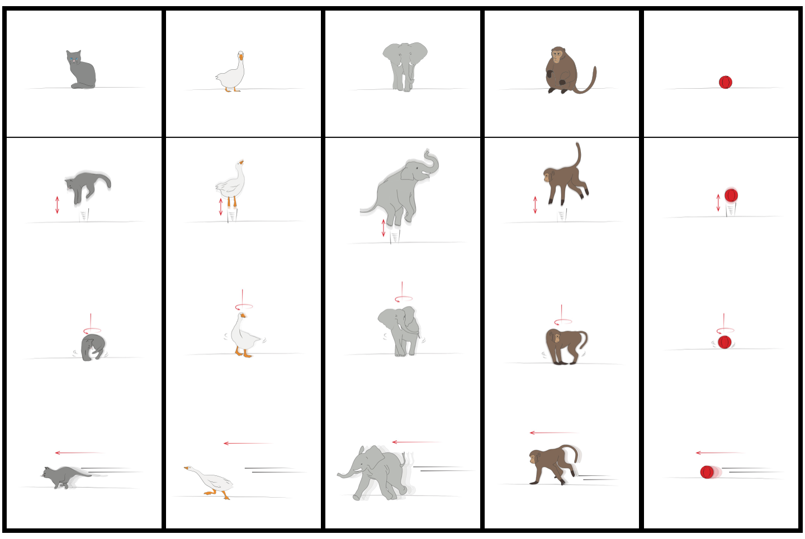
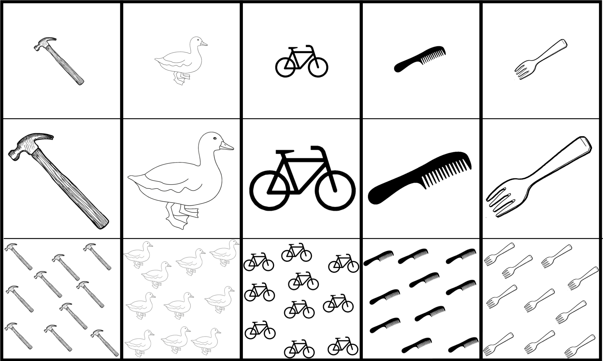

```{r global_options, include=FALSE}
knitr::opts_chunk$set(echo=TRUE, warning=FALSE, message=FALSE)
```


```{r load_packages, include = FALSE}
library(tidyverse)
library(ggthemes)
library(langcog)
library(lme4)
library(exactRankTests)
library(ggpubr)
```


# General setup and procedure

All studies used the same general setup and procedure. We established an audio-video connection between two separate rooms within a child laboratory. In each room a Panasonic XX video camera was mounted on a tripod which was placed behind a XX" XXX TV screen. Each camera captured an area in front of the TV, which was marked with black tape on the floor. Children were encouraged to stay within the marked area to ensure that their partner could see them. A black cross in the center of the area marked children's starting position in each trial. A little fence was used in each room to prevent participants from approaching the TV and/or the camera. The connection was established through DVI cables that went from the camera in one room to the TV in the other room and vice versa. External microphones were plugged into the cameras to capture children's speech. The direct connection between camera and TV made sure that that participants could interact in a smooth and contingent way. One of the rooms was assigned to be the Production Room (PR) and the other the Comprehension Room (CR). A third camera was put in the back of the CR, capturing the child as well as the TV screen. This was an additional measure to ensure that we could link the two videos recorded by the two main cameras.

The two rooms were located on the same hallway. When stepping outside, the experimenters (E1 and E2) could easily talk to one another and coordinate their actions. In each room, we installed a picture board. Importantly, the picture boards were never visible on the TV in the other room. In part 1, the picture board was a wooden, turn-able wheel with five triangular pictures ( see Figure \@ref(fig:gesstimd1)). These were 1) a hammering hand, 2) a female person combing her hair, 3) a boy on a bicycle, 4) a woman eating with a fork and 5) nothing (a white piece of paper). On top of the wheel was a little red arrow that was used to indicate which picture children had to communicate to their partner. A picture was selected by turning the wheel until the picture was on top underneath the arrow. In part 2, the board was a larger, rectangular board. The pictures differed from experiment to experiment and are therefore described later in more detail. In part 2, a sticky red paper arrow was used to indicate a picture.


```{r gesstimd1, echo = F, fig.cap="Pictures used on day 1 of part 1", fig.align = "center"}

knitr::include_graphics("./stimuli/stimuli_ges_d1.png")

```

In the beginning of each trial, E1 was with the child in PR (Production Child - PC) and E2 with the child in CR (Comprehension Child - CC). The general trial structure in all experiments went as follows: Children were first asked to take their starting position (facing away from the board towards the wall). Next, E1 selected a picture in PR. On a visual signal from E1, both Es said "ready, set, go" and left the room. Children were now allowed to turn around. The task of the child in PR was to communicate the content of the selected picture to the child in CR. The child in CR made a choice by selecting a picture on her board and knocking on the door. Thereupon, Es opened the doors, E2 told E1 across the hallway which picture had been selected in the CR and E1 checked if this was the same picture as in the PR. If the pictures were different, children were told that it didn't work out this time but that they could try again in the next trial. If the pictures were the same, children received a marble, which they collected in a tube. At the end of the study, children exchanged the marbles for stickers. 

All children started with a training phase in which the video as well as the audio connection was still intact. In the beginning of the training phase, children and Es entered their respective rooms. They greeted each other through the TV and established that they could only be seen by their partner when they were inside the marked area. Next, E1 and PC "discovered" the picture board. E1 encouraged PC to ask CC if they also had a picture board in their room. When CC confirmed that they did, PC went through all pictures (including the empty one) and asked CC if had the same kind of picture on her board. This established common ground between children that they had the same pictures on their board. Es did not provide label for the pictures but let children label them. Es used whatever label children used to refer to the pictures. Next, E1 suggested that they could play a fun game in which children could win marbles. Children were told that the game involves PC communicating to CC which picture was selected on her board and CC selecting the same picture. This marked the beginning of the training phase in which the audio connection was still working. PC could therefore simply tell CC which picture was selected. The training familiarized children with the structure of the game. During training, each picture was selected once. 

After the last training trial, children were told that they could play the game in a different way to make it more fun. Children and Es left the room and met in the hallway. Next, one E went into each room and cut the audio connection by turning off the volume at each TV. To strengthen the impression that the other one could not longer hear what was being said as well as to prevent children from trying to communicate via shouting, low instrumental Jazz music was played in both rooms (Chet Baker - "Out of nowhere"). If children shouted nevertheless, the experimenters asked them to lower their voice. When children re-entered the room, each E drew her child's attention to the music and encouraged her to ask the other child whether she also heard the music. This way children discovered that they could no longer hear each other. After stating that they could not hear anybody from the other room, children and Es left the room to meet in the hallway. There they confirmed that they could not hear each other when in the room. E1 asked the children if they wanted to play the game nevertheless and also reminded them of the game's structure. Gestures as an alternative means of communication was never mentioned. Next, children went into their respective room and the first test trial started.

In each test trial, children had one minute to establish communication. If they remained passive, E1 entered the PR and prompted PC to use iconic gestures in three steps. Between prompts, she waited for 30s to see if the child would start gesturing. As first prompt, E1 said:"[CCs name] can't hear you, but she can see you, maybe you can *show* (German: zeigen) it to her". The second prompt was: "She can't hear you but she can see you, look we can wave to her, maybe you can *demonstrate* (German: vormachen) it to her". As the final prompt, she said: "Oh, I have an idea ... this way it could work" and started to perform an iconic gesture depicting the action corresponding to the selected picture. 

Describe gestrues demonstrated by E. 

As soon as the child also used the gesture, E1 left the room and the trial continued as described above. During prompting, E2 entered CR and encouraged CC to attend to the TV.

## General note on analysis

Data and analysis scripts can be found online at ``htps://github.com/manuelbohn/ges3000``. To improve readability, we only report a small set of statistics in the text itself (estimates, standard errors and p-values for models and p-values for other tests). For additional information we ask the reader to directly run the code and look at the model outputs. For all analysis, we used R [@R-base] and for models we used the function glmer of the lme4 package [@R-lme4] with maximal random effect structures. Non-significant interaction terms were removed from models and p-values were based on likelihood ratio tests [dobson2008introduction] which were computed via the function ``drop1``.

# Part 1: Lexical items

## 1.1: Spontaneous production of gestures by 4- and 6-year-old children 

In the following, we describe the methodological details and deviations from the general protocol for each part of the studies.

### Participants
```{r part 1-1-1 data, echo = F}
d1 <- read.csv(file="data/pt1_prod_up_comp.csv") %>% 
  filter(block == "Spontaneous") %>%
  na.omit(prompts) # remove trials without response

```

We tested 24 same sex, same age dyads of four (mean age within dyad = `r round(mean(d1$mage[d1$age=="M48"]),2)`, range = `r round(range(d1$mage[d1$age=="M48"])[1],2)` to `r round(range(d1$mage[d1$age=="M48"])[2],2)`) and six year-old children (mean age within dyad = `r round(mean(d1$mage[d1$age=="M72"]),2)`, range = `r round(range(d1$mage[d1$age=="M72"])[1],2)` to `r round(range(d1$mage[d1$age=="M72"])[2],2)`), with 12 dyads per age group, six male and six female. Children came from an ethnically homogeneous, mid-sized German city (approx. 550.000 inhabitants, median income €1254 per month as of 2015), were mostly mono-lingual and had mixed socio-economic background. They were recruited from a database of children whose parents volunteered to take part in studies on child development. Data collection took place between April and September 2016. XX additional dyads were excluded because ...

### Design and procedure
The test phase following the training was divided into two parts, "spontaneous" and "uptake". Children were first tested with all pictures except the empty picture. We reasoned that including the empty picture from the beginning might discourage children from establishing communication through gestures. The empty picture was introduced after each other picture had been selected at least once (twice for six-year-olds). The first trial of the spontaneous phase assessed whether children would discover the idea to use gestures to communicate independently. If the PC remained passive for one minute in the first test trial, instead of receiving prompts, children switched rooms and the former CR got a chance to spontaneously start gesturing. If the new PC remained passive for another minute, E1 started prompting. The three trials following the first trial, each with a new picture, assessed whether children would transfer the idea of using gestures. For the second part, uptake, children switched rooms and roles. In this part, all pictures were used right away.

Six-year-olds received a total of 30 test trials, 20 in spontaneous and 10 in uptake. Pilot testing suggested that this was too long for the younger age group and so four-year-olds received a total of 19 test trials, 14 in spontaneous and 5 in uptake. The order in which pictures were selected was randomized with the constraint that each picture was selected once before another picture could be selected again. 

For most children, the intermediate prompts were not helpful and we therefore do not differentiate between them in the analysis. We only analyse whether a dyad received a prompt or not.

### Results and discussion

```{r part 1-1-1, cache = TRUE}
# Do 4yo need more prompts in trial 1 than 6yo?
d11.m <- d1 %>%
  filter(blocktrial == 1)%>%
  mutate(prompts = ifelse(prompts > 0,1,0))

m11 <- glm(prompts ~ age , family = binomial, data = d11.m)


pm11 <- drop1(m11, test = "Chisq")
# Do children get better with trials? 
d1.m <- d1 %>%
  filter(blocktrial < 5) %>%
  mutate(blocktrial = scale(as.numeric(blocktrial), center = TRUE, scale=TRUE))%>%
  group_by(blocktrial,dyad_id,age) %>%
  summarise(prompts = sum(prompts))%>%
  mutate(prompts = ifelse(prompts > 0,1,0))
  
# non-significant interaction has been removed  
m1 <- glmer(prompts ~ blocktrial + age + (blocktrial|dyad_id), family = binomial, data = d1.m, control=glmerControl(optimizer="bobyqa",optCtrl=list(maxfun=2e5)))

pm1 <- drop1(m1, test = "Chisq")
```

Except for a single, unsuccessful attempt to use lip-reading, all children produced gestures.

Describe some gesture variants produced by children

First we looked at the production of iconic gestures in the beginning of the test phase. Figure \@ref(fig:plot1) shows that the majority of six-year-olds spontaneously produced gestures already in trial 1, more so compared to four-year-olds (trial 1: $\beta$ = `r round(summary(m11)$coefficients[2,1], 2)`, se = `r round(summary(m11)$coefficients[2,2], 2)` *p* = `r sub('^(-)?0[.]', '\\1.', round(pm11[2,4], 3))`; trial 1-4: $\beta$ = `r round(summary(m1)$coefficients[3,1], 2)`, se = `r round(summary(m1)$coefficients[3,2], 2)` *p* = `r sub('^(-)?0[.]', '\\1.', round(pm1[3,4], 3))`). Even though four-year-olds initially only produced gestures after receiving prompts, they needed fewer prompts in later trials, showing that they transferred the idea of iconically depicting an referent to new pictures (main effect of trial: $\beta$ = `r round(summary(m1)$coefficients[2,1], 2)`, se = `r round(summary(m1)$coefficients[2,2], 2)` *p* = `r sub('^(-)?0[.]', '\\1.', round(pm1[2,4], 3))`). Thus, while both age groups successfully adopted a novel means of communication (iconic gestures) to coordinate, six-year-olds did so spontaneously while four-year-olds needed an initial hint.  

## 1.2: Spontaneous production of gestures by 3- and 4-year-olds

Part 1.2 follows up on 1.1.1 developmentally. We repeated the initial phase of the first study with three- and four-year-olds to investigate if and how younger children would be able to substitute speech for iconic gestures. The main focus of the study was on gesture production and so we tested children with an adult partner to streamline the procedure. We also added more pictures to prolong the phase in which children could transfer the idea of using iconic gestures to new pictures. 

### Participants
```{r part 1-1-2 data, echo = F}
d2 <- read.csv(file="data/pt1_trans_3_4.csv") 
```

Twelve three-year-olds (mean = `r round(mean(d2$mage[d2$age=="m36"]),2)`, range = `r round(range(d2$mage[d2$age=="m36"])[1],2)` to `r round(range(d2$mage[d2$age=="m36"])[2],2)`) and 12 four-year-olds (mean = `r round(mean(d2$mage[d2$age=="m48"]),2)`, range = `r round(range(d2$mage[d2$age=="m48"])[1],2)` to `r round(range(d2$mage[d2$age=="m48"])[1],2)`) participated in the study. Recruitment was the same as in 1.1.1. Xx additional children were excluded because ... . Data was collected between January and March 2017.

### Design and procedure

The procedure was the same as for part 1.1.1 with the following changes: Instead of testing peer dyads, children were tested with E2 as the CC. We removed the empty picture and used two different ones instead, one depicting a duck and the second one depicting a deer (see Figure \@ref(fig:gesstimd2)). All children received 12 trials, two trials with each picture. In the first phase (transfer), children started with the four pictures from part 1.1.1 in a randomized order followed by the two new pictures, also in a randomized order. In the second phase (imitation), pictures were repeated in the same way. Since there was no CC, there was no uptake phase. Pilot testing showed that three-year-olds felt uncomfortable alone in the room. Therefore E1 remained in the room throughout a trial but pretended to be working on something else while the child was communicating with E2. We dropped the intermediate prompts and E1 directly presented an iconic gesture as the solution if the child remained passive for more than 1 minute.

### Results and discussion
```{r part 1-1-2,  cache = TRUE}
# do 4yo transfer more rapidly compared to 3yo?
# 3-way interaction: slope for trial is steeper in 4yo only in transfer but not in imitation
# maximal converging model

d2.m <- d2 %>%
  mutate(trial = scale(as.numeric(blocktrial), center = TRUE, scale=TRUE))

m2 <- glmer(prompts ~ block*age*blocktrial + (blocktrial + block||id) + (1|stimulus) , family = binomial, data = d2.m,
        control=glmerControl(optimizer="bobyqa",optCtrl=list(maxfun=2e5)))

pm2 <- drop1(m2, test = "Chisq")

```


The right panel in Figure \@ref(fig:plot1) shows the production of iconic gestures in the transfer and imitation phase. Like in 1.1.1 four-year-olds did not spontaneously create iconic gestures in trial 1 but rapidly transferred the idea of doing so to new pictures. Three-year-olds relied mostly on prompts throughout the transfer phase. In the imitation phase, at least half of the three-year-olds produced gestures independently. We confirmed the differential rate of transfer statistically in a model finding a significant three-way-interaction between age, block and trial, suggesting a steeper slope for trial for four-year-olds in the transfer but not the imitation phase ($\beta$ = `r round(summary(m2)$coefficients[8,1], 2)`, se = `r round(summary(m2)$coefficients[8,2], 2)` *p* = `r sub('^(-)?0[.]', '\\1.', round(pm2[2,4], 3))`). 

Summarizing the results for production, we may say that six-year-olds independently create iconic gestures as an alternative means of communication when spoken language cannot be used. Four-year-olds initially struggle but rapidly transfer the idea of using gestures to new instances. Three-year-olds rarely create their own gestures but mostly rely on imitating gestures they were taught by others. 

## 1.3: Uptake

Next, we investigated gesture production during uptake. That is, whether children, who previously played the role of CC, would spontaneously produce gestures when they play the role of the PC. For this analysis we return to the data set from 1.1.

### Participants, design and procedure

See 1.1. 

### Results and discussion
```{r part 1-2}
# prompts needed during uptake phase
d3 <- read.csv(file="data/pt1_prod_up_comp.csv") %>% 
  filter(block == "Uptake") %>%
  na.omit(prompts)

d3.t <- d3 %>%  
  filter(blocktrial == 1) %>%
  group_by(age, dyad_id) %>%
  summarise(prompts = sum(prompts)) %>%
  mutate(prompts = ifelse(prompts > 0,1,0)) %>%
  summarize(prompts = list(prompts)) %>%
  spread(age,prompts) %>%
  mutate(sum4 = sum(unlist(M48)),
         sum6 = sum(unlist(M72)),
         stat = wilcox.exact(unlist(M48),unlist(M72))$statistic,
         p_value = wilcox.exact(unlist(M48),unlist(M72))$p.value)%>%
  select(sum4,sum6,stat,p_value)

#comparing prompts in spontaneous to prompts in uptake
d3.t2 <- read.csv(file="data/pt1_prod_up_comp.csv") %>%  
  filter(blocktrial == 1 & age =="M48") %>%
  group_by(block, dyad_id) %>%
  summarise(prompts = sum(prompts)) %>%
  mutate(prompts = ifelse(prompts > 0,1,0)) %>%
  summarize(prompts = list(prompts)) %>%
  spread(block,prompts) %>%
  mutate(sumS = sum(unlist(Spontaneous)),
         sumU = sum(unlist(Uptake)),
         stat = wilcox.exact(unlist(Spontaneous),unlist(Uptake))$statistic,
         p_value = wilcox.exact(unlist(Spontaneous),unlist(Uptake))$p.value)%>%
  select(sumS,sumU,stat,p_value)

```

Figure \@ref(fig:plot1) shows that all six-year-olds and also most of the four year-olds spontaneously produced gestures. Statistically, there was no difference between the age groups at trial 1 (*p* = `r sub('^(-)?0[.]', '\\1.', round(d3.t$p_value, 3))`, Wilcoxon test). Furthermore, fewer four-year-olds needed prompts in trial 1 during uptake compared to spontaneous (*p* = `r sub('^(-)?0[.]', '\\1.', round(d3.t2$p_value, 3))`). These results show that once one child established a way of referring to the pictures the other child easily picked it up. 

```{r make plot1, echo = F}
# plot for dyads producing gestures (instead of for dyads needing prompts)
d1.p <- d1 %>%  
  mutate(prompts = ifelse(prompts > 0,1,0)) %>%
  mutate(Age = ifelse(age == "M48","4yo","6yo")) %>%
  filter(blocktrial<5) %>%
  group_by(Age, blocktrial) %>%
  summarise(prompts = sum(prompts)) %>%
  mutate(prompts = 12 - prompts)%>%
  ungroup()%>%
  add_row(Age = "3yo", blocktrial = 2, prompts = -1)


plot1 <- ggplot(d1.p, 
       aes(x = blocktrial, y = prompts, col = Age)) +
  geom_line(aes(group= Age))+
  geom_point(aes(group= Age))+
  theme_few() + 
  scale_y_continuous(name = "Spontaneous Gestures", limits = c(0,12), breaks = c(0,2,4,6,8,10,12))+
  scale_x_continuous(name = "Trial", breaks = c(1:4))+
  theme_few() +
  scale_colour_manual(name="Age",
                      labels=c("3yo", "4yo","6yo"), values=c("#859900","#dc322f","#268bd2"))
```

```{r make plot2, echo = F}
# plot 
d2.p <- d2 %>%
  mutate(Age = ifelse(age == "m36","3yo","4yo")) %>%
  mutate(block = relevel(block, ref = "Transfer")) %>%
  group_by(Age,trial, blocktrial,block) %>%
  summarise(prompts = sum(prompts))%>%
  mutate(prompts = 12 - prompts)%>%
  ungroup()%>%
  add_row(Age = "6yo", blocktrial = 2, prompts = -1,block = "Transfer")

plot2 <- ggplot(d2.p, 
       aes(x = blocktrial, y = prompts, col = Age)) +
  geom_line(aes(group= Age))+
  geom_point(aes(group= Age))+
  facet_grid(~block)+
  theme_few() + 
  scale_y_continuous(name =  NULL, limits = c(0,12), breaks = c(0,2,4,6,8,10,12))+
  scale_x_continuous(name = "Trial", breaks = c(1:6))+
  scale_colour_manual(name="Age",
                      labels=c("3yo", "4yo","6yo"), values=c("#859900","#dc322f","#268bd2"))

```

```{r make plot3, echo = F}
# plot
d3.p <- d3 %>%  
  mutate(prompts = ifelse(prompts > 0,1,0)) %>%
  mutate(Age = ifelse(age == "M48","4yo","6yo")) %>%
  filter(blocktrial<6) %>%
  group_by(Age, blocktrial) %>%
  summarise(prompts = sum(prompts))%>%
  mutate(prompts = 12 - prompts)%>%
  ungroup()%>%
  add_row(Age = "3yo", blocktrial = 2, prompts = -1)

# plot
plot3 <- ggplot(d3.p, 
       aes(x = blocktrial, y = prompts, col = Age)) +
  geom_line(aes(group= Age))+
  geom_point(aes(group= Age))+
  theme_few() + 
  scale_y_continuous(name = NULL,  limits = c(0,12), breaks = c(0,2,4,6,8,10,12))+
  scale_x_continuous(name = "Trial", breaks = c(1:5))+
   scale_colour_manual(name="Age",
                      labels=c("3yo","4yo","6yo"), values=c("#859900","#dc322f","#268bd2"))

```

```{r plot1, echo = FALSE, fig.cap="Spontaneous gesture production without prompts in the first trials of the production phase of part 1.1.1 (A), the uptake phase of part 1.1.1 (B) and for transfer and imitation phase of part 1.1.2 (C).", fig.width = 10, fig.height = 3, fig.scale = 1.8}
ggarrange(plot1, plot3,plot2, ncol = 3, nrow = 1, legend = "right", common.legend = T, widths = c(1,1,2), labels = c("A","B","C"), hjust = c(-1,0.4,0),align = "h")
```

## 1.4: Comprehension

Next we looked at whether the gestures that children produced were understood by their partners. We did not have any specific hypothesis about differences between items and we therefore do not analyse them separately. Nevertheless, to give an impression of the variability in the data set, plots show the overall results as well as the results by stimulus.

### Participants, design and procedure

See 1.1. We excluded trials with the empty picture. These trials will be analysed separately in the next section. 

### Results and discussion
```{r data comprehension, echo = F}
# comprehension by phase excluding empty picture
d4 <- read.csv(file="data/pt1_prod_up_comp.csv") %>%
  filter(stimulus != "Nothing") %>%
  mutate(block = ifelse(block=="Uptake","Uptake","Spontaneous"))%>%
  mutate(Age = ifelse(age == "M48","4yo","6yo"))
```

```{r model comprehension, cache = TRUE}
# are 6yo better than 4yo at comprehension
# 6yo got more trials, for comparison we select those trials for 6yo that 4yo also got.
d4.m <- d4 %>%
  filter(ifelse(block=="Uptake",blocktrial<6,blocktrial<15)) %>%
  mutate(trial = scale(as.numeric(blocktrial), center = TRUE, scale=TRUE))

# non-sognificant higher order interactions removed
# maximal converging model (model with trial as random slope within stimulus yields problems when doing case wise deletions)
m4 <- glmer(comp ~ age+block+trial+ (trial+block|dyad_id) + (1|stimulus), family = binomial, data = d4.m,
        control=glmerControl(optimizer="bobyqa",optCtrl=list(maxfun=2e5)))


pm4 <- drop1(m4, test = "Chisq")

```

Table \@ref(tab:table1) and Figure \@ref(fig:plot2) show that that the gestures produced by the PC were generally understood by the CC in both age groups. Because six-year-olds received more trials in spontaneous and uptake (see 1.1.1), we removed all trials that this age group got beyond the number that four-year-olds got for this comparison. We also removed trials with the empty picture, which we analysed separately. Comprehension improved with trial ($\beta$ = `r round(summary(m4)$coefficients[4,1], 2)`, se = `r round(summary(m4)$coefficients[4,2], 2)` *p* = `r sub('^(-)?0[.]', '\\1.', round(pm4[4,4], 3))`) and was also slightly better in uptake compared to spontaneous ($\beta$ = `r round(summary(m4)$coefficients[3,1], 2)`, se = `r round(summary(m4)$coefficients[3,2], 2)` *p* = `r sub('^(-)?0[.]', '\\1.', round(pm4[3,4], 3))`). There was no difference between age groups ($\beta$ = `r round(summary(m4)$coefficients[2,1], 2)`, se = `r round(summary(m4)$coefficients[2,2], 2)` *p* = `r sub('^(-)?0[.]', '\\1.', round(pm4[2,4], 3))`). This shows that children generally depicted the content of the pictures in a way that was comprehensible to their partner.

```{r table1}
# Comparing comprehension against chance (25% correct)
t4 <- d4 %>%
  group_by(Age, block, dyad_id)%>%
  summarise(comp = mean(comp))%>%
  summarise(comp = list(comp)) %>%
  group_by(Age, block) %>%
  mutate(df= t.test(unlist(comp), mu = 0.25)$parameter,
         mean = mean(unlist(comp)),
         t_value = t.test(unlist(comp), mu = 0.25)$statistic,
         p_value = t.test(unlist(comp), mu = 0.25)$p.value) %>%
  select(Age, block ,mean,df,t_value,p_value)


knitr::kable(t4, caption = "Gesture comprehension compared to chance.Statistics are based on two-tailed one sample t-tests with data aggregated for each dyad. Trials with empty pictures were excluded, hence we chose a more conservative comparison level of .25.", digits = 2)
```

```{r plot2, echo = FALSE, fig.cap="Proportion correct picture chosen by the CC by part and item. Rightmost column within each facet shows overall comprehension by part. Error bars are 95% confidence intervals based on non-parametric bootstraps.", fig.width = 10, fig.height = 4}
# plot per age group and phase
d4.p2 <- read.csv(file="data/pt1_prod_up_comp.csv") %>%
  mutate(block = ifelse(block=="Uptake","Uptake","Spontaneous"))%>%
  mutate(Age = ifelse(age == "M48","4yo","6yo")) %>%
  group_by(Age, stimulus, block, dyad_id)%>%
  summarise(comp = mean(comp))

d4.p3 <- d4.p2 %>%
  multi_boot_standard(col = "comp")

d4.p4 <- d4.p2 %>%
  group_by(Age, block, dyad_id)%>%
  summarise(comp = mean(comp)) %>%
  multi_boot_standard(col = "comp")%>%
  mutate(stimulus = "Overall")

ggplot() +
  geom_jitter(data = d4.p2, aes(x = stimulus, y = comp, col = Age), position = position_jitterdodge(jitter.width = .2, jitter.height = 0.05,dodge.width = 0.5), alpha = .5)+
  geom_pointrange(data = d4.p3,aes(x = stimulus, y = mean, col = Age,ymin = ci_lower, ymax = ci_upper), 
                  position = position_dodge(width = .5), size = 0.6) +
  geom_pointrange(data = d4.p4,aes(x = stimulus, y = mean, col = Age,ymin = ci_lower, ymax = ci_upper), 
                  position = position_dodge(width = .5), size = 1) +
  geom_hline(yintercept = 0.25, lty=2)+
  geom_vline(xintercept = 5.5, lty=1, size = 0.7)+
  guides(alpha = F)+
  facet_grid(~block)+
  labs(x="Picture")+
  scale_y_continuous(name = "Proportion Correct", limits = c(-0.05,1.05))+
  theme_few() + 
  scale_colour_solarized()
```

## 1.5: Abstract concepts (empty picture)

As mentioned above, we analysed production and comprehension separately for trials in which the empty picture was selected. In contrast to the other pictures, the empty picture did not show an action that could be turned into an iconic gesture. Children therefore had to find a different way to establish reference. On the comprehension side, children could select the empty picture either because PC's gesture successfully communicated the "emptiness" of the picture or because the gesture they saw did not match any of the other pictures. The latter was possible because we introduced the empty picture only after all other pictures had been selected at least once.

### Participants, design and procedure

see 1.1.

### Results and discussion

Describe the gestures being used for nothing. Depicting "nothing", doing nothing, pointing to white things. some of these gestures were resulted from little conversations in which the CC would produce gestures for some of the other pictures, "asking" the PC if it was this one.

```{r part 1-4, cache = TRUE}
#### Production
# prompts per age group and phase
d5 <- read.csv(file="data/pt1_prod_up_comp.csv") %>% 
  filter(stimulus == "Nothing") %>%
  mutate(block = ifelse(block=="Uptake","Uptake","Spontaneous"))%>%
  mutate(Age = ifelse(age == "M48","4yo","6yo")) %>%
  na.omit(prompts)

# descriptives for production (plot not informative) and tests
# do 4yo need more prompts compared to 6yo?
d5.t1 <- d5 %>%
  group_by(age, block, dyad_id) %>%
  summarise(prompts = sum(prompts)) %>%
  mutate(prompts = ifelse(prompts > 0,1,0)) %>%
  summarize(prompts = list(prompts)) %>%
  spread(age,prompts) %>%
  group_by(block) %>%
  mutate(sum4 = sum(unlist(M48)),
         sum6 = sum(unlist(M72)),
         stat = wilcox.exact(unlist(M48),unlist(M72))$statistic,
         p_value = wilcox.exact(unlist(M48),unlist(M72))$p.value)%>%
  select(block,sum4,sum6,stat,p_value)

### Comprehension 
#comparing against chance per age group and phase
d5.t2 <- d5 %>%
  group_by(Age, block, dyad_id)%>%
  summarise(comp = mean(comp))%>%
  summarise(comp = list(comp)) %>%
  group_by(Age,block) %>%
    mutate(mean = mean(unlist(comp)),
           stat = wilcox.exact(unlist(comp), mu = 0.25)$statistic,
           p_value = wilcox.exact(unlist(comp), mu = 0.25)$p.value) %>%
    select(Age,block,mean,stat,p_value)

# are 6yo better than 4yo at comprehension
d5.m <- d5 %>%
  filter(ifelse(block=="Uptake",blocktrial<6,blocktrial<15))

#model does not converge with interaction
m5 <- glmer(comp ~ age+block + (1|dyad_id), family = binomial, data = d5.m,
        control=glmerControl(optimizer="bobyqa",optCtrl=list(maxfun=2e5)))

pm5 <- drop1(m5, test = "Chisq")

```

Both age groups spontaneously produced gestures for the empty picture. Six-year-olds did not need prompts in any of the two parts. Four dyads of four-year-olds needed prompts in spontaneous and two did so in uptake. Statistically, there was no difference between age groups regarding the number of prompts (spontaneous: *p* = `r sub('^(-)?0[.]', '\\1.', round(d5.t1$p_value[1], 3))`, uptake: *p* = `r sub('^(-)?0[.]', '\\1.', round(d5.t1$p_value[2], 3))`; Wilcoxon test). 
The second row in Figure \@ref(fig:plot2) shows how well the gestures were understood by the CC. In general, children chose the correct picture above chance (all *p* < .01), except for four-year-olds in spontaneous (*p* = `r sub('^(-)?0[.]', '\\1.', round(d5.t2$p_value[1], 3))`, Wilcoxon test). To compare performance between age groups and blocks, we again dropped all trials that six-year-olds got more than four-year-olds and fit a model to the data (`comp ~ age + block + (1 | dyad_id)`). Rate of comprehension was higher for six-year-olds ($\beta$ = `r round(summary(m5)$coefficients[2,1], 2)`, se = `r round(summary(m5)$coefficients[2,2], 2)` *p* = `r sub('^(-)?0[.]', '\\1.', round(pm5[2,4], 3))`) and during the uptake part ($\beta$ = `r round(summary(m5)$coefficients[3,1], 2)`, se = `r round(summary(m5)$coefficients[3,2], 2)` *p* = `r sub('^(-)?0[.]', '\\1.', round(pm5[3,4], 3))`). Taken together, both age groups produced gestures for the empty picture. These gestures were immediately understood in the older age group and during the uptake part also in the younger one. 

## 1.6: Convergence

So far, we saw that children switched to a new modality when spoken language was no longer an option. They created iconic gestures which successfully communicated the content of the picture to their partner. In the second part, we investigate whether children would use the same kind of gesture for a given picture. To do this we compared the gestures produced in the spontaneous and the uptake part. We hypothesized that children within a dyad would use more similar gestures compared to children from different dyads. In general, there are many different ways to iconically depict a picture (see part 1.1.1 for some variants created by children). Children within a dyad should be more similar because the PC in the uptake part (the former CC) can simply imitate the gesture she saw during the spontaneous part. The degree to which we can detect similarity due to imitation is limited by the variability in how children initially depict the picture. For example, if many children independently decide to depict the comb by stroking a hand across the head, similarity will be high across dyads and similarity within dyads due to imitation will be hard to detect. 

### Participants

We used the videos of children producing gestures during part 1. Twelve adult raters, unfamiliar with the study design and procedure, judged the similarity of gestures within dyads.

### Design and Procedure

For each dyad we selected the video of the last gesture for a picture from the PC during spontaneous and the first gesture for the same picture from the PC (former CC) during uptake. That is, we chose the two depictions of the same picture by the two children that were closest in time. We used E-Prime (version 2.0.10.356) to set-up the rating procedure. On each trial, the rater was shown a sample video on top of the screen and two comparison videos on the bottom, one on the left and one in the right. The sample showed a child during the spontaneous part. One of the comparison videos showed the child from the *same* dyad during uptake whereas the other video showed a child of the same age and sex from a *different* dyad, also during uptake, also producing a gesture for the same picture. On each trial, the comparison video was randomly selected from the pool of suitable videos. Furthermore, the position of the comparison videos on the screen (left or right) was randomly determined. Raters could watch and re-watch each video multiple times. Each video was numbered (sample video was always nr. 1) and raters were asked: "Which video is more similar to 1". They made a choice by pressing the respective number on the keyboard. Raters went through the videos in blocks. Each block consisted of all videos from a given age and sex for a particular picture. The order of blocks was randomized across raters. We only used videos corresponding to trials in which the child produced a gesture without prompts. This resulted in a total number of 97 sample videos.

### Results and discussion.

```{r part 1-5, cache = TRUE}
# Do raters choose the gesture from the same dyad above chance in both age groups?
d6 <- read.csv(file="data/pt1_convergence.csv") %>% 
  mutate(Age = ifelse(age == "M48","4yo","6yo"))

d6.t <- d6 %>%
  group_by(Age, rater)%>%
  summarise(corr = mean(corr))%>%
  summarise(corr = list(corr)) %>%
  group_by(Age) %>%
  mutate(mean = mean(unlist(corr)),
         df= t.test(unlist(corr), mu = 0.5)$parameter,
         t_value = t.test(unlist(corr), mu = 0.5)$statistic,
         p_value = t.test(unlist(corr), mu = 0.5)$p.value) %>%
  select(Age,mean,df,t_value,p_value)

d6.m <- d6  %>%
  mutate(trial = scale(as.numeric(trial), center = TRUE, scale=TRUE))

# model 
m6 <- glmer(corr ~ age + (age | rater) + (1 | video), family = binomial, data = d6.m, control=glmerControl(optimizer="bobyqa",optCtrl=list(maxfun=2e5)))
# summary
pm6 <- drop1(m6, test = "Chisq")

### select only videos with gestures for which children did not receive a prompt

ex <- read.csv(file="data/pt1_prod_up_comp.csv") %>% 
  filter(prompts > 2)%>%
  select(video) %>%
  mutate(video = as.character(video))

d6.no.prompt <- filter(d6, !video %in% ex$video)

d6.m2 <- d6.no.prompt  %>%
  mutate(trial = scale(as.numeric(trial), center = TRUE, scale=TRUE))

# model 
m6.2 <- glmer(corr ~ age + (age| rater) + (1 | video), family = binomial, data = d6.m2, control=glmerControl(optimizer="bobyqa",optCtrl=list(maxfun=2e5)))
# summary
pm6.2 <- drop1(m6.2, test = "Chisq")

```

Figure \@ref(fig:plot3) shows how often the video from the same dyad was rated to be more similar to the sample video. For both age groups, raters chose the video from the same dyad above chance (both *p* < .001). In direct comparison, corresponding videos were chosen slightly more often for six- compared to four-year-olds ($\beta$ = `r round(summary(m6)$coefficients[2,1], 2)`, se = `r round(summary(m6)$coefficients[2,2], 2)` *p* = `r sub('^(-)?0[.]', '\\1.', round(pm6[2,4], 3))`). This difference might follow from the different rate of spontaneous production found in part 1. Six-year-olds mostly created gestures independently, probably resulting in more different gestures between dyads. Four-year-olds on the other hand, relied more often on prompts from the experimenter. Since most prompting resulted in the experimenter showing the child an iconic gesture, four-year-olds' gestures were more similar because many of them were imitations of the experimenter's gesture. To address this empirically, we sub-setted the data and excluded all videos showing gestures which were produced following a direct demonstration by the experimenter. In contrast to the hypothesis laid out above, excluding prompted gestures augmented rather than weakened the difference between age groups ($\beta$ = `r round(summary(m6.2)$coefficients[2,1], 2)`, se = `r round(summary(m6.2)$coefficients[2,2], 2)` *p* = `r sub('^(-)?0[.]', '\\1.', round(pm6.2[2,4], 3))`). Nevertheless, both age groups produced more similar gestures within than between dyads. 

```{r plot3, echo = FALSE, fig.cap="Proportion with which raters judged the video from the same dyad to be more similar, overall and by item. Rightmost column shows overall ratings. Dotted line indicates performance expected by chance. Error bars are 95% confidence intervals based on non-parametric bootstraps.", fig.width = 10, fig.height = 4, fig.scale = 1.8}
# plot per age group and stimulus
d6.p2 <- d6 %>%
  group_by(Age, stimulus, rater)%>%
  summarise(corr = mean(corr))

d6.p3 <- d6.p2 %>%
  multi_boot_standard(col = "corr")


d6.p4 <- d6 %>%
  group_by(Age,rater) %>%
  summarise(corr = mean(corr)) %>%
  multi_boot_standard(col = "corr") %>%
  mutate(stimulus = "Overall")


ggplot() +
  geom_jitter(data = d6.p2, aes(x = stimulus, y = corr, col = Age), position = position_jitterdodge(jitter.width = .2, jitter.height = 0.05,dodge.width = 0.5), alpha = .5)+
  geom_pointrange(data = d6.p3,aes(x = stimulus, y = mean, col = Age,ymin = ci_lower, ymax = ci_upper),position = position_dodge(width = .5), size = .6) + 
  geom_pointrange(data = d6.p4,aes(x = stimulus, y = mean, col = Age,ymin = ci_lower, ymax = ci_upper),position = position_dodge(width = .5), size = 1)+
  geom_vline(xintercept = 5.5, lty=1, size = 0.7)+
  geom_hline(yintercept = 0.5, lty=2)+
  xlab("Picture")+
  guides(alpha = F)+
  scale_y_continuous(name = "Proportion Gesture from Same Dyad Chosen", limits = c(-0.05,1.05))+
  theme_few() + 
  scale_colour_solarized()

```

## 1.7: Drift to arbitrary

Adult communicators streamline their communication over time by reducing the effort of each utterance. When using iconic lexical items, this usually results in a "drift to the arbitrary" with items gradually loosing their iconicty. In part 3 we investigated this drift to the arbitrary in children's production and comprehension of gestures.

In terms of production, we compared the first instance of a gesture for a picture to the last to see if children streamline their utterances over time. In terms of comprehension, we paired children with an adult who produced more and more abstract gestures over time.

### 1.7.1: Drift to arbitrary production

We used the videos recorded during part 1. However, because children only got up to five repetitions of the same gesture (four-year-olds only up to 3) we invited children back into the lab on a second day and repeated the procedure with fewer pictures and more repetitions per gesture. On this second day, we paired children with an adult comprehension partner.

#### Participants
```{r part 3 participants}
d7.participants <- read.csv(file="data/pt1_drift_day2_production.csv")
```

For the additional study, we invited half of the children (one from each dyad) who participated in part 1 on day 1 back to the lab on a second day. Three four-year-olds could not participate on the second day and were therefore replaced with new children. In sum, twelve four-year-olds (mean age = `r round(mean(d7.participants$age[d7.participants$age_group=="M48"]),2)`, range = `r round(range(d7.participants$age[d7.participants$age_group=="M48"])[1],2)` to `r round(range(d7.participants$age[d7.participants$age_group=="M48"])[2],2)`) and 12 six-year-olds (mean age = `r round(mean(d7.participants$age[d7.participants$age_group=="M72"]),2)`, range = `r round(range(d7.participants$age[d7.participants$age_group=="M72"])[2],2)`) participated in the study.

We presented the videos from day 1 and 2 to twelve adult raters, who were unfamiliar with the study design and procedure. They were asked to rate how abstract and effortful gestures were. 

#### Design and Procedure

For the data collection on day 2, we made the following changes to the procedure compared to day 1. We used E2 as  comprehension partner. Instead of a warm-up phase with sound, children received four training trials with the pictures from day 1, already without sound. Then the experimenter introduced the new pictures (deer, duck and fish, see Figure \@ref(fig:gesstim_d2)) that were used for the remainder of the session. Children received a total of 30 test trials, 10 with each picture. Order of pictures was randomized in blocks of six, that is, each picture was selected twice before another picture could be selected a third time. Children who did not participate on day 1, received additional training trials with sound and were prompted to use gestures if they did not do so spontaneously.


```{r gesstimd2, echo = F, fig.cap="Pictures used on day 2 of part 1", fig.align = "center"}

knitr::include_graphics("./stimuli/stimuli_ges_d2.png")

```

The rating procedure was similar to the one used in part 2. For each child, we selected the first and the last gesture for a picture. That is, we used the two depictions for the same picture that were furthest apart in time. From day 1, we only used gestures produced during spontaneous because four-year-olds only received one trial with each picture during uptake. Again, we used E-Prime (version 2.0.10.356) to set-up the rating procedure. On a trial, the rater was shown the two videos from a child with a given picture, one showing the first and the other showing the last gesture production. The position of each video (left and right) was randomly determined. The two videos were numbered and raters could select them by pressing the corresponding number on the keyboard. On each trial, raters could watch and re-watch the videos as they liked. The first rating question was always "Which of the two gestures is more abstract?" and the second question was "Which of the two gestures is more effortful?". Before going through the videos, raters read descriptions of what was meant by the two rating categories "abstract" and "effortful". We defined *abstract* as ... and *effortful* as .... 

Raters went through the videos in blocks. Each block consisted of all videos from a given age and sex for a particular picture. Raters were shown the picture that was used as stimulus for children in the beginning of each block. Order of blocks was randomized across raters. Like in part 2, we only used videos from trials in which the child produced the gesture spontaneously. In total, there were 168 video pairs.

#### Results and discussion
```{r part 3 production, cache = TRUE}
d7 <- read.csv(file="data/pt1_drift_production.csv") %>% 
  mutate(Age = ifelse(age == "M48","4yo","6yo"))%>%
  filter(phase != "Uptake")  #filtering out uptake because 4yo only got 1 trial per stimulus in uptake

### influence of age and effort per day. 
# day 1
d7.m1 <- d7 %>%
  filter(day == "Day1")

m7.1 <- glmer(abs ~ age + effort + (age | rater) + (1 | video), family = binomial, data = d7.m1, control=glmerControl(optimizer="bobyqa",optCtrl=list(maxfun=2e5)))

pm7.1 <- drop1(m7.1, test = "Chisq")

#day2
d7.m2 <- d7 %>%
  filter(day == "Day2")

m7.2 <- glmer(abs ~ age + effort + (age | rater) + (1 | video), family = binomial, data = d7.m2, control=glmerControl(optimizer="bobyqa",optCtrl=list(maxfun=2e5)))

pm7.2 <- drop1(m7.2, test = "Chisq")

```

We analysed the data for the two days separately because children were tested with different pictures. Table \@ref(tab:table2) and Figure \@ref(fig:plot4) show abstractness ratings compared to chance level. These results indicate that raters generally rated the later gestures to be more abstract. Figure \@ref(fig:plot4) shows the relation between ratings for effort and abstractness.

We analysed the influence of age and effort on abstractness ratings for each day. For day 1, six-year-olds' later gestures were rated as more abstract more often compared to four-year-olds' ($\beta$ = `r round(summary(m7.1)$coefficients[2,1], 2)`, se = `r round(summary(m7.1)$coefficients[2,2], 2)` *p* = `r sub('^(-)?0[.]', '\\1.', round(pm7.1[2,4], 3))` ). Ratings of abstractness were strongly influenced by ratings of effort  ($\beta$ = `r round(summary(m7.1)$coefficients[3,1], 2)`, se = `r round(summary(m7.1)$coefficients[3,2], 2)` *p* = `r sub('^(-)?0[.]', '\\1.', round(pm7.1[3,4], 3))`). The age difference on day 1 might be due to the fact that six-year-olds received more trials with each picture on day 1. If this would be the case, the age difference should disappear on day 2 when both age groups received the same number of trials. Model results show that this was the case. On day 2, abstractness ratings were again strongly influenced by effort ($\beta$ = `r round(summary(m7.2)$coefficients[3,1], 2)`, se = `r round(summary(m7.2)$coefficients[3,2], 2)` *p* = `r sub('^(-)?0[.]', '\\1.', round(pm7.2[3,4], 3))`) but, in contrast to day 1, not by age ($\beta$ = `r round(summary(m7.2)$coefficients[2,1], 2)`, se = `r round(summary(m7.2)$coefficients[2,2], 2)` *p* = `r sub('^(-)?0[.]', '\\1.', round(pm7.2[2,4], 3))`). This pattern of results suggests that gestures became more abstract over time because children reduced the effort put into each depiction. The differential age effect further suggests that this is a function of the number of repetitions of each gesture.

```{r table2}

 # Do raters choose the later gesture as the more abstract one?
### t-tests against chance per age group and day
t7 <-d7 %>%
  group_by(Age, day, rater)%>%
  summarise(abs = mean(abs))%>%
  summarise(abs = list(abs)) %>%
  group_by(Age, day) %>%
  mutate(mean = mean(unlist(abs)),
         df= t.test(unlist(abs), mu = 0.5)$parameter,
         t_value = t.test(unlist(abs), mu = 0.5)$statistic,
         p_value = t.test(unlist(abs), mu = 0.5)$p.value) %>%
  select(Age,day,mean,df,t_value,p_value)


knitr::kable(t7,caption = "Abstractness ratings for gestures compared to chance. Statistics are based on two-tailed one sample t-tests with data aggregated for each rater. Chance comparison level is .5.", digits = 2)
```

```{r make plot6, echo = F}
# plot per age group, phase, day and stimulus
d7.p2 <- d7 %>%
  group_by(Age, day, stimulus, rater)%>%
  summarise(abs = mean(abs))

d7.p3 <- d7.p2 %>%
  multi_boot_standard(col = "abs")


d7.p4 <- d7 %>%
  group_by(Age,day,rater) %>%
  summarise(abs = mean(abs)) %>%
  multi_boot_standard(col = "abs") %>%
  mutate(stimulus = "Overall")

plot6 <-ggplot() +
  geom_jitter(data = d7.p2, aes(x = stimulus, y = abs, col = Age), position = position_jitterdodge(jitter.width = .2, jitter.height = 0.05,dodge.width = 0.5), alpha = .5)+
  geom_pointrange(data = d7.p3,aes(x = stimulus, y = mean, col = Age,ymin = ci_lower, ymax = ci_upper),position = position_dodge(width = .5), size = 0.6) +
  geom_pointrange(data = d7.p4,aes(x = stimulus, y = mean, col = Age,ymin = ci_lower, ymax = ci_upper),position = position_dodge(width = .5), size = 1) +
  geom_hline(yintercept = 0.5, lty=2)+
  facet_grid(~day,scales = "free_x", space = "free_x", drop = T)+
  guides(alpha = F)+
  scale_y_continuous(name = "Proportion Later Chosen", limits = c(-0.05,1.05))+
  xlab("Picture")+
  theme_few() + 
  scale_colour_solarized()

```


```{r make plot7, echo = F}

d7.p5 <- d7 %>%
  group_by(Age,day,video,stimulus) %>%
  summarise(abs = mean(abs),
            eff = mean(effort))

plot7 <- ggplot(data = d7.p5,aes(x = eff, y = abs, col = Age)) +
  geom_jitter(width = .05,height = .05, alpha = 0.7)+
  geom_smooth(method = "lm", se = T)+
  geom_abline(intercept = 1, slope = -1, lty = 2, alpha = 0.5)+
  theme_few() +
  facet_wrap(~day)+
  xlab("Effort")+
  ylab("Abstractness")+
  #stat_cor(aes(col = Age), method = "pearson", label.x = 0.25,label.y = c(0,0.1),show.legend = F)+
  scale_colour_solarized()+
  coord_fixed()
```

```{r plot4, echo = FALSE, fig.cap="Proportion with which raters judged the later gesture to be more abstract, overall by day and by item. Dotted line indicates performance expected by chance. Error bars are 95% confidence intervals based on non-parametric bootstraps. B: Realtion between ratings of abstractness and effort for each day. Each dot represents the mean rating across raters for a video pair across. Regression lines show smoothed conditional means per age group with 95% confidence intervals.", fig.width =10, fig.height = 10, fig.scale = 1.8}

ggarrange(plot6, plot7, ncol = 1, nrow = 2, legend = "right", common.legend = T, labels = c("A","B"), align = "h")
```

### 1.7.2: Drift to arbitrary comprehension
The previous section showed that children's gestures become more abstract over time, presumably because features of the initial depictions are dropped in order to reduce production effort. However, the gestures produced by children towards the end of the study were still highly iconic. We therefore investigated whether children would comprehend gestures that become more and more arbitrary over time, up to a point where they bear no direct iconic correspondence to the original picture. In order to comprehend them at the final stage, children had to keep track of each gesture as it was drifting towards the arbitrary. We contrasted performance in this condition with that of naive children who only saw the initial iconic depictions and the final abstract depictions but not the intermediate stages.

#### Participants
```{r drift comprehension participants}
d8 <- read.csv(file="data/pt1_drift_comprehension.csv", sep = ";") %>% 
  mutate(condition = ifelse(condition == "Abstract", "Abstract", "Iconic"))%>%
  mutate(condition = as.factor(condition))%>%
  mutate(Age = ifelse(age == "M48","4yo","6yo"))%>%
  mutate(phase = ifelse(phase == "test", "Test", "Control"))%>%
  mutate(phase= as.factor(phase))

```

We invited the other half of children per age group from day 1 back to the lab to participate in the drift to the arbitrary comprehension game. For the control condition, we recruited the same number of children per age group from local kindergartens. In total 24 four-year olds (mean age = `r round(mean(d8$i_age[d8$age=="M48"]),2)`, range = `r round(range(d8$i_age[d8$age=="M48"])[1],2)` to `r round(range(d8$i_age[d8$age=="M48"])[2],2)`) and 24 six-year-olds (mean age = `r round(mean(d8$i_age[d8$age=="M72"]),2)`, range = `r round(range(d8$i_age[d8$age=="M72"])[1],2)` to `r round(range(d8$i_age[d8$age=="M72"])[2],2)`) participated in the study. Three four-year-olds from day 1 could not come back on the second day and were therefore replaced with children who were naive to the procedure. Drop outs ...

#### Design and Procedure
Data in the control condition was collected prior to the test condition. The logic behind this order was that we wanted to find abstract depictions for the pictures that children would not spontaneously understand. After showing that this was the case for one set of depictions, we tested whether children would understand these abstract forms if they had been tested on intermediate (more iconic) versions as well.

##### Control
Children in the control condition were tested in a separate room in their kindergarten. Videos were played on a 15 inch laptop located on a table. The pictures to which the gestures corresponded were put on the table between child and laptop. They were the same as the ones that would be later used in the test condition (deer, duck and fish, see Figure \@ref(fig:gesstimd2)). Children responded by pointing to or naming a picture. The videos showing the iconic and abstract depiction of each stimulus were per-recorded in the same setup and involving the same experimenters as in the test condition. Children were instructed that they would see videos in which someone would depict one of the pictures in front of them and their task would be to guess which picture it was. As a warm-up, children received XX training trials with videos of iconic depictions of different pictures (XX, Tiger and Elephant). Criteria?????. Subsequently, children received six test trials: first three with abstract gestures and then three with iconic gestures (each time, one trial per picture). The order of stimuli was counterbalanced within trials of abstract and iconic depictions. Children received feedback???. Reliability . Abstract gestures corresponded to stage 5 and iconic to stage 1 depictions described below.

##### Test
The general setup and procedure for the test condition (drift to the arbitrary) were similar to day 1. Children played the role of the CC but instead of a peer, they were paired with an adult production partner. As a warm-up, children received one trial with each of the pictures from day 1. Children who did not participate in day 1, received additional training trials with sound. After the warm-up, the pictures were changed to test pictures (deer, duck and fish, same as in the previous section). Each child received 30 trials. There were 5 stages of abstraction with six trials (two per picture) per stage. The order of pictures within each stage was randomized. Gestures became more abstract in that elements of the iconic depictions were removed and aspects of the original gestures were depicted in a different way. Sample videos can be found in the online repository. Below are detailed descriptions of the gestures from each stage for each picture:  

*Deer*: 
Stage 1: The experimenter stretched out both arms over her had and spread her fingers as if depicting the deer's antlers. In addition she moved her upper body up and down and left and right. Stage 2: Both arms as well as fingers were stretched out next to the head but upper body was not moved. Stage 3: Instead of stretching out the arms, the experimenter depicted the distance that the arm/antler previously covered vertically next to her head. That is she put one arm, palm facing outwards close to her neck and her second arm, palm facing inwards, away from her head at the point where her outstretched arm previously ended. She did yo both on the left and the right side of her head. Stage 4: distance was only depicted on one side of the head. Stage 5: Instead of depicting the distance next to her head, the experimenter depicted the distance horizontally in front of her body (same hand position as in previous depiction). 
 
*Duck*:
Stage 1: The experimenter bent her elbows, bringing her hands to her chest to depict the duck's wings. In addition she squatted, waddled around while moving her head and bent arms up and down to depict flapping the wings. Stage 2: Elbows were again bent and arms in front of chest. Arms and head were moved up and down to depict flapping of wings. Squatting and moving around were omitted. Stage 3: Experimenter bent her elbows but put put them down straight on the side (no flapping) while shrugging her shoulders. In addition eyebrows were moved up and down. Stage 4: No bending of arms, only shrugging shoulders and moving eye-brows up and down. Stage 5: Only the eyebrows were moved up and down. 

*Fish*:
Stage 1: The experimenter put her palms together in front of her body, with arms stretched out and moved her arms in a curling motion left and right, while slowly moving forwards. In addition, she opened and closed her mouth. Stage 2: Only right arm was used to to make curling motion in front of body, mouth was still opened and closed. Moving forward was omitted. Stage 3: Opening and closing of mouth was omitted. Left arm was held horizontally in front of body (depicting a surface). Right arm made again the curling motion but ended with a little twist so that the right hand vertically hit the left hand (as if the fish (right hand) was jumping into the water (left hand)).Stage 4: Same as before but the curling motion of the right hand was omitted. The right hand was moved in a semi-circular motion to hit the left hand vertically. Stage 5: Only the left hand was held in front of the body. 

#### Results and discussion

```{r drift comprehension model, cache = T}
# are children better in test compared to pretest when seeing abstract gestures?

# comparing test and pretest in iconic
d8.m1 <- d8  %>%
  filter(condition == "Iconic") %>%
  mutate(trial = scale(as.numeric(trial), center = TRUE, scale=TRUE))

m8.1 <- glmer(corr ~ age + phase + (1| id) + (1 | stimulus), family = binomial, data = d8.m1, control=glmerControl(optimizer="bobyqa",optCtrl=list(maxfun=2e5)))

pm8.1 <- drop1(m8.1, test = "Chisq")

# comparing test and pretest in abstract
d8.m2 <- d8  %>%
  filter(condition == "Abstract") %>%
  mutate(trial = scale(as.numeric(trial), center = TRUE, scale=TRUE))

m8.2 <- glmer(corr ~ age + phase + (trial | id) + (1 | stimulus), family = binomial, data = d8.m2, control=glmerControl(optimizer="bobyqa",optCtrl=list(maxfun=2e5)))

pm8.2 <- drop1(m8.2, test = "Chisq")

```
To have the same number of trials in test and control, we selected only children's first encounter with the abstract and iconic depictions of each picture in the test condition. Figure \@ref(fig:plot5) summarizes performance in each condition, per age group and gesture type.  Both age groups performed above chance when seeing iconic gestures in the two conditions (see Table \@ref(tab:table3)). Furthermore, when looking at iconic gestures, performance did not differ between control and test condition ($\beta$ = `r round(summary(m8.1)$coefficients[3,1], 2)`, se = `r round(summary(m8.1)$coefficients[3,2], 2)` *p* = `r sub('^(-)?0[.]', '\\1.', round(pm8.1[3,4], 3))`). Six-year-olds performed better compared to four-year-olds ($\beta$ = `r round(summary(m8.1)$coefficients[2,1], 2)`, se = `r round(summary(m8.1)$coefficients[2,2], 2)` *p* = `r sub('^(-)?0[.]', '\\1.', round(pm8.1[2,4], 3))`).

Performance was at chance level for all children in the control condition. As noted above, this served as a validation for the abstractness of the gestures. Importantly, the same gestures were comprehended  above chance in the test condition (Table \@ref(tab:table3)). Furthermore children in the test outperformed children in the control condition on abstract gestures ($\beta$ = `r round(summary(m8.2)$coefficients[3,1], 2)`, se = `r round(summary(m8.2)$coefficients[3,2], 2)` *p* = `r sub('^(-)?0[.]', '\\1.', round(pm8.2[3,4], 3))`). In sum, we found that children of both age groups successfully retained the meaning of a gesture when its form gradually drifted from iconic to arbitrary. 

```{r table3}
# Comparing comprehension against chance (25% correct)
### t-tests against chance per age group, day and phase
t8 <- d8 %>%
  group_by(Age,condition, phase, id)%>%
  summarise(corr = mean(corr))%>%
  summarise(corr = list(corr)) %>%
  group_by(Age,condition, phase) %>%
  mutate(mean = mean(unlist(corr)),
         df= t.test(unlist(corr), mu = 1/3)$parameter,
         t_value = t.test(unlist(corr), mu = 1/3)$statistic,
         p_value = t.test(unlist(corr), mu = 1/3)$p.value) %>%
  select(Age,phase,condition,mean,df,t_value,p_value) 


knitr::kable(t8, caption = "Gesture comprehension compared to chance for iconic and abstract gestures in test and control condition. Statistics are based on two-tailed one sample t-tests with data aggregated for each participant. Chance level = .33.", digits = 2)
```

```{r plot5, echo = FALSE, fig.cap="Proportion correct picture chosen by age group and condition. Dotted line indicates performance expected by chance. Error bars are 95% confidence intervals based on non-parametric bootstraps.", fig.width = 10, fig.height = 5}
# plot per age group, condition and phase
d8.p <- d8 %>%
  mutate(condition = relevel(condition, ref = "Iconic")) %>%
  group_by(Age, condition, phase,id)%>%
  summarise(corr = mean(corr))

d8.p1 <- d8.p %>%
  multi_boot_standard(col = "corr")

ggplot() +
  geom_jitter(data = d8.p, aes(x = phase, y = corr, col = Age), position = position_jitterdodge(jitter.width = .2, jitter.height = 0.05,dodge.width = 0.5), alpha = .5)+
  geom_pointrange(data = d8.p1,aes(x = phase, y = mean, col = Age,ymin = ci_lower, ymax = ci_upper),position = position_dodge(width = .5), size = 1) + 
  geom_hline(yintercept = 1/3, lty=2)+
  facet_grid(~condition)+
  guides(alpha = F)+
  xlab("Phase")+
  scale_y_continuous(name = "Proportion Correct", limits = c(-0.05,1.05))+
  theme_few() + 
  scale_colour_solarized()
```

## Interim discussion

Part 1 documented how children constructed a basic communication system in a peer context. We found that children spontaneously used iconic gestures to refer to the content of the pictures. The gestures that were used to do so, were more similar within dyads than between dyads, suggesting that children started conventionalizing their means of communication. Over time, children's gestures became more abstract, presumably because children put less effort into the production of each gesture. Children also retained the meaning of gestures that gradually became less iconic. Taken together, the rudimentary communication systems developed here share some important aspects with symbolic language. In the next section we studied how children would communicate more complex meanings. 

# Part 2: Grammatical constructions

In this part, we investigated how children disambiguate between depictions of the same referent with varying properties. We contrasted moving vs. static referents, differences in numerosity, differences in size as well as transitive actions between multiple referents. Our main focus was on the question whether children would spontaneously create combinatorial gesture sequences reminiscent of grammatical constructions. That is, sequences in which separate gestures are used to denote properties of the referent (predicates) and/or sequences in which the order of gestures specifies the meaning of the sequence. In both cases, each gesture of the sequence alone would not be sufficient to retain the intended meaning. In addition, different meanings could be communicated by changing individual elements of the sequence, either in kind or in relative order.

In each of the following experiments, we first coded if children differentiated between different instantiations of the same referent. For the cases in which they did, we looked at the kind of gesture they used and more specifically at whether they used a single holistic gesture or a combinatorial gesture sequence to differentiate. Finally, in case children used a gesture sequence, we documented the order of elements, differentiating between subjects (agents), predicates (adjectives or verbs) and objects (patients). 

The basic setup was the same as in the previous experiments. The pictures changed from experiment to experiment and are described in more detail in the respective section. In each experiment, children started with one set of pictures. Towards the end of the experiment, we introduced new pictures to see whether children would transfer their way of gesturing to new referents.

Our main focus was on gesture production and for practical reasons we paired children with an adult comprehension partner. As a benefit, this decreased the likelihood that gestures would not be understood because the partner was inattentive or otherwise distracted. For the first three experiments, we tested six and eight year old children. In the fifth and sixth experiment, we only tested eight year olds.

## Coding details

First we coded whether children differentiated between the instantiations of a given referent. That is, whether they used different gestures or gesture sequences for different pictures including the same referent. This was a realtive code, that is, only after seeing the gestures for two instantiations of the same referent, we were able to tell if they differentiated between them. The particular ways children differentiated between instantiations are described separately for each experiment. 

Next, for the cases in which children differentiated, we coded whether they used a single holistic gesture or a combinatorial gesture sequence. To qualify as a sequence, there had to be at least two semantically different gestures in the sequence. That is, we did not code repetitions of the same gesture as a gesture sequence. Furthermore, different gestures had to map on to the dimension on which depictions of the referents differed. For example, if the child used two distinct gestures to identify the referent but did not use a separate gesture for the property, we did not code this as a gesture sequence (e.g. for turning elephant: crossing arms to show a trunk followed by stomping while simultaneously turning). If the child used an additional gesture to depict the property of the referent, this was coded as a sequence (e.g. for turning elephant: crossing arms for trunk followed by moving the hand in a circular motion). Our reasoning was that in order to qualify as combinatorial, the sequences should feature gestures that could be recombined with different referents. For example, the turning gesture described above could easily be combined with gestures for a duck or a ball. 

In case of a gesture sequence, we coded the order of gestures. We differentiated between gestures for subjects (S), that is agents or objects that either had a property or were the agent in a transitive interaction (e.g. hammer in *large hammer* or monkey in *monkey chase cat*), predicates (P), that is properties or actions (e.g. large in *large hammer* or chase in *monkey chase cat*), and objects (O), which only occurred as patients in depictions of transitive actions (e.g. cat in *monkey chase cat*). We also counted the number of elements in a gesture sequence. We were primarily interested in the number of distinct elements and therefore ignored gesture repetitions for this count. For example, If the child repeated the gesture for hammer twice before making the gesture for large, we coded this as S-P and counted 2 elements. Also, if elements were depicted by two seperate gestures (as in the example for elephant above), we counted this as a single item. The element count therefore reflected the complexity of the sequence in that it represents the number of elements that had to be related to one another in order to recover the intended meaning.

For each experiment, we report a short overview of the results. That is, we report the rate at which children differentiated between different instantiations, the relation between differentiation and comprehension, as well as the rate of combinatorial gesture sequences for cases in which children differentiated. At the end of this part, present a more in depth analysis using data from all experiments reported in part 2.

```{r data part 2}
#loading data for part 2
gram_data <- read.csv(file="data/pt2_data.csv")

```

## 2.1: Movement

```{r move data}
move_data <- gram_data %>%
  filter(condition == "movement")
```
In this part, we varied the way an object or agent was moving. Each referent was depicted twice, once in a static and once in a moving fashion.

### Participants

```{r gram data}
p2.move.p <- gram_data %>% 
  filter(condition == "movement")%>%
  group_by(age)%>%
  summarise(n = length(unique(id)),
            mean_age = mean(nage),
            l_range = range(nage)[1],
            u_range = range(nage)[2])

```
We tested 24 children, 12 six-year-olds (mean age = `r round(p2.move.p$mean_age[1],2)`, range = `r round(p2.move.p$l_range[1],2)` to `r round(p2.move.p$u_range[1],2)`) and 12 eight-year-olds (mean age = `r round(p2.move.p$mean_age[2],2)`, range = `r round(p2.move.p$l_range[2],2)` to `r round(p2.move.p$u_range[2],2)`) with six boys and six girls per age group. Children were sampled from the same population as in part 1. Data collection took place between August and November 2017. XX additional children were excluded because ...

### Design and Procedure

The basic design and procedure were the same as in part 1. Children first interacted with their partner with the sound still working. Pictures in this phase were static depictions of three different referents (out of five: cat, goose, elephant, monkey and ball). After the sound training (one trial per picture), they briefly left the room. When returning, they experienced that the sound was not working anymore. E1 told them that they could still continue to play the game and prompted children to use gestures if needed. The first six trials with gestures were training trials with static pictures only. Hereafter, E1 entered the room and told the child that they would now play the game with more pictures. For each static picture, E1 introduced a picture showing the same referent in a particular motion. Each child saw one type of movement ("jumping", "running" and "turning" - see Figure \@ref(fig:movestim). To common ground that their partner had the same pictures, E1 showed every picture to the child and then held it up into the camera. At the same time, the comprehension partner held up the same picture into their camera. When introducing a picture, E1 always labelled its content (e.g. "This is a jumping monkey"). After that, the game continued without any further instructions or prompts. Each of the now six pictures was selected three times in a random order with the constraint that each picture was selected once before another picture could be selected again. After 18 test trials, E1 introduced the two remaining static referents along with their moving equivalents. This transfer phase continued for another 8 trials during which each of the new pictures was selected twice. The adult partner was naive about the selected picture and was instructed to try their best to understand the child's gesture. Like in part1, children received differential feedback about their partners comprehension  

```{r movestim, echo = F, fig.cap="Pictures used in the movement experiment. Each child saw one type of movement.", fig.align = "center"}



```

### Results and discussion

```{r move model, cache = T}
# does differentiation help comprehension

dmove.m1 <- move_data  %>%
  mutate(block = relevel(block, ref = "variations"),
         predicate = relevel(predicate, ref = "static")) %>%
  group_by(block)%>%
  mutate(trial = scale(as.numeric(trial), center = TRUE, scale=TRUE))

# random slope for trial within stimulus is omitted because variance and std.dev are close to zero (avoid overfitting)
mmove.1 <- glmer(compr ~ Age + diff + block + trial + (trial + block| id) + (1 | stimulus), family = binomial, data = dmove.m1, control=glmerControl(optimizer="bobyqa",optCtrl=list(maxfun=2e5)))

pmmove.1 <- drop1(mmove.1, test = "Chisq")

```
Figure \@ref(fig:plot6) summarizes the results of this experiment. Children of both age groups successfully differentiated between different instantiations of the same referent in the majority of trials. We coded three different gesture differentiation types (see also Figure \@ref(fig:gestypes}). The code "enact" reflected trials in which children enacted the way the referent moved at the same time as they were depicting the referent. For example, to depict a turning monkey, the child scratched their head (for "monkey") while turning (for "turn"). One child used the number of repetitions of the gesture to indicate movement ("running"). For example, they would make one somersault for a static ball and multiple somersaults for the "running" ball. We used the code "repeat" to capture this. The code "combinatorial" denotes combinatorial gesture sequences. For example, children would first scratch their head (for "monkey") and then, in a seperate gesture, move their index finger in a circular motion in front of their body. Enact gestures were the most frequent type. The right graph in Figure \@ref(fig:plot6) (C) shows the proportion of combinatorial gesture sequences. We found that differentiation greatly enhanced gesture comprehension ($\beta$ = `r round(summary(mmove.1)$coefficients[3,1], 2)`, se = `r round(summary(mmove.1)$coefficients[3,2], 2)` *p* = `r sub('^(-)?0[.]', '\\1.', round(pmmove.1[3,4], 3))`, see also middle plot in Figure \@ref(fig:plot5).

```{r plot6, echo = F, fig.cap="A: Proportion of gestures for which children differentiated between the two instantiations of the referent. B: Rate of gesture comprehension by differentiation. C: Proportion of combinatorial solutions for gestures in which children differentiated and which were understood. Error bars are 95% confidence intervals based on non-parametric bootstraps.", fig.width = 10, fig.height = 3, fig.scale = 1.5}

# Proportion differentiate
mp1 <- move_data %>%
  group_by(Age,id)%>%
  summarise(diff = mean(diff == "yes"))
  
mp2 <- mp1 %>%  
  multi_boot_standard(col = "diff")


move_diff <- ggplot() +
  geom_jitter(data = mp1, aes(x = 1, y = diff, col = Age), position = position_jitterdodge(jitter.width = .2, jitter.height = 0.05,dodge.width = 0.5))+
  geom_pointrange(data = mp2,aes(x = 1, y = mean, col = Age,ymin = ci_lower, ymax = ci_upper),position = position_dodge(width = .5), size = 0.7) +
  guides(alpha = F)+
  scale_y_continuous(name = "Differentiate = yes", limits = c(-0.05,1.05))+
  #xlab("Differentiate between ambiguous stimuli")+
  #ggtitle("Differentiation")+
  theme_few() +
  scale_colour_manual(name="Age",
                      labels=c("6yo","8yo"), values=c("#268bd2","#b58900"))+
  theme(axis.title.x= element_blank(),axis.text.x= element_blank(), axis.ticks.x = element_blank())


# Proportion comprehension by differentiation
mp3 <- move_data %>%
  group_by(Age,diff,id)%>%
  summarise(compr = mean(compr))
  
mp4 <- mp3 %>%  
  multi_boot_standard(col = "compr")

move_comp <- ggplot() +
  geom_jitter(data = mp3, aes(x = diff, y = compr, col = Age), position = position_jitterdodge(jitter.width = .2, jitter.height = 0.05,dodge.width = 0.5), alpha = .5)+
  geom_pointrange(data = mp4,aes(x = diff, y = mean, col = Age,ymin = ci_lower, ymax = ci_upper),position = position_dodge(width = .5), size = 0.7) +
  guides(alpha = F)+
  scale_y_continuous(name = "Comprehension", limits = c(-0.05,1.05))+
  xlab("Differentiate")+
  #ggtitle("Comprehension")+
  theme_few() +
  scale_colour_manual(name="Age",
                      labels=c("6yo","8yo"), values=c("#268bd2","#b58900"))


# Proportion combinatorial gesture sequences
mp5 <- move_data %>%
  filter(diff == "yes",
         predicate != "static")%>%
  group_by(Age,id)%>%
  summarise(combinatorial = mean(hol_or_atom))
  
mp6 <- mp5 %>%  
  multi_boot_standard(col = "combinatorial")


move_comb <- ggplot() +
  geom_jitter(data = mp5, aes(x = 1, y = combinatorial, col = Age), position = position_jitterdodge(jitter.width = .2, jitter.height = 0.05,dodge.width = 0.5), alpha = .5)+
  geom_pointrange(data = mp6,aes(x = 1, y = mean, col = Age,ymin = ci_lower, ymax = ci_upper),position = position_dodge(width = .5), size = 0.7) +
  guides(alpha = F)+
  scale_y_continuous(name = "Combinatorial Solutions", limits = c(-0.05,1.05))+
  #xlab("Differentiate between ambiguous stimuli")+
  #ggtitle("Combinatorial gesture sequences")+
  theme_few() +
  scale_colour_manual(name="Age",
                      labels=c("6yo","8yo"), values=c("#268bd2","#b58900"))+
  theme(axis.title.x= element_blank(),axis.text.x= element_blank(), axis.ticks.x = element_blank())


ggarrange(move_diff, move_comp,move_comb, ncol = 3, nrow = 1, legend = "right", common.legend = T, labels = c("A","B","C"), align = "hv", widths = c(1,1.5,1))
```

## 2.2: Number

```{r number data}
num_data <- gram_data %>%
  filter(condition == "number")
```

### Participants

```{r num data}
p2.num.p <- gram_data %>% 
  filter(condition == "number")%>%
  group_by(age)%>%
  summarise(n = length(unique(id)),
            mean_age = mean(nage),
            l_range = range(nage)[1],
            u_range = range(nage)[2])

```
We tested 24 children, 12 six-year-olds (mean age = `r round(p2.move.p$mean_age[1],2)`, range = `r round(p2.move.p$l_range[1],2)` to `r round(p2.move.p$u_range[1],2)`) and 12 eight-year-olds (mean age = `r round(p2.move.p$mean_age[2],2)`, range = `r round(p2.move.p$l_range[2],2)` to `r round(p2.move.p$u_range[2],2)`) with six boys and six girls per age group. Children were sampled from the same population as in part 1. Data collection took place between June and September 2017. XX additional children were excluded because ...

### Design and Procedure

Design and procedure were the same as for the movement experiment. Children started with three pictures showing a single object of each kind (see top row Figure \@ref(fig:numsizestim)) After the training, E1 introduced three additional pictures showing multiple depictions of the same referents (see bottom row Figure \@ref(fig:numsizestim)). After 18 test trials, E1 introduced the two remaining pictures showing single referents along with their multiple equivalents.

```{r numsizestim, echo = F, fig.cap="Pictures used in the number (top and bottom row) and size (top and middle row) experiments.", fig.align = "center"}



```

### Results and discussion

```{r model num, cache = T}
# does differentiation help comprehension

dnum.m1 <- num_data  %>%
  mutate(block = relevel(block, ref = "variations"),
         predicate = relevel(predicate, ref = "one")) %>%
  group_by(block)%>%
  mutate(trial = scale(as.numeric(trial), center = TRUE, scale=TRUE))

# random slope for trial within stimulus is omitted because variance and std.dev are close to zero (avoid overfitting)
mnum.1 <- glmer(compr ~ Age + diff + block + trial + (trial + block| id) + (1 | stimulus), family = binomial, data = dnum.m1, control=glmerControl(optimizer="bobyqa",optCtrl=list(maxfun=2e5)))

pmnum.1 <- drop1(mnum.1, test = "Chisq")

```

Figure \@ref(fig:plot7) summarizes the results of this experiment. Children of both age groups successfully differentiated between different instantiations of the same referent in the majority of trials. We coded five different gesture differentiation types (see also Figure \@ref(fig:gestypes)). Like for movement, the code "combinatorial" denotes combinatorial gesture sequences. For example, children would first hold up their hand with the index finger close to the thumb (for "small") and then, in a seperate gesture, open and close their hand in front of their mouth (for "duck"). The code "tempo" reflected trials in which children used the speed in which they depicted the referent to indicate its numerosity. For example, for one hammer, the child would slowly hammer three times while for many hammers, the child would quickly hammer three times. The code "repeat" captured trials in which children would use the number of repetitions to depict numerosity. For example, the child would hammer once for one hammer and multiple times for many hammers. The code "bimanual" was used when children used the number of arms involved in the gesture to indicate numerosity. For example, the child would hammer with one arm for one hammer and with both arms for many hammers. Finally, the code "position" was used when children repeated the same gesture in multiple positions to refer to multiple referents. For example, for one hammer, the child id a hammering gesture while staying in one location and for many hammers, they did the same gesture multiple times but moved to a different location each time. The most frequent gesture type was "bimanual". The right graph in Figure\@ref(fig:plot7) (C) shows the proportion of "combinatorial" gestures. Like for movement, we looked at the effect of diferentiation and found that differentiation greatly enhanced gesture comprehension ($\beta$ = `r round(summary(mnum.1)$coefficients[3,1], 2)`, se = `r round(summary(mnum.1)$coefficients[3,2], 2)` *p* = `r sub('^(-)?0[.]', '\\1.', round(pmnum.1[3,4], 3))`, see also middle plot in Figure \@ref(fig:plot7)). The model also suggested higher rates of comprehension for gestures produced by 8-year-olds ($\beta$ = `r round(summary(mnum.1)$coefficients[2,1], 2)`, se = `r round(summary(mnum.1)$coefficients[2,2], 2)` *p* = `r sub('^(-)?0[.]', '\\1.', round(pmnum.1, 3))`) and better comprehension of gestures in later trials ($\beta$ = `r round(summary(mnum.1)$coefficients[5,1], 2)`, se = `r round(summary(mnum.1)$coefficients[5,2], 2)` *p* = `r sub('^(-)?0[.]', '\\1.', round(pmnum.1, 3))`). 

```{r plot7, echo = FALSE, fig.cap="A: Proportion of gestures for which children differentiated between the two instantiations of the referent. B: Rate of gesture comprehension by differentiation. C: Proportion of combinatorial solutions for gestures in which children differentiated and which were understood. Error bars are 95% confidence intervals based on non-parametric bootstraps.", fig.width = 10, fig.height = 3, fig.scale = 1.5}

# Proportion differentiate
np1 <- num_data %>%
  group_by(Age,id)%>%
  summarise(diff = mean(diff == "yes"))
  
np2 <- np1 %>%  
  multi_boot_standard(col = "diff")


num_diff <- ggplot() +
  geom_jitter(data = np1, aes(x = 1, y = diff, col = Age), position = position_jitterdodge(jitter.width = .2, jitter.height = 0.05,dodge.width = 0.5), alpha = .5)+
  geom_pointrange(data = np2,aes(x = 1, y = mean, col = Age,ymin = ci_lower, ymax = ci_upper),position = position_dodge(width = .5), size = 0.7) +
  guides(alpha = F)+
  scale_y_continuous(name = "Differentiate = yes", limits = c(-0.05,1.05))+
  #xlab("Differentiate between ambiguous stimuli")+
  #ggtitle("Differentiation")+
  theme_few() +
  scale_colour_manual(name="Age",
                      labels=c("6yo","8yo"), values=c("#268bd2","#b58900")) +
  theme(axis.title.x= element_blank(),axis.text.x= element_blank(), axis.ticks.x = element_blank())


# Proportion comprehension by differentiation
np3 <- num_data %>%
  group_by(Age,diff,id)%>%
  summarise(compr = mean(compr))
  
np4 <- np3 %>%  
  multi_boot_standard(col = "compr")

num_comp <- ggplot() +
  geom_jitter(data = np3, aes(x = diff, y = compr, col = Age, alpha = .2), position = position_jitterdodge(jitter.width = .2, jitter.height = 0.05,dodge.width = 0.5))+
  geom_pointrange(data = np4,aes(x = diff, y = mean, col = Age,ymin = ci_lower, ymax = ci_upper),position = position_dodge(width = .5), size = 0.7) +
  guides(alpha = F)+
  scale_y_continuous(name = "Comprehension", limits = c(-0.05,1.05))+
  xlab("Differentiate")+
  #ggtitle("Comprehension")+
  theme_few() +
  scale_colour_manual(name="Age",
                      labels=c("6yo","8yo"), values=c("#268bd2","#b58900"))


# Proportion combinatorial gesture sequences
np5 <- num_data %>%
  filter(diff == "yes",
         predicate != "static")%>%
  group_by(Age,id)%>%
  summarise(combinatorial = mean(hol_or_atom))
  
np6 <- np5 %>%  
  multi_boot_standard(col = "combinatorial")


num_comb <- ggplot() +
  geom_jitter(data = np5, aes(x = 1, y = combinatorial, col = Age), position = position_jitterdodge(jitter.width = .2, jitter.height = 0.05,dodge.width = 0.5), alpha = .5)+
  geom_pointrange(data = np6,aes(x = 1, y = mean, col = Age,ymin = ci_lower, ymax = ci_upper),position = position_dodge(width = .5), size = 0.7) +
  guides(alpha = F)+
  scale_y_continuous(name = "Combinatorial Solutions", limits = c(-0.05,1.05))+
  #xlab("Differentiate between ambiguous stimuli")+
  #ggtitle("Combinatorial gesture sequences")+
  theme_few() +
  scale_colour_manual(name="Age",
                      labels=c("6yo","8yo"), values=c("#268bd2","#b58900")) +
  theme(axis.title.x= element_blank(),axis.text.x= element_blank(), axis.ticks.x = element_blank())


ggarrange(num_diff, num_comp,num_comb, ncol = 3, nrow = 1, legend = "right", common.legend = T, labels = c("A","B","C"), align = "hv", widths = c(1,1.5,1))
```

## 2.3: Size

```{r size data}
size_data <- gram_data %>%
  filter(condition == "size")
```

### Participants

```{r size demographics}
p2.size.p <- gram_data %>% 
  filter(condition == "size")%>%
  group_by(age)%>%
  summarise(n = length(unique(id)),
            mean_age = mean(nage),
            l_range = range(nage)[1],
            u_range = range(nage)[2])

```

We tested 24 children, 12 six-year-olds (mean age = `r round(p2.size.p$mean_age[1],2)`, range = `r round(p2.size.p$l_range[1],2)` to `r round(p2.size.p$u_range[1],2)`) and 12 eight-year-olds (mean age = `r round(p2.size.p$mean_age[2],2)`, range = `r round(p2.size.p$l_range[2],2)` to `r round(p2.size.p$u_range[2],2)`) with six boys and six girls per age group. Children were sampled from the same population as in part 1. Data collection took place between June and September 2017. XX additional children were excluded because ...

### Design and Procedure

Design and procedure were the same as in 2.1 and 2.2. Children started with three pictures showing a normal sized object of each kind (see top row Figure \@ref(fig:numsizestim)) After the training, E1 introduced three additional pictures showing large depictions of the same referents (see middle row Figure \@ref(fig:numsizestim)). After 18 test trials, E1 introduced the two remaining pictures showing single referents along with their large equivalents.

### Results and discussion

```{r size model, cache = T}
# does differentiation help comprehension

dsize.m1 <- size_data  %>%
  mutate(block = relevel(block, ref = "variations"),
         predicate = relevel(predicate, ref = "small")) %>%
  group_by(block)%>%
  mutate(trial = scale(as.numeric(trial), center = TRUE, scale=TRUE))


msize.1 <- glmer(compr ~ Age + diff + block + trial + (trial + block| id) + (1 | stimulus), family = binomial, data = dsize.m1, control=glmerControl(optimizer="bobyqa",optCtrl=list(maxfun=2e5)))

pmsize.1 <- drop1(msize.1, test = "Chisq")

```
Figure \@ref(fig:plot8) summarizes the results. Again, children of both age groups successfully differentiated between different instantiations of the same referent in the majority of trials. We coded three different gesture differentiation types. The code "combinatorial" again denoted combinatorial gesture sequences. For example, children would first make a hammering motion (for "hammer") and then, in a seperate gesture, horizontally stretch out their arms to the side (for "big"). We coded "enact" when children enacted the size of the referent, usually by making bigger movements when gesturing. For example, for the small hammer, the child would make an up and down hammering movement in front of their chest while for the large hammer, they would first lift their arm over their head and then move it all the way down to their hip. A small number of children used the the speed with which they made the gesture to denote size. For example, for the samll hammer, they would hammer in a normal pace while hammering more quickly in case of the large hammer. Overall, combinatorial gestures were the most frequent. We used the code "tempo" for this. The right graph in Figure \@ref(fig:plot8) (C) shows again the proportion of "combinatorial" gestures. Differentiation again enhanced gesture comprehension ($\beta$ = `r round(summary(mnum.1)$coefficients[3,1], 2)`, se = `r round(summary(mnum.1)$coefficients[3,2], 2)` *p* = `r sub('^(-)?0[.]', '\\1.', round(pmsize.1[3,4], 3))`). 

```{r plot8, echo = FALSE, fig.cap="A: Proportion of gestures for which children differentiated between the two instantiations of the referent. B: Rate of gesture comprehension by differentiation. C: Proportion of combinatorial solutions for gestures in which children differentiated and which were understood. Error bars are 95% confidence intervals based on non-parametric bootstraps.", fig.width = 10, fig.height = 3, fig.scale = 1.5}

# Proportion differentiate
sp1 <- size_data %>%
  group_by(Age,id)%>%
  summarise(diff = mean(diff == "yes"))
  
sp2 <- np1 %>%  
  multi_boot_standard(col = "diff")


size_diff <- ggplot() +
  geom_jitter(data = sp1, aes(x = 1, y = diff, col = Age), position = position_jitterdodge(jitter.width = .2, jitter.height = 0.05,dodge.width = 0.5), alpha = .5)+
  geom_pointrange(data = sp2,aes(x = 1, y = mean, col = Age,ymin = ci_lower, ymax = ci_upper),position = position_dodge(width = .5), size = 0.7) +
  guides(alpha = F)+
  scale_y_continuous(name = "Differentiate = yes", limits = c(-0.05,1.05))+
  #xlab("Differentiate between ambiguous stimuli")+
  #ggtitle("Differentiation")+
  theme_few() +
  scale_colour_manual(name="Age",
                      labels=c("6yo","8yo"), values=c("#268bd2","#b58900")) +
  theme(axis.title.x= element_blank(),axis.text.x= element_blank(), axis.ticks.x = element_blank())


# Proportion comprehension by differentiation
sp3 <- size_data %>%
  group_by(Age,diff,id)%>%
  summarise(compr = mean(compr))
  
sp4 <- sp3 %>%  
  multi_boot_standard(col = "compr")

size_comp <- ggplot() +
  geom_jitter(data = sp3, aes(x = diff, y = compr, col = Age), position = position_jitterdodge(jitter.width = .2, jitter.height = 0.05,dodge.width = 0.5), alpha = .5)+
  geom_pointrange(data = sp4,aes(x = diff, y = mean, col = Age,ymin = ci_lower, ymax = ci_upper),position = position_dodge(width = .5), size = 0.7) +
  guides(alpha = F)+
  scale_y_continuous(name = "Comprehension", limits = c(-0.05,1.05))+
  xlab("Differentiate")+
  #ggtitle("Comprehension")+
  theme_few() +
  scale_colour_manual(name="Age",
                      labels=c("6yo","8yo"), values=c("#268bd2","#b58900"))


# Proportion combinatorial gesture sequences
sp5 <- size_data %>%
  filter(diff == "yes",
         predicate != "static")%>%
  group_by(Age,id)%>%
  summarise(combinatorial = mean(hol_or_atom))
  
sp6 <- sp5 %>%  
  multi_boot_standard(col = "combinatorial")


size_comb <- ggplot() +
  geom_jitter(data = sp5, aes(x = 1, y = combinatorial, col = Age), position = position_jitterdodge(jitter.width = .2, jitter.height = 0.05,dodge.width = 0.5), alpha = .5)+
  geom_pointrange(data = sp6,aes(x = 1, y = mean, col = Age,ymin = ci_lower, ymax = ci_upper),position = position_dodge(width = .5), size = 0.7) +
  guides(alpha = F)+
  scale_y_continuous(name = "Combinatorial Solutions", limits = c(-0.05,1.05))+
  #xlab("Differentiate between ambiguous stimuli")+
  #ggtitle("Combinatorial gesture sequences")+
  theme_few() +
  scale_colour_manual(name="Age",
                      labels=c("6yo","8yo"), values=c("#268bd2","#b58900")) +
  theme(axis.title.x= element_blank(),axis.text.x= element_blank(), axis.ticks.x = element_blank())


ggarrange(size_diff, size_comp,size_comb, ncol = 3, nrow = 1, legend = "right", common.legend = T, labels = c("A","B","C"), align = "hv", widths = c(1,1.5,1))
```

## 2.4: Transitive 2

## Part 2 overall analysis

### Age differences in diff

### Holistic vs. combinatorial gestures


```{r}
# do difftypes differ in the rate that they are understood?

d.hol_comb <- gram_data  %>%
  filter(condition != "transitive_2",
         condition != "transitive_3",
         typediff_1 != "NA",
         predicate != "small",
         predicate != "static",
         predicate != "one")%>%
  mutate(block = relevel(block, ref = "variations"),
         typediff_1 = plyr::mapvalues(typediff_1,c("numges","sizeges","moveges"),rep("combinatorial",3)),
         typediff_1 = factor(ifelse(typediff_1 == "combinatorial", "combinatorial", "holistic")),
         typediff_1 = relevel(typediff_1, ref = "holistic"))%>%
group_by(condition,block)%>%
  mutate(trial = scale(as.numeric(trial), center = TRUE, scale=TRUE))


m.hol_comb <- glmer(compr ~ Age + typediff_1 + condition + trial + block  + ( trial | id) + (1 | stimulus), family = binomial, data = d.hol_comb, control=glmerControl(optimizer="bobyqa",optCtrl=list(maxfun=2e5)))

summary(m.hol_comb)

drop1(m.hol_comb, test = "Chi")

hcp1 <- d.hol_comb %>%
  group_by(Age,typediff_1,id)%>%
  summarise(compr = mean(compr))
  
hcp2 <- hcp1 %>%  
  multi_boot_standard(col = "compr")

ggplot() +
  geom_jitter(data = hcp1, aes(x = typediff_1, y = compr, col = Age), position = position_jitterdodge(jitter.width = .2, jitter.height = 0.01,dodge.width = 0.5), alpha = .5)+
  geom_pointrange(data = hcp2,aes(x = typediff_1, y = mean, col = Age,ymin = ci_lower, ymax = ci_upper),position = position_dodge(width = .5), size = 0.7) +
  guides(alpha = F)+
  scale_y_continuous(name = "Comprehension", limits = c(-0.05,1.05))+
  xlab("Differentiation Type")+
  #ggtitle("Comprehension")+
  theme_few() +
  scale_colour_manual(name="Age",
                      labels=c("6yo","8yo"), values=c("#268bd2","#b58900"))


```


```{r}
mp7 <- move_data%>%
  filter(compr == 1, 
         diff == "yes",
         predicate != "small",
         predicate != "static",
         predicate != "one",
         typediff_1 != "NA")%>%
  mutate(typediff_1 = gsub("hol","enact",typediff_1),
         typediff_1 = gsub("sizeact","enact",typediff_1),
         typediff_1 = gsub("partseq","comb_part",typediff_1),
         typediff_1 = plyr::mapvalues(typediff_1,c("numges","sizeges","moveges","seq"),rep("combinatorial",4)))%>%
  group_by(condition, Age, typediff_1)%>%
  summarise(count = n())%>% 
  mutate(perc=count/sum(count))


move_types <- ggplot() +
  geom_bar(data = mp7, stat = "identity" ,aes(x = condition, y = perc, fill = typediff_1), width = 1)+
  coord_polar("y")+
  theme_few()+
  facet_wrap(~Age)+
  theme(axis.title.x = element_blank(),
        axis.title.y = element_blank(),
        panel.border = element_blank(),
        panel.grid = element_blank(),
        axis.ticks = element_blank(),
        axis.text.x  = element_blank(),
        axis.text.y  = element_blank())+
  scale_fill_pander(name = "Gesture Type")
  
  #ggtitle("Gesture types")
  
```

# References

