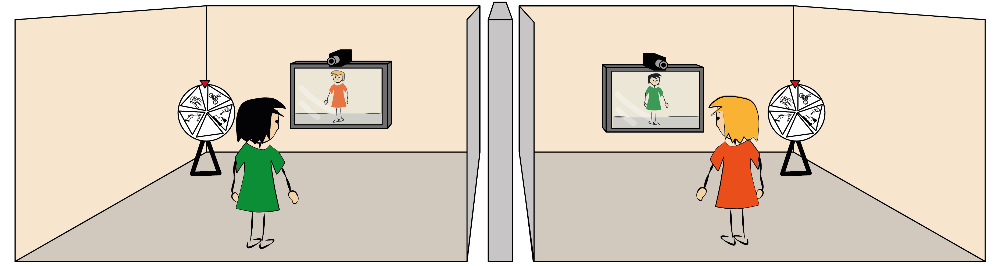
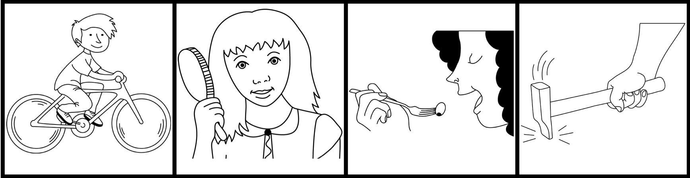
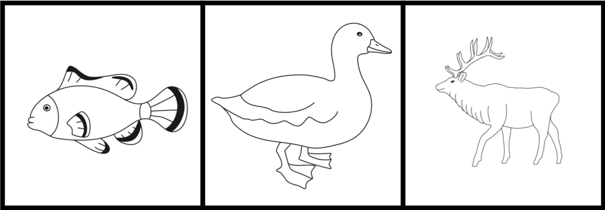
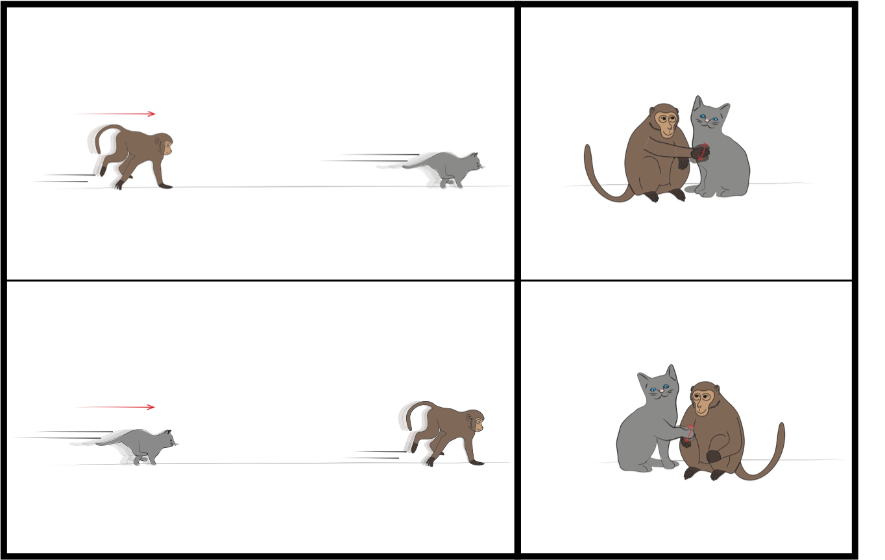

```{r global_options, include=FALSE}
knitr::opts_chunk$set(echo=TRUE, warning=FALSE, message=FALSE)
```


```{r load_packages, include = FALSE}
library(tidyverse)
library(ggthemes)
library(lme4)
library(exactRankTests)
library(ggpubr)

library(langcog)
# langcog package is installed by running
# install.packages("devtools")
# devtools::install_github("langcog/langcog")


```
# Introduction

## General setup

All studies used the same general setup and procedure. We established an audio-video connection between two separate rooms within a child laboratory (see Figure \@ref(fig:setup) for a schematic drawing). In each room a Panasonic HC-V380 video camera was mounted on a tripod which was placed behind a 27" Samsung TV screen. Each camera captured an area in front of the TV, which was marked with black tape on the floor. Children were encouraged to stay within the marked area to ensure that their partner could see them. A black cross in the center of the area marked children's starting position in each trial. A little fence was used in each room to prevent participants from approaching the TV and/or the camera. The connection was established through DVI cables that went from the camera in one room to the TV in the other room and vice versa. External microphones were plugged into the cameras to capture children's speech. The direct connection between camera and TV made sure that that participants could interact in a smooth and contingent way. One of the rooms was assigned to be the Production Room (PR) and the other the Comprehension Room (CR). A third camera was put in the back of the CR, capturing the child as well as the TV screen. This was an additional measure to ensure that we could link the two videos recorded by the two main cameras.

```{r setup, echo = F, fig.cap="Schematic drawing of the general setup", fig.align = "center"}



```

The two rooms were located on the same hallway. When stepping outside, the experimenters (E1 and E2) could easily talk to one another and coordinate their actions. In each room, we installed a picture board. Picture boards were not visible on the TV in the respective other room. In part 1, the picture board was a wooden, turn-able wheel with five triangular pictures (see Figure \@ref(fig:gesstimd1) and Figure \@ref(fig:setup)). These were 1) a hammering hand, 2) a female person combing her hair, 3) a boy on a bicycle, 4) a woman eating with a fork and 5) nothing (a white piece of paper). On top of the wheel was a little red arrow that was used to indicate which picture children had to communicate to their partner. A picture was selected by turning the wheel until the picture was on top underneath the arrow. In [part 2](#part-2-grammatical-constructions), the board was a larger, rectangular board. The pictures differed from experiment to experiment and are therefore described later. In part 2, a sticky red paper arrow was used to select a picture.

```{r gesstimd1, echo = F, fig.cap="Pictures used on day 1 of part 1", fig.align = "center"}

```

## General procedure

In the beginning of each trial, E1 was with the child in PR (Production Child - PC) and E2 with the child in CR (Comprehension Child - CC). The general trial structure in all experiments went as follows: Children were first asked to take their starting position (facing away from the board and the TV towards the wall). Next, E1 selected a picture in PR. On a visual signal from E1, both Es said "ready, set, go" and left the room. Children were now allowed to turn around. The task of the child in PR was to communicate the content of the selected picture to the child in CR. The child in CR made a choice by selecting a picture on her board and knocking on the door. Thereupon, Es opened the doors, E2 told E1 across the hallway which picture had been selected in the CR and E1 checked if this was the same picture as in the PR. If the pictures were different, children were told that it didn't work out this time but that they could try again in the next trial. If the pictures were the same, children received a marble, which they collected in a tube. At the end of the study, children exchanged the marbles for stickers. 

All experiments started with a training phase in which the video as well as the audio connection was still intact. In the beginning of the training phase, children and Es entered their respective rooms. They greeted each other through the TV and established that they could only be seen by their partner when they were inside the marked area. Next, E1 and PC "discovered" the picture board. E1 encouraged PC to ask CC if they also had a picture board in their room. When CC confirmed that they did, PC went through all pictures (including the empty one) and asked CC if had the same kind of picture on her board. This established common ground between children that they had the same pictures on their board. Es did not provide label for the pictures but let children label them. Es used whatever label children used to refer to the pictures. Next, E1 suggested that they could play a fun game in which children could win marbles. Children were told that the game involves PC communicating to CC which picture was selected on her board and CC selecting the same picture. This marked the beginning of the training phase in which the audio connection was still working. PC could therefore simply tell CC which picture was selected. The training familiarized children with the structure of the game. During training, each picture was selected once. 

After the last training trial, children were told that they could play the game in a different way to make it more fun. Children and Es left the room and met in the hallway. Next, one E went into each room and cut the audio connection by turning off the volume at each TV. To strengthen the impression that the partner could no longer hear what was being said as well as to prevent children from trying to communicate via shouting, low instrumental Jazz music was played in both rooms (Chet Baker - "Out of nowhere"). If children shouted nevertheless, the experimenters asked them to lower their voice. When children re-entered the room, each E drew their child's attention to the music and encouraged them to ask the other child whether they also heard the music. This way children discovered that they could no longer hear each other. After stating that they could not hear anybody from the other room, children and Es left the room to meet in the hallway. There they confirmed that they could not hear each other when in the room. E1 asked the children if they wanted to play the game nevertheless and also reminded them of the game's structure. Gestures as an alternative means of communication was never mentioned. Next, children went into their respective room and the first test trial started.

In each test trial, children had one minute to establish communication. If they remained passive, E1 entered the PR and prompted PC to use iconic gestures in three steps. Between prompts, she waited for 30s to see if the child would start gesturing. As first prompt, E1 said:"[CCs name] can't hear you, but she can see you, maybe you can *show* (German: zeigen) it to her". The second prompt was: "She can't hear you but she can see you, look we can wave to her, maybe you can *demonstrate* (German: vormachen) it to her". As the final prompt, she said: "Oh, I have an idea ... this way it could work" and started to perform an iconic gesture depicting the action corresponding to the selected picture. As soon as the child also used the gesture, E1 left the room and the trial continued as described above. During prompting, E2 entered CR and encouraged CC to attend to the TV. In part 2, we omitted the intermediate prompt.

## General note on participants

Children came from an ethnically homogeneous, mid-sized German city (approx. 550.000 inhabitants, median income €1767 per month as of 2017, see [Stadt Leipzig](https://statistik.leipzig.de/statcity/table.aspx?cat=9&rub=2)), were mostly mono-lingual and had mixed socio-economic background. They were recruited from a database of children whose parents volunteered to take part in studies on child development.

## General note on analysis

Stimuli, data and analysis scripts are available online at [`https://github.com/manuelbohn/ges3000`](https://github.com/manuelbohn/ges3000). To improve readability, we only report a small set of statistics in the text itself (estimates, standard errors and p-values for models and p-values for other tests). For additional information we ask the reader to directly run the code and look at the model outputs. For all analysis, we used R [@R-base] and for models we used the functions `glm` and `glmer` of the lme4 package [@R-lme4]. For mixed models we used a maximal random effect structures. Non-significant interaction terms were removed from models. P-values for fixed effects are based on likelihood ratio tests [@dobson2008introduction] which were computed via the function `drop1`.

# Part 1: Lexical items

In the first part, we were interested in how children establish reference using gestures. We first look at the spontaneous production of gestures across age groups. Next, we analysed how well the gestures that children produced were understood. Subsequently we ask whether gestures within a dyad are more similar to one another compared to gestures across dyads. Finally, we study how gestures change over time.

## Reliability coding

The hand coded dependent measures in part 1 were whether the child received a prompt and whether the gestures was understood. Across experiments, in addition to to a primary coder, a second, naive, person re-coded 25% of all test trials. Agreement between coders was 100% for prompts and 99.3% ($\kappa$ = 0.97) for comprehension. All other dependent measures were recorded via key presses on a computer.  

## 1.1: Spontaneous production of gestures by 4- and 6-year-olds

In the following, we describe the methodological details and deviations from the general protocol for each part of the studies.

### Participants
```{r part 1-1-1 data, echo = F}
d1 <- read.csv(file="data/pt1_prod_up_comp.csv") %>% 
  filter(block == "Spontaneous") %>%
  na.omit(prompts) # remove trials without response
  
```

We tested 24 same sex, same age dyads of four (mean age within dyad = `r round(mean(d1$mage[d1$age=="M48"]),2)`, range = `r round(range(d1$mage[d1$age=="M48"])[1],2)` to `r round(range(d1$mage[d1$age=="M48"])[2],2)`) and six year-old children (mean age within dyad = `r round(mean(d1$mage[d1$age=="M72"]),2)`, range = `r round(range(d1$mage[d1$age=="M72"])[1],2)` to `r round(range(d1$mage[d1$age=="M72"])[2],2)`), with 12 dyads per age group, six male and six female. Data collection took place between April and September 2016. Four additional dyads (three four-year-olds and one six-year-old) started the experiment but did not complete it. 

### Design and procedure
The test phase following the training was divided into two parts, "initiation" and "uptake". Children were first tested with all pictures except the empty picture. We reasoned that including the empty picture from the beginning might discourage children from establishing communication through gestures. The empty picture was introduced after each other picture had been selected at least once (twice for six-year-olds). The first trial of the initiation phase assessed whether children would discover the idea to use gestures to communicate independently. If the PC remained passive for one minute in the first test trial, instead of receiving prompts, children switched rooms and the former CR got a chance to spontaneously start gesturing. If the new PC remained passive for another minute, E1 started prompting. The three trials following the first trial, each with a new picture, assessed whether children would transfer the idea of using gestures. From the fifth trial onward, pictures were repeated, including the empty one.  For the second part, uptake, children switched rooms and roles. In this part, all pictures were used right away. The order in which pictures were selected was randomized with the constraint that each picture was selected once before another picture could be selected again.Six-year-olds received a total of 30 test trials, 20 in initiation and 10 in uptake. Pilot testing suggested that this was too long for the younger age group and so four-year-olds received a total of 19 test trials, 14 in initiation and 5 in uptake. 

### Results and discussion

```{r part 1-1-1, cache = F}
# do 4yo need more prompts in trial 1 than 6yo?
## filter out only trial 1
## recode prompts to ignore intermediate levels
d11.m <- d1 %>%
  filter(blocktrial == 1)%>%
  mutate(prompts = ifelse(prompts > 0,1,0))

## model for difference in trial 1
m11 <- glm(prompts ~ age , family = binomial, data = d11.m)

## p-values for model above
pm11 <- drop1(m11, test = "Chisq")

# do children get better with trials? 
## filter out only the first trials with new pictures on each trial
## center trial
## recode prompts to ignore intermediate levels

d1.m <- d1 %>%
  filter(blocktrial < 5) %>%
  mutate(blocktrial = scale(as.numeric(blocktrial), center = TRUE, scale=TRUE))%>%
  group_by(blocktrial,dyad_id,age) %>%
  summarise(prompts = sum(prompts))%>%
  mutate(prompts = ifelse(prompts > 0,1,0))

## model for difference across first 4 trials  
### non-significant interaction has been removed  
m1 <- glmer(prompts ~ blocktrial + age + (blocktrial|dyad_id), family = binomial, data = d1.m, control=glmerControl(optimizer="bobyqa",optCtrl=list(maxfun=2e5)))

## p-values for model above
pm1 <- drop1(m1, test = "Chisq")
```

Except for a single, unsuccessful attempt to use lip-reading, all children produced iconic gestures. For most children, the intermediate prompts were not helpful and we therefore do not differentiate between them in the analysis. We only analyse whether a dyad received a prompt or not. 

First we looked at the production of iconic gestures in the beginning of the test phase. Figure \@ref(fig:plot1) shows that the majority of six-year-olds spontaneously produced gestures already in trial 1, more so compared to four-year-olds (trial 1: $\beta$ = `r round(summary(m11)$coefficients[2,1], 2)`, se = `r round(summary(m11)$coefficients[2,2], 2)` *p* = `r sub('^(-)?0[.]', '\\1.', round(pm11[2,5], 3))`; trial 1-4: $\beta$ = `r round(summary(m1)$coefficients[3,1], 2)`, se = `r round(summary(m1)$coefficients[3,2], 2)` *p* = `r sub('^(-)?0[.]', '\\1.', round(pm1[3,4], 3))`). Even though four-year-olds initially only produced gestures after receiving prompts, they needed fewer prompts in later trials, showing that they transferred the idea of iconically depicting an referent to new pictures (main effect of trial: $\beta$ = `r round(summary(m1)$coefficients[2,1], 2)`, se = `r round(summary(m1)$coefficients[2,2], 2)` *p* = `r sub('^(-)?0[.]', '\\1.', round(pm1[2,4], 3))`). Thus, while both age groups successfully adopted a novel means of communication (iconic gestures) to coordinate, six-year-olds did so spontaneously while four-year-olds needed an initial hint.  

## 1.2: Spontaneous production of gestures by 3- and 4-year-olds

Part 1.2 follows up on 1.1 developmentally. We repeated the initial phase of the first study with three- and four-year-olds to investigate if and how younger children would be able to substitute speech for iconic gestures. The main focus of the study was on gesture production and so we tested children with an adult partner to streamline the procedure. We also added more pictures to prolong the phase in which children could transfer the idea of using iconic gestures to new pictures. 

### Participants
```{r part 1-1-2 data, echo = F}
d2 <- read.csv(file="data/pt1_trans_3_4.csv") 
```

Twelve three-year-olds (mean = `r round(mean(d2$mage[d2$age=="m36"]),2)`, range = `r round(range(d2$mage[d2$age=="m36"])[1],2)` to `r round(range(d2$mage[d2$age=="m36"])[2],2)`) and 12 four-year-olds (mean = `r round(mean(d2$mage[d2$age=="m48"]),2)`, range = `r round(range(d2$mage[d2$age=="m48"])[1],2)` to `r round(range(d2$mage[d2$age=="m48"])[1],2)`) participated in the study. Nine additional three-year-olds started the experiment but had to be excluded. Data was collected between January and March 2017.

### Design and procedure

The procedure was the same as for [part 1.1](#spontaneous-production-of-gestures-by 4--and-6-year-olds) with the following changes: Instead of testing peer dyads, children were tested with E2 as the CC. We removed the empty picture and used two different ones instead, one depicting a duck and the second one depicting a deer (see Figure \@ref(fig:gesstimd2)). All children received 12 trials, two trials with each picture. In the first phase (transfer), children started with the four pictures from part 1.1 in a randomized order followed by the two new pictures, also in a randomized order. In the second phase (imitation), pictures were repeated in the same way. Since there was no CC, there was no uptake phase. Pilot testing showed that three-year-olds felt uncomfortable alone in the room. Therefore E1 remained in the room throughout a trial but pretended to be working on something else while the child was communicating with E2. We dropped the intermediate prompts and E1 directly presented an iconic gesture as the solution if the child remained passive for more than 1 minute.

### Results and discussion
```{r part 1-1-2,  cache = F}
# do 3- and 4-yo differ in the rate they improve in the two phases
## center trial 
## center age
d2.m <- d2 %>%
  mutate(trial = scale(as.numeric(blocktrial), center = TRUE, scale=TRUE),
         age_c = scale(as.numeric(age)))

## model for differences in the slopes between age groups for the two phases
m2 <- glmer(prompts ~ block*age*blocktrial + (blocktrial|id) + (age_c|stimulus) , family = binomial, data = d2.m,
        control=glmerControl(optimizer="bobyqa",optCtrl=list(maxfun=2e5)))

## p-values for the model above
pm2 <- drop1(m2, test = "Chisq")

```

The right panel in Figure \@ref(fig:plot1) shows the production of iconic gestures in the transfer and imitation phase. Like in part 1.1 four-year-olds did not spontaneously create iconic gestures in trial 1 but rapidly transferred the idea of doing so to new pictures. Three-year-olds relied mostly on prompts throughout the transfer phase. In the imitation phase, at least half of the three-year-olds produced gestures independently. We confirmed the differential rate of transfer statistically in a model finding a significant three-way-interaction between age, block and trial, suggesting a steeper slope for trial for four-year-olds in the transfer but not the imitation phase ($\beta$ = `r round(summary(m2)$coefficients[8,1], 2)`, se = `r round(summary(m2)$coefficients[8,2], 2)` *p* = `r sub('^(-)?0[.]', '\\1.', round(pm2[2,4], 3))`). 

Summarizing the results for production, we may say that six-year-olds independently create iconic gestures as an alternative means of communication when spoken language cannot be used. Four-year-olds initially struggle but rapidly transfer the idea of using gestures to new instances. Three-year-olds rarely create their own gestures but mostly rely on imitating gestures they were taught by others. 

## 1.3: Uptake

Next, we investigated gesture production during uptake. That is, whether children, who previously played the role of CC, would spontaneously produce gestures when they play the role of the PC. For this analysis we return to the data set from part 1.1.

### Participants, design and procedure

See [part 1.1](#spontaneous-production-of-gestures-by 4--and-6-year-olds). 

### Results and discussion
```{r part 1-2}
# do 4- and 6yo differ in the number of prompts they need in the two conditions?
## filter out only data from uptake phase
d3 <- read.csv(file="data/pt1_prod_up_comp.csv") %>% 
  filter(block == "Uptake") %>%
  na.omit(prompts)

## we use a Wilcoxon test to compare age groups because non of the 6yo dyads needed a prompt. This resulted in a very large (unidentifiable) estimate for this group in a GLM.
d3.t <- d3 %>%  
  filter(blocktrial == 1) %>%
  group_by(age, dyad_id) %>%
  summarise(prompts = sum(prompts)) %>%
  mutate(prompts = ifelse(prompts > 0,1,0)) %>%
  summarize(prompts = list(prompts)) %>%
  spread(age,prompts) %>%
  mutate(sum4 = sum(unlist(M48)),
         sum6 = sum(unlist(M72)),
         stat = wilcox.exact(unlist(M48),unlist(M72))$statistic,
         p_value = wilcox.exact(unlist(M48),unlist(M72))$p.value)%>%
  select(sum4,sum6,stat,p_value)

# Do 4yo need fewer prompts in trial 1 during uptake compared to initiation?
## filter out only trial 1 for 4yo
## recode prompts
d3.m <- read.csv(file="data/pt1_prod_up_comp.csv") %>%  
  filter(blocktrial == 1 & age =="M48") %>%
  mutate(prompts = ifelse(prompts > 0,1,0))

## model for difference between uptake and initiation
### random intercepts for individual dyads cannot be estimated. We therefore remove this random effect
m3 <- glm(prompts ~ block , family = binomial, data = d3.m)

## p-value for model above
pm3 <- drop1(m3, test = "Chisq")

```

Panel B in Figure \@ref(fig:plot1) shows that all six-year-olds and also most of the four year-olds spontaneously produced gestures. Statistically, there was no difference between the age groups at trial 1 (*p* = `r sub('^(-)?0[.]', '\\1.', round(d3.t$p_value, 3))`, Wilcoxon test). Furthermore, fewer four-year-olds needed prompts in trial 1 during uptake compared to initiation ($\beta$ = `r round(summary(m3)$coefficients[2,1], 2)`, se = `r round(summary(m3)$coefficients[2,2], 2)` *p* = `r sub('^(-)?0[.]', '\\1.', round(pm3[2,5], 3))`). These results show that once one child established a way of referring to the pictures the other child easily picked it up. 

```{r make plot1, echo = F}
# plot for dyads producing gestures (instead of for dyads needing prompts)
d1.p <- d1 %>%  
  mutate(prompts = ifelse(prompts > 0,1,0)) %>%
  mutate(Age = ifelse(age == "M48","4yo","6yo")) %>%
  filter(blocktrial<5) %>%
  group_by(Age, blocktrial) %>%
  summarise(prompts = sum(prompts)) %>%
  mutate(prompts = 12 - prompts)%>%
  ungroup()%>%
  add_row(Age = "3yo", blocktrial = 2, prompts = -1)


plot1 <- ggplot(d1.p, 
       aes(x = blocktrial, y = prompts, col = Age)) +
  geom_line(aes(group= Age))+
  geom_point(aes(group= Age))+
  theme_few() + 
  scale_y_continuous(name = "Spontaneous Gestures", limits = c(0,12), breaks = c(0,2,4,6,8,10,12))+
  scale_x_continuous(name = "Trial", breaks = c(1:4))+
  theme_few() +
  scale_colour_manual(name="Age",
                      labels=c("3yo", "4yo","6yo"), values=c("#859900","#dc322f","#268bd2"))
```

```{r make plot2, echo = F}
# plot 
d2.p <- d2 %>%
  mutate(Age = ifelse(age == "m36","3yo","4yo")) %>%
  mutate(block = relevel(block, ref = "Transfer")) %>%
  group_by(Age,trial, blocktrial,block) %>%
  summarise(prompts = sum(prompts))%>%
  mutate(prompts = 12 - prompts)%>%
  ungroup()%>%
  add_row(Age = "6yo", blocktrial = 2, prompts = -1,block = "Transfer")

plot2 <- ggplot(d2.p, 
       aes(x = blocktrial, y = prompts, col = Age)) +
  geom_line(aes(group= Age))+
  geom_point(aes(group= Age))+
  facet_grid(~block)+
  theme_few() + 
  scale_y_continuous(name =  NULL, limits = c(0,12), breaks = c(0,2,4,6,8,10,12))+
  scale_x_continuous(name = "Trial", breaks = c(1:6))+
  scale_colour_manual(name="Age",
                      labels=c("3yo", "4yo","6yo"), values=c("#859900","#dc322f","#268bd2"))

```

```{r make plot3, echo = F}
# plot
d3.p <- d3 %>%  
  mutate(prompts = ifelse(prompts > 0,1,0)) %>%
  mutate(Age = ifelse(age == "M48","4yo","6yo")) %>%
  filter(blocktrial<6) %>%
  group_by(Age, blocktrial) %>%
  summarise(prompts = sum(prompts))%>%
  mutate(prompts = 12 - prompts)%>%
  ungroup()%>%
  add_row(Age = "3yo", blocktrial = 2, prompts = -1)

# plot
plot3 <- ggplot(d3.p, 
       aes(x = blocktrial, y = prompts, col = Age)) +
  geom_line(aes(group= Age))+
  geom_point(aes(group= Age))+
  theme_few() + 
  scale_y_continuous(name = NULL,  limits = c(0,12), breaks = c(0,2,4,6,8,10,12))+
  scale_x_continuous(name = "Trial", breaks = c(1:5))+
   scale_colour_manual(name="Age",
                      labels=c("3yo","4yo","6yo"), values=c("#859900","#dc322f","#268bd2"))

```

```{r plot1, echo = FALSE, fig.cap="Spontaneous gesture production without prompts in the first trials of the production phase of  1.1. (A), the uptake phase of 1.3 (B) and for transfer and imitation phase of part 1.2 (C).", fig.width = 10, fig.height = 3, fig.scale = 1.8}
ggarrange(plot1, plot3,plot2, ncol = 3, nrow = 1, legend = "right", common.legend = T, widths = c(1,1,2), labels = c("A","B","C"), hjust = c(-1,0.4,0),align = "h")
```

## 1.4: Comprehension

Next we looked at whether the gestures that children produced were understood by their partners. We did not have any specific hypothesis about differences between items and we therefore do not analyse them separately. Nevertheless, to give an impression of the variability in the data set, plots show the overall results as well as the results by stimulus.

### Participants, design and procedure

See 1.1. We excluded trials with the empty picture. These trials will be analysed separately in the next section. 

### Results and discussion
```{r data comprehension, echo = F}
# comprehension by phase excluding empty picture
d4 <- read.csv(file="data/pt1_prod_up_comp.csv") %>%
  filter(stimulus != "Nothing") %>%
  mutate(block = ifelse(block=="Uptake","Uptake","Initiation"))%>%
  mutate(Age = ifelse(age == "M48","4yo","6yo"))

```

```{r model comprehension, cache = F}
# do age groups differ in comprehension?
## empty picture has been removed for this analysis
## remove all trials that 6yo got more compared to 4yo
## center age, trial and block
d4.m <- d4 %>%
  filter(ifelse(block=="Uptake",blocktrial<6,blocktrial<15)) %>%
  mutate(trial = scale(as.numeric(blocktrial), center = TRUE, scale=TRUE),
         age_c = scale(as.numeric(age)),
         block_c = scale(as.numeric(factor(block))))

## model for difference between age groups
### non-sognificant higher order interactions removed
### maximal converging model (model with trial as random slope within stimulus yields problems when doing case wise deletions)
m4 <- glmer(comp ~ age+block+trial+ (trial + block_c |dyad_id) + (age_c|stimulus), family = binomial, data = d4.m,
        control=glmerControl(optimizer="bobyqa",optCtrl=list(maxfun=2e5)))

## p-value for model above
pm4 <- drop1(m4, test = "Chisq")

```

Table \@ref(tab:table1) and Figure \@ref(fig:plot2) show that that the gestures produced by the PC were generally understood by the CC in both age groups. Because six-year-olds received more trials in initiation and uptake (see [part 1.1](#spontaneous-production-of-gestures-by 4--and-6-year-olds)), we removed all trials that this age group got beyond the number that four-year-olds got for this comparison. We also removed trials with the empty picture, which we analysed separately. Comprehension improved with trial ($\beta$ = `r round(summary(m4)$coefficients[4,1], 2)`, se = `r round(summary(m4)$coefficients[4,2], 2)` *p* = `r sub('^(-)?0[.]', '\\1.', round(pm4[4,4], 3))`) and was also slightly better in uptake compared to initiation ($\beta$ = `r round(summary(m4)$coefficients[3,1], 2)`, se = `r round(summary(m4)$coefficients[3,2], 2)` *p* = `r sub('^(-)?0[.]', '\\1.', round(pm4[3,4], 3))`). We found no difference between age groups ($\beta$ = `r round(summary(m4)$coefficients[2,1], 2)`, se = `r round(summary(m4)$coefficients[2,2], 2)` *p* = `r sub('^(-)?0[.]', '\\1.', round(pm4[2,4], 3))`). This shows that children generally depicted the content of the pictures in a way that was comprehensible to their partner.

```{r table1, echo = F}

t4 <- d4 %>%
  group_by(Age, block, dyad_id)%>%
  summarise(comp = mean(comp))%>%
  summarise(comp = list(comp)) %>%
  group_by(Age, block) %>%
  mutate(df= t.test(unlist(comp), mu = 0.25)$parameter,
         mean = mean(unlist(comp)),
         t_value = t.test(unlist(comp), mu = 0.25)$statistic,
         p_value = t.test(unlist(comp), mu = 0.25)$p.value) %>%
  select(Age, block ,mean,df,t_value,p_value)%>%
  mutate(p_value = ifelse(p_value < 0.001, "<0.001",as.character(round(p_value,3))))


knitr::kable(t4, caption = "Gesture comprehension compared to chance. Statistics are based on two-tailed one sample t-tests with data aggregated for each dyad. Trials with empty pictures were excluded, hence we chose a more conservative comparison level of .25.", digits = 2)
```

```{r plot2, echo = FALSE, fig.cap="Proportion correct picture chosen by the CC by part and item. Rightmost column within each facet shows overall comprehension by part. Error bars are 95% confidence intervals based on non-parametric bootstraps.", fig.width = 10, fig.height = 3}

d4.p2 <- read.csv(file="data/pt1_prod_up_comp.csv") %>%
  mutate(block = ifelse(block=="Uptake","Uptake","Initiation"))%>%
  mutate(Age = ifelse(age == "M48","4yo","6yo")) %>%
  group_by(Age, stimulus, block, dyad_id)%>%
  summarise(comp = mean(comp))

d4.p3 <- d4.p2 %>%
  multi_boot_standard(col = "comp")

d4.p4 <- d4.p2 %>%
  group_by(Age, block, dyad_id)%>%
  summarise(comp = mean(comp)) %>%
  multi_boot_standard(col = "comp")%>%
  mutate(stimulus = "Overall")

ggplot() +
  geom_jitter(data = d4.p2, aes(x = stimulus, y = comp, col = Age), position = position_jitterdodge(jitter.width = .2, jitter.height = 0.05,dodge.width = 0.5), alpha = .5)+
  geom_pointrange(data = d4.p3,aes(x = stimulus, y = mean, col = Age,ymin = ci_lower, ymax = ci_upper), 
                  position = position_dodge(width = .5), size = 0.6) +
  geom_pointrange(data = d4.p4,aes(x = stimulus, y = mean, col = Age,ymin = ci_lower, ymax = ci_upper), 
                  position = position_dodge(width = .5), size = 1) +
  geom_hline(yintercept = 0.25, lty=2)+
  geom_vline(xintercept = 5.5, lty=1, size = 0.7)+
  guides(alpha = F)+
  facet_grid(~block)+
  labs(x="Picture")+
  scale_y_continuous(name = "Proportion Correct", limits = c(-0.05,1.05))+
  theme_few() + 
  scale_colour_solarized()
```

## 1.5: Abstract concepts (empty picture)

As mentioned above, we analysed production and comprehension separately for trials in which the empty picture was selected. In contrast to the other pictures, the empty picture did not show an action that could be turned into an iconic gesture. Children therefore had to find a different way to establish reference. On the comprehension side, children could select the empty picture either because PC's gesture successfully communicated the "emptiness" of the picture or because the gesture they saw did not match any of the other pictures. The latter was possible because we introduced the empty picture only after all other pictures had been selected at least once.

### Participants, design and procedure

see 1.1.

### Results and discussion

Children were very creative in the way they depicted the empty picture. Examples were: Pointing to something white in the room or on their clothes; ostensively standing still and doing "nothing"; holding out their hand, palm forward; shaking their head; repeatedly crossing their hands horizontally in front of their body; crossing their hands or fingers to show a cross.  

```{r part 1-4, cache = F}
# production
## filter out only trials for empty picture
d5 <- read.csv(file="data/pt1_prod_up_comp.csv") %>% 
  filter(stimulus == "Nothing") %>%
  mutate(block = ifelse(block=="Uptake","Uptake","Initiation"))%>%
  mutate(Age = ifelse(age == "M48","4yo","6yo")) %>%
  na.omit(prompts)

## do 4yo need more prompts compared to 6yo?
### None of the 6yo needed a prompt in any phase. As noted earlier this makes GLM estimation impossible. We therefore used Wilcoxon tests.

d5.t1 <- d5 %>%
  group_by(age, block, dyad_id) %>%
  summarise(prompts = sum(prompts)) %>%
  mutate(prompts = ifelse(prompts > 0,1,0)) %>%
  summarize(prompts = list(prompts)) %>%
  spread(age,prompts) %>%
  group_by(block) %>%
  mutate(sum4 = sum(unlist(M48)),
         sum6 = sum(unlist(M72)),
         stat = wilcox.exact(unlist(M48),unlist(M72))$statistic,
         p_value = wilcox.exact(unlist(M48),unlist(M72))$p.value)%>%
  select(block,sum4,sum6,stat,p_value)

# comprehension 

## do children select the correct picture above chance?
### we compare against chance per age group and phase.
### Given the low number of trials per subject, we use Wilcoxon tests instead of t-tests. 

d5.t2 <- d5 %>%
  group_by(Age, block, dyad_id)%>%
  summarise(comp = mean(comp))%>%
  summarise(comp = list(comp)) %>%
  group_by(Age,block) %>%
    mutate(mean = mean(unlist(comp)),
           stat = wilcox.exact(unlist(comp), mu = 0.25)$statistic,
           p_value = wilcox.exact(unlist(comp), mu = 0.25)$p.value) %>%
    select(Age,block,mean,stat,p_value)

# are 6yo better than 4yo at comprehension?
## remove trials that 6yo got in addition to 4yo
d5.m <- d5 %>%
  filter(ifelse(block=="Uptake",blocktrial<6,blocktrial<15))%>%
  mutate(block_c = scale(as.numeric(as.factor(block))))

## model for age difference
### model does not converge with interaction
m5 <- glmer(comp ~ age+block + (1|dyad_id), family = binomial, data = d5.m,
        control=glmerControl(optimizer="bobyqa",optCtrl=list(maxfun=2e5)))

## p-value for model above
pm5 <- drop1(m5, test = "Chisq")

```

Both age groups spontaneously produced gestures for the empty picture. Six-year-olds did not need prompts in any of the two parts. Four dyads of four-year-olds needed prompts in initiation and two did so in uptake. Statistically, there was no difference between age groups regarding the number of prompts (initiation: *p* = `r sub('^(-)?0[.]', '\\1.', round(d5.t1$p_value[1], 3))`, uptake: *p* = `r sub('^(-)?0[.]', '\\1.', round(d5.t1$p_value[2], 3))`; Wilcoxon test). 
The second row in Figure \@ref(fig:plot2) shows how well the gestures were understood by the CC. In general, children chose the correct picture above chance (all *p* < .01), except for four-year-olds in initiation (*p* = `r sub('^(-)?0[.]', '\\1.', round(d5.t2$p_value[1], 3))`, Wilcoxon test). To compare performance between age groups and blocks, we again dropped all trials that six-year-olds got more than four-year-olds. Rate of comprehension was higher for six-year-olds ($\beta$ = `r round(summary(m5)$coefficients[2,1], 2)`, se = `r round(summary(m5)$coefficients[2,2], 2)` *p* = `r sub('^(-)?0[.]', '\\1.', round(pm5[2,4], 3))`) and during the uptake part ($\beta$ = `r round(summary(m5)$coefficients[3,1], 2)`, se = `r round(summary(m5)$coefficients[3,2], 2)` *p* = `r sub('^(-)?0[.]', '\\1.', round(pm5[3,4], 3))`). Taken together, both age groups produced gestures for the empty picture. These gestures were immediately understood in the older age group and during the uptake part also in the younger one. 

## 1.6: Convergence

So far, we saw that children switched to a new modality when spoken language was no longer an option. They created iconic gestures which successfully communicated the content of the picture to their partner. In the following, we investigate whether children within a dyad would use the same kind of gesture for a given picture. To do this we compared the gestures produced in the initiation and the uptake part. We hypothesized that children within a dyad would use more similar gestures compared to children from different dyads. In general, there are many different ways to iconically depict a picture. Children within a dyad should be more similar because the PC in the uptake part (the former CC) can simply imitate the gesture she saw during the initiation part. The degree to which we can detect similarity due to imitation is limited by the variability in how children initially depict the picture. For example, if many children independently decide to depict the comb by stroking a hand across the head, similarity will be high across dyads and similarity within dyads due to imitation will be hard to detect. 

### Participants

We used the videos of children producing gestures during part 1.1. Twelve adult raters, unfamiliar with the study design and procedure, judged the similarity of gestures within dyads.

### Design and procedure

For each dyad we selected the video of the last gesture for a picture from the PC during initiation and the first gesture for the same picture from the PC (former CC) during uptake. That is, we chose the two depictions of the same picture by the two children that were closest in time. We used E-Prime (version 2.0.10.356) to set-up the rating procedure. On each trial, the rater was shown a sample video on top of the screen and two comparison videos on the bottom, one on the left and one in the right. The sample showed a child during the initiation part. One of the comparison videos showed the child from the *same* dyad during uptake whereas the other video showed a child of the same age and sex from a *different* dyad, also during uptake, also producing a gesture for the same picture. On each trial, the comparison video was randomly selected from the pool of suitable videos. Furthermore, the position of the comparison videos on the screen (left or right) was randomly determined. Raters could watch and re-watch each video multiple times. Each video was numbered (sample video was always no. 1) and raters were asked: "Which video is more similar to 1". They made a choice by pressing the respective number on the keyboard. Raters went through the videos in blocks. Each block consisted of all videos from a given age and sex for a particular picture. The order of blocks was randomized across raters. We only used videos corresponding to trials in which the child produced a gesture without prompts. This resulted in a total number of 97 sample videos.

### Results and discussion.

```{r part 1-5, cache = F}
# do raters choose the gesture from the same dyad above chance in both age groups?
d6 <- read.csv(file="data/pt1_convergence.csv") %>% 
  mutate(Age = ifelse(age == "M48","4yo","6yo"))

## do raters select the gesture from the same dyad above chance?
### we compare against chance by age group
d6.t <- d6 %>%
  group_by(Age, rater)%>%
  summarise(corr = mean(corr))%>%
  summarise(corr = list(corr)) %>%
  group_by(Age) %>%
  mutate(mean = mean(unlist(corr)),
         df= t.test(unlist(corr), mu = 0.5)$parameter,
         t_value = t.test(unlist(corr), mu = 0.5)$statistic,
         p_value = t.test(unlist(corr), mu = 0.5)$p.value) %>%
  select(Age,mean,df,t_value,p_value)%>%
  mutate(p_value = ifelse(p_value < 0.001, "<0.001",as.character(round(p_value,3))))

## do age groups differ in the rate that the gesture from the same dyad is selected?
### scale trial
d6.m <- d6  %>%
  mutate(trial = scale(as.numeric(trial), center = TRUE, scale=TRUE))

## model for age difference
### maximal converging random effect structure within rater
m6 <- glmer(corr ~ age + (trial  | rater) + (1 | video), family = binomial, data = d6.m, control=glmerControl(optimizer="bobyqa",optCtrl=list(maxfun=2e5)))

## p-value for model above
pm6 <- drop1(m6, test = "Chisq")

## do age groups differ when only trials with non-prompted pictures are considered?
### select only videos with gestures for which children did not receive a prompt
ex <- read.csv(file="data/pt1_prod_up_comp.csv") %>% 
  filter(prompts > 2)%>%
  select(video) %>%
  mutate(video = as.character(video))

d6.no.prompt <- filter(d6, !video %in% ex$video)

### scale trial
d6.m2 <- d6.no.prompt  %>%
  mutate(trial = scale(as.numeric(trial), center = TRUE, scale=TRUE))

### model for age difference
#### maximal converging random effect structure within rater
m6.2 <- glmer(corr ~ age + (trial| rater) + (1 | video), family = binomial, data = d6.m2, control=glmerControl(optimizer="bobyqa",optCtrl=list(maxfun=2e5)))

### p-value for model above
pm6.2 <- drop1(m6.2, test = "Chisq")

```

Figure \@ref(fig:plot3) shows how often the video from the same dyad was rated to be more similar to the sample video. For both age groups, raters chose the video from the same dyad above chance (both *p* < .001). In direct comparison, corresponding videos were chosen slightly more often for six- compared to four-year-olds ($\beta$ = `r round(summary(m6)$coefficients[2,1], 2)`, se = `r round(summary(m6)$coefficients[2,2], 2)` *p* = `r sub('^(-)?0[.]', '\\1.', round(pm6[2,4], 3))`). This difference might follow from the different rate of spontaneous production found in part 1.1. Six-year-olds mostly created gestures independently, probably resulting in more different gestures between dyads. Four-year-olds, on the other hand, relied more often on prompts from the experimenter. Since most prompting resulted in the experimenter showing the child an iconic gesture, four-year-olds' gestures might be more similar because many of them were imitations of the experimenter's gesture. To address this empirically, we sub-setted the data and excluded all videos showing gestures which were produced following a direct demonstration by the experimenter. In contrast to the hypothesis laid out above, excluding prompted gestures augmented rather than weakened the difference between age groups ($\beta$ = `r round(summary(m6.2)$coefficients[2,1], 2)`, se = `r round(summary(m6.2)$coefficients[2,2], 2)` *p* = `r sub('^(-)?0[.]', '\\1.', round(pm6.2[2,4], 3))`). Nevertheless, both age groups produced more similar gestures within than between dyads. 

```{r plot3, echo = FALSE, fig.cap="Proportion with which raters judged the video from the same dyad to be more similar, overall and by item. Rightmost column shows overall ratings. Dotted line indicates performance expected by chance. Error bars are 95% confidence intervals based on non-parametric bootstraps.", fig.width = 10, fig.height = 3, fig.scale = 1.5}
# plot per age group and stimulus
d6.p2 <- d6 %>%
  group_by(Age, stimulus, rater)%>%
  summarise(corr = mean(corr))

d6.p3 <- d6.p2 %>%
  multi_boot_standard(col = "corr")


d6.p4 <- d6 %>%
  group_by(Age,rater) %>%
  summarise(corr = mean(corr)) %>%
  multi_boot_standard(col = "corr") %>%
  mutate(stimulus = "Overall")


ggplot() +
  geom_jitter(data = d6.p2, aes(x = stimulus, y = corr, col = Age), position = position_jitterdodge(jitter.width = .2, jitter.height = 0.05,dodge.width = 0.5), alpha = .5)+
  geom_pointrange(data = d6.p3,aes(x = stimulus, y = mean, col = Age,ymin = ci_lower, ymax = ci_upper),position = position_dodge(width = .5), size = .6) + 
  geom_pointrange(data = d6.p4,aes(x = stimulus, y = mean, col = Age,ymin = ci_lower, ymax = ci_upper),position = position_dodge(width = .5), size = 1)+
  geom_vline(xintercept = 5.5, lty=1, size = 0.7)+
  geom_hline(yintercept = 0.5, lty=2)+
  xlab("Picture")+
  guides(alpha = F)+
  scale_y_continuous(name = "Proportion same Dyad", limits = c(-0.05,1.05))+
  theme_few() + 
  scale_colour_solarized()

```

## 1.7: Drift to arbitrary

Adult communicators streamline their communication over time by reducing the effort of each utterance [see e.g. @fay2018create; @garrod2007foundations; @10.2307/412894]. When using iconic lexical items, this might result in a "drift to the arbitrary" with items gradually losing their iconicty. In part 3 we investigated this drift to the arbitrary in children's production and comprehension of gestures.

In terms of production, we compared the first instance of a gesture for a picture to the last to see if children streamline their utterances over time. In terms of comprehension, we paired children with an adult who produced more and more abstract gestures over time.

### 1.7.1: Drift to arbitrary production

We used the videos recorded during part 1. However, because children only got up to five repetitions of the same gesture (four-year-olds only up to 3) we invited children back into the lab on a second day and repeated the procedure with fewer pictures and more repetitions per gesture. On this second day, we paired children with an adult comprehension partner.

#### Participants
```{r part 3 participants, echo = F}
d7.participants <- read.csv(file="data/pt1_drift_day2_production.csv")

d7 <- read.csv(file="data/pt1_drift_production.csv") %>% 
  mutate(Age = ifelse(age == "M48","4yo","6yo"))%>%
  filter(phase != "Uptake")  #filtering out uptake because 4yo only got 1 trial per stimulus in uptake

```

For the additional study, we invited half of the children (one from each dyad) who participated in part 1.1 on day 1 back to the lab on a second day. Three four-year-olds could not participate on the second day and were therefore replaced with new children. In sum, twelve four-year-olds (mean age = `r round(mean(d7.participants$age[d7.participants$age_group=="M48"]),2)`, range = `r round(range(d7.participants$age[d7.participants$age_group=="M48"])[1],2)` to `r round(range(d7.participants$age[d7.participants$age_group=="M48"])[2],2)`) and 12 six-year-olds (mean age = `r round(mean(d7.participants$age[d7.participants$age_group=="M72"]),2)`, range = `r round(range(d7.participants$age[d7.participants$age_group=="M72"])[2],2)`) participated in the study.

We presented the videos from day 1 and 2 to twelve adult raters, who were unfamiliar with the study design and procedure. They were asked to rate how abstract and effortful gestures were. 

#### Design and procedure

For the data collection on day 2, we made the following changes to the procedure compared to day 1. We used E2 as comprehension partner. Instead of a warm-up phase with sound, children received four training trials with the pictures from day 1, already without sound. Then the experimenter introduced the new pictures (deer, duck and fish, see Figure \@ref(fig:gesstimd2)) that were used for the remainder of the session. Children received a total of 30 test trials, 10 with each picture. The order of pictures was randomized in blocks of six, that is, each picture was selected twice before another picture could be selected a third time. Children who did not participate on day 1, received additional training trials with sound and were prompted to use gestures if they did not do so spontaneously.

```{r gesstimd2, echo = F, fig.cap="Pictures used on day 2 of part 1", fig.align = "center"}

```

The rating procedure was similar to the one used in part 2. For each child, we selected the first and the last gesture for a picture. That is, we used the two depictions for the same picture that were furthest apart in time. From day 1, we only used gestures produced during initiation because four-year-olds only received one trial with each picture during uptake. Again, we used E-Prime (version 2.0.10.356) to set-up the rating procedure. On a trial, the rater was shown the two videos from a child with a given picture, one showing the first and the other showing the last gesture production. The position of each video (left and right) was randomly determined. The two videos were numbered and raters could select them by pressing the corresponding number on the keyboard. On each trial, raters could watch and re-watch the videos as they liked. The first rating question was always "Which of the two gestures is more abstract?" and the second question was "Which of the two gestures is more effortful?". Before going through the videos, raters read descriptions of what was meant by the two rating categories "abstract" and "effortful". We defined abstract as: less iconic, less elaborate, harder to recognize, involving fewer elements in representing the picture, less evocative of the picture. Effortful was defined as: more energetic, more motivated, more engaged, requiring more energy.

Raters went through the videos in blocks. Each block consisted of all videos from a given age and sex for a particular picture. Raters were shown the picture that was used as stimulus for children in the beginning of each block. Order of blocks was randomized across raters. Like in part 2, we only used videos from trials in which the child produced the gesture spontaneously. In total, there were 168 video pairs.

#### Results and discussion
```{r part 3 production, cache = F}

# influence of age and effort per day. 
## day 1
### center variables 
d7.m1 <- d7 %>%
  filter(day == "Day1")%>%
  mutate(trial = scale(trial),
         age_c = scale(as.numeric(age)),
         stimulus = scale (as.numeric(stimulus)))

### model for einfleunce of effort and age differences on day 1
#### maximal converging random effect structure within rater
m7.1 <- glmer(abs ~ age + effort + (trial + age_c + stimulus | rater) + (1 | video), family = binomial, data = d7.m1, control=glmerControl(optimizer="bobyqa",optCtrl=list(maxfun=2e5)))

#### p-value for model above
pm7.1 <- drop1(m7.1, test = "Chisq")

##day2
### center variables 
d7.m2 <- d7 %>%
  filter(day == "Day2")%>%
  mutate(trial = scale(trial),
         age_c = scale(as.numeric(age)),
         stimulus = scale (as.numeric(stimulus)))

### model for einfleunce of effort and age differences on day 2
#### maximal converging random effect structure within rater
m7.2 <- glmer(abs ~ age + effort + (trial + age_c + stimulus + sex | rater) + (1 | video), family = binomial, data = d7.m2, control=glmerControl(optimizer="bobyqa",optCtrl=list(maxfun=2e5)))

#### p-value for model above
pm7.2 <- drop1(m7.2, test = "Chisq")
```

We analysed the data for the two days separately because children were tested with different pictures. Table \@ref(tab:table2) and Figure \@ref(fig:plot4) show abstractness ratings compared to chance level. These results indicate that raters generally rated the later gestures to be more abstract. Figure \@ref(fig:plot4) shows the relation between ratings for effort and abstractness.

We analysed the influence of age and effort on abstractness ratings for each day. For day 1, six-year-olds' later gestures were rated as more abstract more often compared to four-year-olds' ($\beta$ = `r round(summary(m7.1)$coefficients[2,1], 2)`, se = `r round(summary(m7.1)$coefficients[2,2], 2)` *p* = `r sub('^(-)?0[.]', '\\1.', round(pm7.1[2,4], 3))` ). Ratings of abstractness were strongly influenced by ratings of effort  ($\beta$ = `r round(summary(m7.1)$coefficients[3,1], 2)`, se = `r round(summary(m7.1)$coefficients[3,2], 2)` *p* = `r sub('^(-)?0[.]', '\\1.', round(pm7.1[3,4], 3))`). The age difference on day 1 might be due to the fact that six-year-olds received more trials with each picture on day 1. If this would be the case, the age difference should disappear on day 2 when both age groups received the same number of trials. Model results show that this was the case. On day 2, abstractness ratings were again strongly influenced by effort ($\beta$ = `r round(summary(m7.2)$coefficients[3,1], 2)`, se = `r round(summary(m7.2)$coefficients[3,2], 2)` *p* = `r sub('^(-)?0[.]', '\\1.', round(pm7.2[3,4], 3))`) but, in contrast to day 1, not by age ($\beta$ = `r round(summary(m7.2)$coefficients[2,1], 2)`, se = `r round(summary(m7.2)$coefficients[2,2], 2)` *p* = `r sub('^(-)?0[.]', '\\1.', round(pm7.2[2,4], 3))`). This pattern of results suggests that gestures became more abstract over time because children reduced the effort put into each depiction. The differential age effect further suggests that this is a function of the number of repetitions of each gesture.

```{r table2, echo = F}
t7 <-d7 %>%
  group_by(Age, day, rater)%>%
  summarise(abs = mean(abs))%>%
  summarise(abs = list(abs)) %>%
  group_by(Age, day) %>%
  mutate(mean = mean(unlist(abs)),
         df= t.test(unlist(abs), mu = 0.5)$parameter,
         t_value = t.test(unlist(abs), mu = 0.5)$statistic,
         p_value = t.test(unlist(abs), mu = 0.5)$p.value) %>%
  select(Age,day,mean,df,t_value,p_value) %>%
  mutate(p_value = ifelse(p_value < 0.001, "<0.001",as.character(round(p_value,3))))


knitr::kable(t7,caption = "Abstractness ratings for gestures compared to chance. Statistics are based on two-tailed one sample t-tests with data aggregated for each rater. Chance comparison level is .5.", digits = 2)
```

```{r make plot6, echo = F}
d7.p2 <- d7 %>%
  group_by(Age, day, stimulus, rater)%>%
  summarise(abs = mean(abs))

d7.p3 <- d7.p2 %>%
  multi_boot_standard(col = "abs")


d7.p4 <- d7 %>%
  group_by(Age,day,rater) %>%
  summarise(abs = mean(abs)) %>%
  multi_boot_standard(col = "abs") %>%
  mutate(stimulus = "Overall")

plot6 <-ggplot() +
  geom_jitter(data = d7.p2, aes(x = stimulus, y = abs, col = Age), position = position_jitterdodge(jitter.width = .2, jitter.height = 0.05,dodge.width = 0.5), alpha = .5)+
  geom_pointrange(data = d7.p3,aes(x = stimulus, y = mean, col = Age,ymin = ci_lower, ymax = ci_upper),position = position_dodge(width = .5), size = 0.6) +
  geom_pointrange(data = d7.p4,aes(x = stimulus, y = mean, col = Age,ymin = ci_lower, ymax = ci_upper),position = position_dodge(width = .5), size = 1) +
  geom_hline(yintercept = 0.5, lty=2)+
  facet_grid(~day,scales = "free_x", space = "free_x", drop = T)+
  guides(alpha = F)+
  scale_y_continuous(name = "Proportion later gesture", limits = c(-0.05,1.05))+
  xlab("Picture")+
  theme_few() + 
  scale_colour_solarized()

```


```{r make plot7, echo = F}

d7.p5 <- d7 %>%
  group_by(Age,day,video,stimulus) %>%
  summarise(abs = mean(abs),
            eff = mean(effort))

plot7 <- ggplot(data = d7.p5,aes(x = eff, y = abs, col = Age)) +
  geom_jitter(width = .05,height = .05, alpha = 0.7)+
  geom_smooth(method = "lm", se = T)+
  geom_abline(intercept = 1, slope = -1, lty = 2, alpha = 0.5)+
  theme_few() +
  facet_wrap(~day)+
  xlab("Effort")+
  ylab("Abstractness")+
  #stat_cor(aes(col = Age), method = "pearson", label.x = 0.25,label.y = c(0,0.1),show.legend = F)+
  scale_colour_solarized()+
  coord_fixed()
```

```{r plot4, echo = FALSE, fig.cap="Proportion with which raters judged the later gesture to be more abstract, overall by day and by item. Dotted line indicates performance expected by chance. Error bars are 95% confidence intervals based on non-parametric bootstraps. B: Relation between ratings of abstractness and effort for each day. Each dot represents the mean rating across raters for a video pair across. Regression lines show smoothed conditional means per age group with 95% confidence intervals.", fig.width =10, fig.height = 8, fig.scale = 1.5}

ggarrange(plot6, plot7, ncol = 1, nrow = 2, legend = "right", common.legend = T, labels = c("A","B"), align = "h")
```

### 1.7.2: Drift to arbitrary comprehension
The previous section showed that children's gestures became more abstract over time, presumably because features of the initial depictions were dropped in order to reduce production effort. However, the gestures produced by children towards the end of the study were still highly iconic. We therefore investigated whether children would comprehend gestures that become more and more arbitrary over time, up to a point where they bear no direct iconic correspondence to the original picture. In order to comprehend them at the final stage, children had to keep track of each gesture as it was drifting towards the arbitrary. We contrasted performance in this condition with that of naive children who only saw the initial iconic depictions and the final abstract   depictions but not the intermediate stages.

#### Participants
```{r drift comprehension participants, echo = F}
d8 <- read.csv(file="data/pt1_drift_comprehension.csv", sep = ";") %>% 
  mutate(condition = ifelse(condition == "Abstract", "Abstract", "Iconic"))%>%
  mutate(condition = as.factor(condition))%>%
  mutate(Age = ifelse(age == "M48","4yo","6yo"))%>%
  mutate(phase = ifelse(phase == "test", "Test", "Control"))%>%
  mutate(phase= as.factor(phase))

```

We invited the other half of children per age group from day 1 back to the lab to participate in the drift to the arbitrary comprehension game. For the control condition, we recruited the same number of children per age group from local kindergartens. In total 24 four-year olds (mean age = `r round(mean(d8$i_age[d8$age=="M48"]),2)`, range = `r round(range(d8$i_age[d8$age=="M48"])[1],2)` to `r round(range(d8$i_age[d8$age=="M48"])[2],2)`) and 24 six-year-olds (mean age = `r round(mean(d8$i_age[d8$age=="M72"]),2)`, range = `r round(range(d8$i_age[d8$age=="M72"])[1],2)` to `r round(range(d8$i_age[d8$age=="M72"])[2],2)`) participated in the study. Three four-year-olds from day 1 could not come back on the second day and were therefore replaced with children who were naive to the procedure.

#### Design and procedure
Data in the control condition was collected prior to the test condition. The logic behind this order was that we wanted to find abstract depictions for the pictures that children would not spontaneously understand. After showing that this was the case for one set of depictions, we tested whether children would understand these abstract forms if they had been tested on intermediate (more iconic) versions as before

##### Control
Children in the control condition were tested in a separate room in their kindergarten. Videos were played on a 15 inch laptop located on a table. The pictures to which the gestures corresponded were put on the table between child and laptop. They were the same as the ones that would be later used in the test condition (deer, duck and fish, see Figure \@ref(fig:gesstimd2)). Children responded by pointing to or naming a picture. The videos showing the iconic and abstract depiction of each stimulus were pre-recorded in the same setup and involving the same experimenters as in the test condition. Children were instructed that they would see videos in which someone would depict one of the pictures in front of them and their task would be to guess which picture it was. As a warm-up, children received two training trials with videos of iconic depictions of different pictures (Tiger and Elephant). Subsequently, children received six test trials: first three with abstract gestures and then three with iconic gestures (each time, one trial per picture). Like children in the test condition, they received differential feedback on whether their gesture was correct. The order of stimuli was counterbalanced within trials of abstract and iconic depictions. Abstract gestures corresponded to stage 5 and iconic to stage 1 depictions described below.

##### Test
The general setup and procedure for the test condition (drift to the arbitrary) were similar to day 1. Children played the role of the CC but instead of a peer, they were paired with an adult production partner. As a warm-up, children received one trial with each of the pictures from day 1. Children who did not participate in day 1, received additional training trials with sound. After the warm-up, the pictures were changed to test pictures (deer, duck and fish, same as in the previous section). Each child received 30 trials. There were 5 stages of abstraction with six trials (two per picture) per stage. The order of pictures within each stage was randomized. Gestures became more abstract in that elements of the iconic depictions were removed and aspects of the original gestures were depicted in a different way. Sample videos can be found in the online repository. Below are detailed descriptions of the gestures from each stage for each picture:  

*Deer*:

Stage 1: The experimenter stretched out both arms over her head and spread her fingers as if depicting the deer's antlers. In addition she moved her upper body up and down and left and right. Stage 2: Both arms as well as fingers were stretched out next to the head but upper body was not moved. Stage 3: Instead of stretching out the arms, the experimenter depicted the distance that the arm/antler previously covered vertically next to her head. That is she depicted the length by putting one arm, palm facing outwards close to her neck and her second arm, palm facing inwards, away from her head at the point where her outstretched arm previously ended. She did so both on the left and the right side of her head. Stage 4: the length was only depicted on one side of the head. Stage 5: Instead of depicting the length next to her head, the experimenter depicted the length horizontally in front of her body (same hand position as in previous depiction). 
 
*Duck*:

Stage 1: The experimenter bent her elbows, bringing her hands to her chest to depict the duck's wings. In addition she squatted, waddled around while moving her head and bent arms up and down to depict flapping the wings. Stage 2: Elbows were again bent and arms in front of her chest. Arms and head were moved up and down to depict flapping of wings. Squatting and moving around were omitted. Stage 3: Experimenter bent her elbows but put them down straight on the side (no flapping) while shrugging her shoulders. In addition eyebrows were moved up and down. Stage 4: No bending of arms, only shrugging shoulders and moving eye-brows up and down. Stage 5: Only the eyebrows were moved up and down. 

*Fish*:

Stage 1: The experimenter put her palms together in front of her body, with arms stretched out and moved her arms in a curling motion left and right, while slowly moving forwards. In addition, she opened and closed her mouth. Stage 2: Only the right arm was used to make a curling motion in front of her body. She continued to open and close her mouth. Moving forward was omitted. Stage 3: Opening and closing of the mouth was omitted. Her left arm was held horizontally in front of her body (depicting a surface). The right arm made again the curling motion but ended with a little twist so that the right hand vertically hit the left hand (as if the fish (right hand) was jumping into the water (left hand)). Stage 4: Same as before but the curling motion of the right hand was omitted. The right hand was moved in a semi-circular motion to hit the left hand vertically. Stage 5: Only the left hand was held in front of the body. 

#### Results and discussion

```{r drift comprehension model, cache = F}
# do test and control group differ with iconic gestures
## filter out only iconic condition
## scale trial and age
d8.m1 <- d8  %>%
  filter(condition == "Iconic") %>%
  mutate(trial = scale(as.numeric(trial), center = TRUE, scale=TRUE),
         age_c = scale(as.numeric(age)))

## model for difference between group and ages
### model does not converge with random slope for trial within id
m8.1 <- glmer(corr ~ age + phase + (1| id) + (age_c | stimulus), family = binomial, data = d8.m1, control=glmerControl(optimizer="bobyqa",optCtrl=list(maxfun=2e5)))

## p-value for model above
pm8.1 <- drop1(m8.1, test = "Chisq")

# do test and control group differ with iconic gestures
## filter out only abstract condition
## scale trial and age
d8.m2 <- d8  %>%
  filter(condition == "Abstract") %>%
  mutate(trial = scale(as.numeric(trial), center = TRUE, scale=TRUE),
         age_c = scale(as.numeric(age)))

## model for difference between group and ages
m8.2 <- glmer(corr ~ age + phase + (trial | id) + (age_c | stimulus), family = binomial, data = d8.m2, control=glmerControl(optimizer="bobyqa",optCtrl=list(maxfun=2e5)))

## p-value for model above
pm8.2 <- drop1(m8.2, test = "Chisq")
```
To have the same number of trials in test and control, we selected only children's first encounter with the abstract and iconic depictions of each picture in the test condition. Figure \@ref(fig:plot5) summarizes performance in each condition, per age group and gesture type. Both age groups performed above chance when seeing iconic gestures in the two conditions (see Table \@ref(tab:table3)). Furthermore, when looking at iconic gestures, performance did not differ between control and test condition ($\beta$ = `r round(summary(m8.1)$coefficients[3,1], 2)`, se = `r round(summary(m8.1)$coefficients[3,2], 2)` *p* = `r sub('^(-)?0[.]', '\\1.', round(pm8.1[3,4], 3))`). Six-year-olds showed a trend towards better performance compared to four-year-olds ($\beta$ = `r round(summary(m8.1)$coefficients[2,1], 2)`, se = `r round(summary(m8.1)$coefficients[2,2], 2)` *p* = `r sub('^(-)?0[.]', '\\1.', round(pm8.1[2,4], 3))`).

Performance was at chance level for children in the control condition. As noted above, this served as a validation for the abstractness of the gestures. Importantly, the same gestures were comprehended above chance in the test condition (Table \@ref(tab:table3)). Furthermore children in the test outperformed children in the control condition on abstract gestures ($\beta$ = `r round(summary(m8.2)$coefficients[3,1], 2)`, se = `r round(summary(m8.2)$coefficients[3,2], 2)` *p* = `r sub('^(-)?0[.]', '\\1.', round(pm8.2[3,4], 3))`), with no difference between age groups ($\beta$ = `r round(summary(m8.2)$coefficients[2,1], 2)`, se = `r round(summary(m8.2)$coefficients[2,2], 2)` *p* = `r sub('^(-)?0[.]', '\\1.', round(pm8.2[2,4], 3))`). In sum, we found that children of both age groups successfully retained the meaning of a gesture when its form gradually drifted from iconic to arbitrary. 

```{r table3, echo = F}
# Comparing comprehension against chance (25% correct)
### t-tests against chance per age group, day and phase
t8 <- d8 %>%
  group_by(Age,condition, phase, id)%>%
  summarise(corr = mean(corr))%>%
  summarise(corr = list(corr)) %>%
  group_by(Age,condition, phase) %>%
  mutate(mean = mean(unlist(corr)),
         df= t.test(unlist(corr), mu = 1/3)$parameter,
         t_value = t.test(unlist(corr), mu = 1/3)$statistic,
         p_value = t.test(unlist(corr), mu = 1/3)$p.value) %>%
  select(Age,phase,condition,mean,df,t_value,p_value)%>%
  mutate(p_value = ifelse(p_value < 0.001, "<0.001",as.character(round(p_value,3))))


knitr::kable(t8, caption = "Gesture comprehension compared to chance for iconic and abstract gestures in test and control condition. Statistics are based on two-tailed one sample t-tests with data aggregated for each participant. Chance level = .33.", digits = 2)
```

```{r plot5, echo = FALSE, fig.cap="Proportion correct picture chosen by age group and condition. Dotted line indicates performance expected by chance. Error bars are 95% confidence intervals based on non-parametric bootstraps.", fig.width = 10, fig.height = 3.5}
# plot per age group, condition and phase
d8.p <- d8 %>%
  mutate(condition = relevel(condition, ref = "Iconic")) %>%
  group_by(Age, condition, phase,id)%>%
  summarise(corr = mean(corr))

d8.p1 <- d8.p %>%
  multi_boot_standard(col = "corr")

ggplot() +
  geom_jitter(data = d8.p, aes(x = phase, y = corr, col = Age), position = position_jitterdodge(jitter.width = .2, jitter.height = 0.05,dodge.width = 0.5), alpha = .5)+
  geom_pointrange(data = d8.p1,aes(x = phase, y = mean, col = Age,ymin = ci_lower, ymax = ci_upper),position = position_dodge(width = .5), size = 1) + 
  geom_hline(yintercept = 1/3, lty=2)+
  facet_grid(~condition)+
  guides(alpha = F)+
  xlab("Phase")+
  scale_y_continuous(name = "Proportion correct", limits = c(-0.05,1.05))+
  theme_few() + 
  scale_colour_solarized()
```

## Interim discussion

Part 1 documented how children constructed a basic communication system in a peer context. We found that children spontaneously used iconic gestures to refer to the content of the pictures. The gestures that were used to do so, were more similar within dyads than between dyads, suggesting that children started conventionalizing their means of communication. Over time, children's gestures became more abstract, presumably because children put less effort into the production of each gesture. Children also retained the meaning of gestures that gradually became less iconic. Taken together, the rudimentary communication systems developed here share some important aspects with symbolic language. In the next section we studied how children would communicate more complex meanings. 

# Part 2: Grammatical constructions

In this part, we investigated how children disambiguate between depictions of the same referent with varying properties. We contrasted moving vs. static referents, differences in number, differences in size as well as transitive actions between multiple referents. Our main focus was whether children would spontaneously create compositional gesture sequences reminiscent of grammatical constructions. That is, sequences in which separate gestures are used to denote properties of the referent (predicates) and/or sequences in which the order of gestures specifies the meaning of the sequence. In both cases, each gesture of the sequence alone would not be sufficient to retain the intended meaning. In addition, different meanings could be communicated by changing individual elements of the sequence, either in kind or in relative order.

In each of the following experiments, we first coded if children differentiated between different instantiations of the same referent. For the cases in which they did, we looked at the kind of gesture they used and more specifically at whether they used a single holistic gesture or a compositional gesture sequence to differentiate. Finally, in case children used a gesture sequence, we documented the order of elements, differentiating between subjects (agents), predicates (adjectives or verbs) and objects (patients). 

The basic setup and procedure were the same as described in the [beginning](#general-setup). The pictures changed from experiment to experiment and are therefore described in the respective sections. In each experiment, children started with one set of pictures. Towards the end of the experiment, we introduced new pictures to see whether children would transfer their way of gesturing to new referents.

Our main focus was on gesture production and for practical reasons we paired children with an adult comprehension partner. As a benefit, this decreased the likelihood that gestures would not be understood because the partner was inattentive or otherwise distracted. For the first three experiments, we tested six and eight year old children. In the fourth and fifth experiment, we only tested eight year olds as pilot testings indicated the task to be very demanding for the younger age-group.

## Coding details

First we coded whether children differentiated between the instantiations of a given referent. That is, whether they used different gestures or gesture sequences for different pictures including the same referent (i.e. large hammer and small hammer). For movement, number and size this was a relative code, that is, only after seeing the gestures for two instantiations of the same referent, we were able to tell if they differentiated between them. For this reason, we coded the way that children differentiated (gesture type - see below) only for one picture of the pair. We chose to do so for the pictures that were introduced later. For transitive 2 and 3, we coded as differentiation in each trial if children depicted all elements that were necessary to uniquely identify the picture given the context of other pictures. For each trial, we also coded the gesture type, which was a descriptive code that captured the way children differentiated. The particular ways children differentiated between instantiations are described separately for each experiment.   

Next, for the cases in which children differentiated, we coded whether they used a single holistic gesture or a compositional gesture sequence. To qualify as a sequence, there had to be at least two semantically distinct gestures in the sequence. That is, we did not code repetitions of the same gesture as a gesture sequence. Furthermore, different gestures had to map on to the dimension on which depictions of the referents differed. For example, if the child used two distinct gestures to identify the referent but did not use a separate gesture for the property, we did not code this as a gesture sequence (e.g. for turning elephant: crossing arms to show a trunk followed by stomping while simultaneously turning). If the child used an additional gesture to depict the property of the referent, this was coded as a sequence (e.g. for turning elephant: crossing arms for trunk followed by moving the hand in a circular motion). Our reasoning was that in order to qualify as compositional, the sequences should feature gestures that could be recombined with other referents to communicate different meanings. For example, the turning gesture described above could easily be combined with gestures for duck or ball. 

In case of a gesture sequence, we coded the order of elements according to their syntactic role. We differentiated between gestures for subjects (S), that is agents or objects that either had a property or were the agent in a transitive interaction (e.g. hammer in *large hammer* or monkey in *monkey chase cat*), predicates (P), that is properties or actions (e.g. large in *large hammer* or chase in *monkey chase cat*), and objects (O), which only occurred as patients in depictions of transitive actions (e.g. cat in *monkey chase cat*). We also counted the number of elements in a gesture sequence. We were primarily interested in the number of distinct elements and therefore ignored gesture repetitions for this count. For example, If the child repeated the gesture for hammer twice before making the gesture for large, we coded this as S-P and counted 2 elements. Also, if elements were depicted by two seperate gestures (as in the example for elephant above), we counted this as a single item. The element count, therefore, reflected the complexity of the sequence by representing the number of elements that had to be related to one another in order to recover the intended meaning.

For each experiment, we report a short overview of the results. That is, we report the rate at which children differentiated between different instantiations, the relation between differentiation and comprehension, as well as the rate of compositional gesture sequences for cases in which children differentiated. A more comprehensive analysis using data from all experiments reported in part 2 is presented towards the [end](#part-2-overall-analysis).

### Reliability coding

A second coder re-coded 25% of test trials. Agreement between raters was 94% for differentiation ($\kappa$ = 0.80), 92% for gesture type ($\kappa$ = 0.90), 98% for compositional nature of the gesture ($\kappa$ = 0.93) and 92% for word order ($\kappa$ = 0.88).

```{r data part 2, echo = F}
#loading data for part 2
gram_data <- read.csv(file="data/pt2_data.csv")

```

## 2.1: Movement

```{r move data, echo=F}
move_data <- gram_data %>%
  filter(condition == "movement")
```
In this part, we varied the way an object or agent was moving. Each referent was depicted twice, once in a static and once in a moving fashion.

### Participants

```{r gram data, echo = F}
p2.move.p <- gram_data %>% 
  filter(condition == "movement")%>%
  group_by(age)%>%
  summarise(n = length(unique(id)),
            mean_age = mean(nage),
            l_range = range(nage)[1],
            u_range = range(nage)[2])

```
We tested 24 children, 12 six-year-olds (mean age = `r round(p2.move.p$mean_age[1],2)`, range = `r round(p2.move.p$l_range[1],2)` to `r round(p2.move.p$u_range[1],2)`) and 12 eight-year-olds (mean age = `r round(p2.move.p$mean_age[2],2)`, range = `r round(p2.move.p$l_range[2],2)` to `r round(p2.move.p$u_range[2],2)`) with six boys and six girls per age group. Children were sampled from the same population as in part 1. Data collection took place between August and November 2017. One additional six-year-old started the experiment but did not complete it.

### Design and procedure

The basic design and procedure were the same as described in the [beginning](#general-setup). Children first interacted with their partner with the sound still working. Pictures in this phase were static depictions of three different referents (out of five: cat, goose, elephant, monkey and ball, see Figure \@ref(fig:movestim)). After the sound training (one trial per picture), they briefly left the room. When returning, they experienced that the sound was not working anymore. E1 told them that they could still continue to play the game and prompted children to use gestures if needed. The first six trials with gestures were training trials with static pictures only. Hereafter, E1 entered the room and told the child that they would now play the game with more pictures. For each static picture, E1 introduced a picture showing the same referent in a particular motion. Each child saw one type of movement ("jumping", "running" and "turning" - see Figure \@ref(fig:movestim). To make it common ground that their partner had the same pictures, E1 showed every picture to the child and then held it up into the camera. At the same time, the comprehension partner held up the same picture into their camera. When introducing a picture, E1 always labelled its content in present tense (e.g. "This is a jumping monkey"). After that, the game continued without any further instructions or prompts. Each of the now six pictures was selected three times in a random order with the constraint that each picture was selected once before another picture could be selected again. After 18 test trials, E1 introduced the two remaining static referents along with their moving equivalents. This transfer phase continued for another 8 trials during which each of the new pictures was selected twice. The adult partner was naive about the selected picture and was instructed to try their best to understand the child's gesture. Like in part 1, children received differential feedback about their partner's comprehension  

```{r movestim, echo = F, fig.cap="Pictures used in the movement experiment. Each child saw one type of movement.", fig.align = "center"}


```

### Results and discussion

```{r move model, cache = F}
# influence of age and differentiation on comprehension
## scale variables
dmove.m1 <- move_data  %>%
  mutate(block = relevel(block, ref = "variations"),
         block_c = scale(as.numeric(block))) %>%
  group_by(block)%>%
  mutate(trial = scale(as.numeric(trial), center = TRUE, scale=TRUE),
         age_c = scale(age))

## model for differentiation and age
mmove.1 <- glmer(compr ~ Age + diff + trial + block + (trial + block_c | id) + (age_c | stimulus), family = binomial, data = dmove.m1, control=glmerControl(optimizer="bobyqa",optCtrl=list(maxfun=2e5)))

## p-value for model above
pmmove.1 <- drop1(mmove.1, test = "Chisq")

```
Figure \@ref(fig:plot6) summarizes the results of this experiment. Children of both age groups successfully differentiated between different instantiations of the same referent in the majority of trials. We coded three different gesture types (see also panel B in Figure \@ref(fig:vardifftype). The code "enact" reflected trials in which children enacted the way the referent moved at the same time as they were depicting the referent. For example, to depict a turning monkey, the child scratched their head (for "monkey") while turning (for "turn"). One child used the number of repetitions of the gesture to indicate movement ("running"). For example, they would make one somersault for a static ball and multiple somersaults for the "running" ball. We used the code "repeat" to capture this. The code "compositional" denotes compositional gesture sequences. For example, children would first scratch their head (for "monkey") and then, in a seperate gesture, move their index finger in a circular motion in front of their body. Enact gestures were the most frequent type. Children were fairly consistent in their use of gesture types and the majority of children used only a single type (see Figure \@ref(fig:vardifftype). The right graph in Figure \@ref(fig:plot6) (C) shows the proportion of compositional gesture sequences. We found that differentiation greatly enhanced gesture comprehension ($\beta$ = `r round(summary(mmove.1)$coefficients[3,1], 2)`, se = `r round(summary(mmove.1)$coefficients[3,2], 2)` *p* = `r sub('^(-)?0[.]', '\\1.', round(pmmove.1[3,4], 3))`, see also middle plot in Figure \@ref(fig:plot5). There was no difference between age groups($\beta$ = `r round(summary(mmove.1)$coefficients[2,1], 2)`, se = `r round(summary(mmove.1)$coefficients[2,2], 2)` *p* = `r sub('^(-)?0[.]', '\\1.', round(pmmove.1[2,4], 3))`). There was no effect of trial ($\beta$ = `r round(summary(mmove.1)$coefficients[4,1], 2)`, se = `r round(summary(mmove.1)$coefficients[4,2], 2)` *p* = `r sub('^(-)?0[.]', '\\1.', round(pmmove.1[4,4], 3))`) or block ($\beta$ = `r round(summary(mmove.1)$coefficients[5,1], 2)`, se = `r round(summary(mmove.1)$coefficients[5,2], 2)` *p* = `r sub('^(-)?0[.]', '\\1.', round(pmmove.1[5,4], 3))`). The result for block suggests that children were able to transfer whatever solution they found in the first part of the experiment to new pictures.

```{r plot6, echo = F, fig.cap="A: Proportion of gestures for which children differentiated between the two instantiations of the referent. B: Rate of gesture comprehension by differentiation. Dotted line indicates comprehension expected by chance. C: Proportion of compositional solutions for gestures in which children differentiated and which were understood. Error bars are 95% confidence intervals based on non-parametric bootstraps.", fig.width = 10, fig.height = 3, fig.scale = 1}
# Proportion differentiate
mp1 <- move_data %>%
  group_by(Age,id)%>%
  summarise(diff = mean(diff == "yes"))
  
mp2 <- mp1 %>%  
  multi_boot_standard(col = "diff")


move_diff <- ggplot() +
  geom_jitter(data = mp1, aes(x = 1, y = diff, col = Age), position = position_jitterdodge(jitter.width = .2, jitter.height = 0.05,dodge.width = 0.5))+
  geom_pointrange(data = mp2,aes(x = 1, y = mean, col = Age,ymin = ci_lower, ymax = ci_upper),position = position_dodge(width = .5), size = 0.7) +
  guides(alpha = F)+
  scale_y_continuous(name = "Differentiate = yes", limits = c(-0.05,1.05))+
  #xlab("Differentiate between ambiguous stimuli")+
  #ggtitle("Differentiation")+
  theme_few() +
  scale_colour_manual(name="Age",
                      labels=c("6yo","8yo"), values=c("#268bd2","#b58900"))+
  theme(axis.title.x= element_blank(),axis.text.x= element_blank(), axis.ticks.x = element_blank())


# Proportion comprehension by differentiation
mp3 <- move_data %>%
  group_by(Age,diff,id)%>%
  summarise(compr = mean(compr))
  
mp4 <- mp3 %>%  
  multi_boot_standard(col = "compr")

move_comp <- ggplot() +
  geom_jitter(data = mp3, aes(x = diff, y = compr, col = Age), position = position_jitterdodge(jitter.width = .2, jitter.height = 0.05,dodge.width = 0.5), alpha = .5)+
  geom_pointrange(data = mp4,aes(x = diff, y = mean, col = Age,ymin = ci_lower, ymax = ci_upper),position = position_dodge(width = .5), size = 0.7) +
  guides(alpha = F)+
  scale_y_continuous(name = "Comprehension", limits = c(-0.05,1.05))+
  xlab("Differentiate")+
  geom_hline(yintercept = 1/6, lty=2)+
  theme_few() +
  scale_colour_manual(name="Age",
                      labels=c("6yo","8yo"), values=c("#268bd2","#b58900"))


# Proportion compositional gesture sequences
mp5 <- move_data %>%
  filter(diff == "yes",
         predicate != "static")%>%
  group_by(Age,id)%>%
  summarise(compositional = mean(hol_or_atom))
  
mp6 <- mp5 %>%  
  multi_boot_standard(col = "compositional")


move_comb <- ggplot() +
  geom_jitter(data = mp5, aes(x = 1, y = compositional, col = Age), position = position_jitterdodge(jitter.width = .2, jitter.height = 0.05,dodge.width = 0.5), alpha = .5)+
  geom_pointrange(data = mp6,aes(x = 1, y = mean, col = Age,ymin = ci_lower, ymax = ci_upper),position = position_dodge(width = .5), size = 0.7) +
  guides(alpha = F)+
  scale_y_continuous(name = "compositional Solutions", limits = c(-0.05,1.05))+
  #xlab("Differentiate between ambiguous stimuli")+
  #ggtitle("compositional gesture sequences")+
  theme_few() +
  scale_colour_manual(name="Age",
                      labels=c("6yo","8yo"), values=c("#268bd2","#b58900"))+
  theme(axis.title.x= element_blank(),axis.text.x= element_blank(), axis.ticks.x = element_blank())


ggarrange(move_diff, move_comp,move_comb, ncol = 3, nrow = 1, legend = "right", common.legend = T, labels = c("A","B","C"), align = "hv", widths = c(1,1.5,1))
```

```{r var within and between plot, include = F}

type_plot <- gram_data%>%
  filter(compr == 1, 
         diff == "yes",
         predicate != "small",
         predicate != "static",
         predicate != "one")%>%
  mutate(typediff_1 = gsub("hol","enact",typediff_1),
         typediff_1 = gsub("sizeact","enact",typediff_1),
         typediff_1 = gsub("partseq","compositional_part",typediff_1),
         typediff_1 = plyr::mapvalues(typediff_1,c("numges","sizeges","moveges","seq"),rep("compositional",4)))%>%
  group_by(condition, typediff_1)%>%
  summarise(count = n())%>% 
  mutate(perc=count/sum(count))%>%
  na.omit()


difftypes <- ggplot() +
  geom_bar(data = na.omit(type_plot), stat = "identity" ,aes(x = condition, y = perc, fill = factor(typediff_1)), width = 0.6)+
  guides(alpha = F, col = F)+
  scale_y_continuous(name = "Proportion gesture type")+
  xlab("Condition")+
  scale_fill_pander(name = "Gesture type")+
  theme_few()
  

var_with_plot <- gram_data %>%
  filter(diff == "yes",
         predicate != "small",
         predicate != "static",
         predicate != "one") %>%
  group_by(condition,id)%>%
  summarise(diff_var = length(unique(typediff_1)))

var_with_plot2 <- var_with_plot %>%
  group_by(condition)%>%
  multi_boot_standard(col = "diff_var")

varwithin <- ggplot() +
  geom_jitter(data = var_with_plot, aes(x = condition, y = diff_var), alpha = .2, width = .2,height = .0)+
  geom_pointrange(data = var_with_plot2,aes(x = condition, y = mean, ymin = ci_lower, ymax = ci_upper),position = position_dodge(width = .5), size = 0.7) +
  guides(alpha = F, col = F)+
  scale_y_continuous(name = "Number of gesture types")+
  xlab("Condition")+
  #ggtitle("Variability of gesture types within subject")+
  theme_few() +
  scale_colour_solarized() 

```

```{r vardifftype, echo = F, fig.width = 10, fig.height = 3, fig.scale = 1.5, fig.cap="A: Number of different gesture types used by individual children in each condition. Error bars are 95% confidence intervals based on non-parametric bootstraps. B: Frequency of gesture types in each condition. For size, number and movement, the proportion collapsesa cross ages. The gesture types *compositional* and *compositional_part* indicate compositional gesture sequences, all other types denote holistic gestures."}
ggarrange(varwithin,difftypes, ncol = 2, nrow = 1, legend = "right", common.legend = F, labels = c("A","B"), align = "hv", widths = c(1.3,2)) 
```

## 2.2: Number

Here we varied the number of the referent.

```{r number data, echo = F}
num_data <- gram_data %>%
  filter(condition == "number")
```

### Participants

```{r num data, echo = F}
p2.num.p <- gram_data %>% 
  filter(condition == "number")%>%
  group_by(age)%>%
  summarise(n = length(unique(id)),
            mean_age = mean(nage),
            l_range = range(nage)[1],
            u_range = range(nage)[2])

```
We tested 24 children, 12 six-year-olds (mean age = `r round(p2.move.p$mean_age[1],2)`, range = `r round(p2.move.p$l_range[1],2)` to `r round(p2.move.p$u_range[1],2)`) and 12 eight-year-olds (mean age = `r round(p2.move.p$mean_age[2],2)`, range = `r round(p2.move.p$l_range[2],2)` to `r round(p2.move.p$u_range[2],2)`) with six boys and six girls per age group. Children were sampled from the same population as in part 1. Data collection took place between June and September 2017. Three six-year-olds and one eight-year-old started but did not complete the experiment.

### Design and procedure

Design and procedure were the same as for the [movement](#design-and-procedure-5) experiment. Children started with three pictures showing a single object of each kind (see top row Figure \@ref(fig:numsizestim)) After the training, E1 introduced three additional pictures showing multiple depictions of the same referents (see bottom row Figure \@ref(fig:numsizestim)). After 18 test trials, E1 introduced the two remaining pictures showing single referents along with their multiple equivalents.

```{r numsizestim, echo = F, fig.cap="Pictures used in the number (top and bottom row) and size (top and middle row) experiments.", fig.align = "center"}


```

### Results and discussion

```{r model num, cache = F}
# influence of age and differentiation on comprehension
## scale variables
dnum.m1 <- num_data  %>%
  mutate(block = relevel(block, ref = "variations"),
         block_c = scale(as.numeric(block))) %>%
  group_by(block)%>%
  mutate(trial = scale(as.numeric(trial), center = TRUE, scale=TRUE),
         age_c = scale(age))

## model for differentiation and age
### model does not converge with random slope for block within id 
mnum.1 <- glmer(compr ~ Age + diff+ trial + block + (trial | id) + (age_c | stimulus), family = binomial, data = dnum.m1, control=glmerControl(optimizer="bobyqa",optCtrl=list(maxfun=2e5)))

## p-value for model above
pmnum.1 <- drop1(mnum.1, test = "Chisq")

```


Figure \@ref(fig:plot7) summarizes the results of this experiment. Children of both age groups successfully differentiated between different instantiations of the same referent in the majority of trials. We coded five different gesture differentiation types (see also Figure \@ref(fig:vardifftype). Like for movement, the code "compositional" denotes compositional gesture sequences. For example, children would first hold up their hand with the index finger close to the thumb (for "small") and then, in a seperate gesture, open and close their hand in front of their mouth (for "duck"). The code "tempo" reflected trials in which children used the speed in which they depicted the referent to indicate its numerosity. For example, for one hammer, the child would slowly hammer three times while for many hammers, the child would quickly hammer three times. The code "repeat" captured trials in which children would use the number of repetitions to depict numerosity. For example, the child would hammer once for one hammer and multiple times for many hammers. The code "bimanual" was used when children used the number of arms involved in the gesture to indicate numerosity. For example, the child would hammer with one arm for one hammer and with both arms for many hammers. Finally, the code "position" was used when children repeated the same gesture in multiple positions to refer to multiple referents. For example, for one hammer, the child did a hammering gesture while staying in one location and for many hammers, they did the same gesture multiple times but moved to a different location each time. The most frequent gesture type was "bimanual". The variability with respect to gesture type between children was also evident within children. Most children used more than one different gesture type in order to differentiate (see Figure \@ref(fig:vardifftype)). The right graph in Figure\@ref(fig:plot7) (C) shows the proportion of "compositional" gestures. Like for movement, we looked at the effect of differentiation and found that differentiation greatly enhanced gesture comprehension ($\beta$ = `r round(summary(mnum.1)$coefficients[3,1], 2)`, se = `r round(summary(mnum.1)$coefficients[3,2], 2)` *p* = `r sub('^(-)?0[.]', '\\1.', round(pmnum.1[3,4], 3))`, see also middle plot in Figure \@ref(fig:plot7)). The model also suggested better comprehension of gestures in later trials ($\beta$ = `r round(summary(mnum.1)$coefficients[4,1], 2)`, se = `r round(summary(mnum.1)$coefficients[4,2], 2)` *p* = `r sub('^(-)?0[.]', '\\1.', round(pmnum.1[4,4], 3))`) but no difference between blocks ($\beta$ = `r round(summary(mnum.1)$coefficients[5,1], 2)`, se = `r round(summary(mnum.1)$coefficients[5,2], 2)` *p* = `r sub('^(-)?0[.]', '\\1.', round(pmnum.1[5,4], 3))`). The latter suggests successful transfer across pictures. Again, we found no effect of age ($\beta$ = `r round(summary(mnum.1)$coefficients[2,1], 2)`, se = `r round(summary(mnum.1)$coefficients[2,2], 2)` *p* = `r sub('^(-)?0[.]', '\\1.', round(pmnum.1[2,4], 3))`). 

```{r plot7, echo = FALSE, fig.cap="A: Proportion of gestures for which children differentiated between the two instantiations of the referent. B: Rate of gesture comprehension by differentiation. Dotted line indicates comprehension expected by chance. C: Proportion of compositional solutions for gestures in which children differentiated and which were understood. Error bars are 95% confidence intervals based on non-parametric bootstraps.", fig.width = 10, fig.height = 3, fig.scale = 1}
# Proportion differentiate
np1 <- num_data %>%
  group_by(Age,id)%>%
  summarise(diff = mean(diff == "yes"))
  
np2 <- np1 %>%  
  multi_boot_standard(col = "diff")


num_diff <- ggplot() +
  geom_jitter(data = np1, aes(x = 1, y = diff, col = Age), position = position_jitterdodge(jitter.width = .2, jitter.height = 0.05,dodge.width = 0.5), alpha = .5)+
  geom_pointrange(data = np2,aes(x = 1, y = mean, col = Age,ymin = ci_lower, ymax = ci_upper),position = position_dodge(width = .5), size = 0.7) +
  guides(alpha = F)+
  scale_y_continuous(name = "Differentiate = yes", limits = c(-0.05,1.05))+
  #xlab("Differentiate between ambiguous stimuli")+
  #ggtitle("Differentiation")+
  theme_few() +
  scale_colour_manual(name="Age",
                      labels=c("6yo","8yo"), values=c("#268bd2","#b58900")) +
  theme(axis.title.x= element_blank(),axis.text.x= element_blank(), axis.ticks.x = element_blank())


# Proportion comprehension by differentiation
np3 <- num_data %>%
  group_by(Age,diff,id)%>%
  summarise(compr = mean(compr))
  
np4 <- np3 %>%  
  multi_boot_standard(col = "compr")

num_comp <- ggplot() +
  geom_jitter(data = np3, aes(x = diff, y = compr, col = Age, alpha = .2), position = position_jitterdodge(jitter.width = .2, jitter.height = 0.05,dodge.width = 0.5))+
  geom_pointrange(data = np4,aes(x = diff, y = mean, col = Age,ymin = ci_lower, ymax = ci_upper),position = position_dodge(width = .5), size = 0.7) +
  guides(alpha = F)+
  scale_y_continuous(name = "Comprehension", limits = c(-0.05,1.05))+
  xlab("Differentiate")+
  geom_hline(yintercept = 1/6, lty=2)+
  theme_few() +
  scale_colour_manual(name="Age",
                      labels=c("6yo","8yo"), values=c("#268bd2","#b58900"))


# Proportion compositional gesture sequences
np5 <- num_data %>%
  filter(diff == "yes",
         predicate != "static")%>%
  group_by(Age,id)%>%
  summarise(compositional = mean(hol_or_atom))
  
np6 <- np5 %>%  
  multi_boot_standard(col = "compositional")


num_comb <- ggplot() +
  geom_jitter(data = np5, aes(x = 1, y = compositional, col = Age), position = position_jitterdodge(jitter.width = .2, jitter.height = 0.05,dodge.width = 0.5), alpha = .5)+
  geom_pointrange(data = np6,aes(x = 1, y = mean, col = Age,ymin = ci_lower, ymax = ci_upper),position = position_dodge(width = .5), size = 0.7) +
  guides(alpha = F)+
  scale_y_continuous(name = "compositional Solutions", limits = c(-0.05,1.05))+
  #xlab("Differentiate between ambiguous stimuli")+
  #ggtitle("compositional gesture sequences")+
  theme_few() +
  scale_colour_manual(name="Age",
                      labels=c("6yo","8yo"), values=c("#268bd2","#b58900")) +
  theme(axis.title.x= element_blank(),axis.text.x= element_blank(), axis.ticks.x = element_blank())


ggarrange(num_diff, num_comp,num_comb, ncol = 3, nrow = 1, legend = "right", common.legend = T, labels = c("A","B","C"), align = "hv", widths = c(1,1.5,1))
```

## 2.3: Size

In this experiment, we varied the size of the referent.

```{r size data, echo=F}
size_data <- gram_data %>%
  filter(condition == "size")
```

### Participants

```{r size demographics, echo = F}
p2.size.p <- gram_data %>% 
  filter(condition == "size")%>%
  group_by(age)%>%
  summarise(n = length(unique(id)),
            mean_age = mean(nage),
            l_range = range(nage)[1],
            u_range = range(nage)[2])

```

We tested 24 children, 12 six-year-olds (mean age = `r round(p2.size.p$mean_age[1],2)`, range = `r round(p2.size.p$l_range[1],2)` to `r round(p2.size.p$u_range[1],2)`) and 12 eight-year-olds (mean age = `r round(p2.size.p$mean_age[2],2)`, range = `r round(p2.size.p$l_range[2],2)` to `r round(p2.size.p$u_range[2],2)`) with six boys and six girls per age group. Children were sampled from the same population as in part 1. Data collection took place between June and September 2017. One additional eight-year-old started the experiment but did not complete it. 

### Design and procedure

Design and procedure were the same as in [movement](#movement) and [size](#size). Children started with three pictures showing a normal sized object of each kind (see top row Figure \@ref(fig:numsizestim)). After the training, E1 introduced three additional pictures showing large depictions of the same referents (see middle row Figure \@ref(fig:numsizestim)). After 18 test trials, E1 introduced the two remaining pictures showing single referents along with their large equivalents.

### Results and discussion

```{r size model, cache = F}
# influence of age and differentiation on comprehension
## scale variables
dsize.m1 <- size_data  %>%
  mutate(block = relevel(block, ref = "variations"),
         block_c = scale(as.numeric(block))) %>%
  group_by(block)%>%
  mutate(trial = scale(as.numeric(trial), center = TRUE, scale=TRUE),
         age_c = scale(age))

## model for differentiation and age
msize.1 <- glmer(compr ~ Age + diff + trial + block + (trial + block_c | id) + (age_c | stimulus), family = binomial, data = dsize.m1, control=glmerControl(optimizer="bobyqa",optCtrl=list(maxfun=2e5)))

## p-value for model above
pmsize.1 <- drop1(msize.1, test = "Chisq")

```
Figure \@ref(fig:plot8) summarizes the results. Again, children of both age groups successfully differentiated between different instantiations of the same referent in the majority of trials. We coded three different gesture differentiation types (see also Figure \@ref(fig:vardifftype). The code "compositional" again denoted compositional gesture sequences. For example, children would first make a hammering motion (for "hammer") and then, in a seperate gesture, horizontally stretch out their arms to the side (for "big"). We coded "enact" when children enacted the size of the referent, usually by making bigger movements when gesturing. For example, for the small hammer, the child would make an up and down hammering movement in front of their chest while for the large hammer, they would first lift their arm over their head and then move it all the way down to their hip. A small number of children used the the speed with which they made the gesture to denote size. For example, for the small hammer, they would hammer in a normal pace while hammering more quickly in case of the large hammer. We used the code "tempo" for this. Overall, compositional gestures were the most frequent. Children were fairly consistent in their gesture use and the majority only used a single type (see Figure \@ref(fig:vardifftype)). The right graph in Figure \@ref(fig:plot8) (C) shows the proportion of "compositional" gestures. Differentiation again enhanced gesture comprehension ($\beta$ = `r round(summary(mnum.1)$coefficients[3,1], 2)`, se = `r round(summary(mnum.1)$coefficients[3,2], 2)` *p* = `r sub('^(-)?0[.]', '\\1.', round(pmsize.1[3,4], 3))`). Comprehension trended to be higher for eight-year-olds ($\beta$ = `r round(summary(mnum.1)$coefficients[2,1], 2)`, se = `r round(summary(mnum.1)$coefficients[2,2], 2)` *p* = `r sub('^(-)?0[.]', '\\1.', round(pmsize.1[2,4], 3))`). There was no effect of trial ($\beta$ = `r round(summary(mnum.1)$coefficients[4,1], 2)`, se = `r round(summary(mnum.1)$coefficients[4,2], 2)` *p* = `r sub('^(-)?0[.]', '\\1.', round(pmsize.1[4,4], 3))`) or block ($\beta$ = `r round(summary(mnum.1)$coefficients[5,1], 2)`, se = `r round(summary(mnum.1)$coefficients[5,2], 2)` *p* = `r sub('^(-)?0[.]', '\\1.', round(pmsize.1[5,4], 3))`). The result for block suggests again that children successfully transferred their way of differentiating to novel pictures.

```{r plot8, echo = FALSE, fig.cap="A: Proportion of gestures for which children differentiated between the two instantiations of the referent. B: Rate of gesture comprehension by differentiation. Dotted line indicates comprehension expected by chance. C: Proportion of compositional solutions for gestures in which children differentiated and which were understood. Error bars are 95% confidence intervals based on non-parametric bootstraps.", fig.width = 10, fig.height = 3, fig.scale = 1}

# Proportion differentiate
sp1 <- size_data %>%
  group_by(Age,id)%>%
  summarise(diff = mean(diff == "yes"))
  
sp2 <- np1 %>%  
  multi_boot_standard(col = "diff")


size_diff <- ggplot() +
  geom_jitter(data = sp1, aes(x = 1, y = diff, col = Age), position = position_jitterdodge(jitter.width = .2, jitter.height = 0.05,dodge.width = 0.5), alpha = .5)+
  geom_pointrange(data = sp2,aes(x = 1, y = mean, col = Age,ymin = ci_lower, ymax = ci_upper),position = position_dodge(width = .5), size = 0.7) +
  guides(alpha = F)+
  scale_y_continuous(name = "Differentiate = yes", limits = c(-0.05,1.05))+
  #xlab("Differentiate between ambiguous stimuli")+
  #ggtitle("Differentiation")+
  theme_few() +
  scale_colour_manual(name="Age",
                      labels=c("6yo","8yo"), values=c("#268bd2","#b58900")) +
  theme(axis.title.x= element_blank(),axis.text.x= element_blank(), axis.ticks.x = element_blank())


# Proportion comprehension by differentiation
sp3 <- size_data %>%
  group_by(Age,diff,id)%>%
  summarise(compr = mean(compr))
  
sp4 <- sp3 %>%  
  multi_boot_standard(col = "compr")

size_comp <- ggplot() +
  geom_jitter(data = sp3, aes(x = diff, y = compr, col = Age), position = position_jitterdodge(jitter.width = .2, jitter.height = 0.05,dodge.width = 0.5), alpha = .5)+
  geom_pointrange(data = sp4,aes(x = diff, y = mean, col = Age,ymin = ci_lower, ymax = ci_upper),position = position_dodge(width = .5), size = 0.7) +
  guides(alpha = F)+
  scale_y_continuous(name = "Comprehension", limits = c(-0.05,1.05))+
  xlab("Differentiate")+
  geom_hline(yintercept = 1/6, lty=2)+
  theme_few() +
  scale_colour_manual(name="Age",
                      labels=c("6yo","8yo"), values=c("#268bd2","#b58900"))


# Proportion compositional gesture sequences
sp5 <- size_data %>%
  filter(diff == "yes",
         predicate != "static")%>%
  group_by(Age,id)%>%
  summarise(compositional = mean(hol_or_atom))
  
sp6 <- sp5 %>%  
  multi_boot_standard(col = "compositional")


size_comb <- ggplot() +
  geom_jitter(data = sp5, aes(x = 1, y = compositional, col = Age), position = position_jitterdodge(jitter.width = .2, jitter.height = 0.05,dodge.width = 0.5), alpha = .5)+
  geom_pointrange(data = sp6,aes(x = 1, y = mean, col = Age,ymin = ci_lower, ymax = ci_upper),position = position_dodge(width = .5), size = 0.7) +
  guides(alpha = F)+
  scale_y_continuous(name = "compositional Solutions", limits = c(-0.05,1.05))+
  #xlab("Differentiate between ambiguous stimuli")+
  #ggtitle("compositional gesture sequences")+
  theme_few() +
  scale_colour_manual(name="Age",
                      labels=c("6yo","8yo"), values=c("#268bd2","#b58900")) +
  theme(axis.title.x= element_blank(),axis.text.x= element_blank(), axis.ticks.x = element_blank())


ggarrange(size_diff, size_comp,size_comb, ncol = 3, nrow = 1, legend = "right", common.legend = T, labels = c("A","B","C"), align = "hv", widths = c(1,1.5,1))
```

## 2.4: Transitive 2

```{r trans2 data, echo=F}
trans2_data <- gram_data %>%
  filter(condition == "transitive_2")
```

In the previous sections, we investigated how children depicted agents with varying properties such as size, movement or numerosity. In the next two sections, we looked at transitive actions between multiple agents. We wanted to investigate if and how children structure their gestures to differentiate between an individual being the agent or the patient of a transitive action. We expected them to use the order of gestures to do so. Furthermore, even though we saw a substantial number of compositional solutions in the previous experiments, we wanted to see if this number would increase when the scene became more complex. 

In the first experiment of this kind, "transitive 2", children saw pictures of two animals interacting with one another. The actions were "chasing" and "petting". Throughout the experiment, we varied the action as well as the role of agent and patient. To be clear, children had to communicate who was the agent, what was the action and who was the patient. However, since there were only two agents in this experiment, the patient (or agent) could be omitted because the context of available pictures specified who the patient (or agent) was. This licensed the use of holistic gestures. For example, to depict *monkey chase cat* one could depict a running monkey. Since the cat was the only possible patient in this context, it could be omitted. For logistical reasons, we only tested 8-year-olds in transitive 2 and 3.   

```{r transstim, echo = F, fig.cap="Examples of pictures used in transitive 2 and transitive 3. The other animals were: Elephant, Duck, Rabbit", fig.align = "center"}



```

### Participants

```{r trans2 demographics, echo = F}
p2.trans2.p <- gram_data %>% 
  filter(condition == "transitive_2")%>%
  group_by(age)%>%
  summarise(n = length(unique(id)),
            mean_age = mean(nage),
            l_range = range(nage)[1],
            u_range = range(nage)[2])

```
We tested 13 eight-year-old children (mean age = `r round(p2.trans2.p$mean_age[1],2)`, range = `r round(p2.trans2.p$l_range[1],2)` to `r round(p2.trans2.p$u_range[1],2)`, seven girls). Children were sampled from the same population as in previous experiments. Data collection took place between November and December 2017. There were no dropouts in this experiment.

### Design and procedure

The overall procedure was similar to the previous experiments. Children started with pictures showing only the animal. After training with and without sound, E1 removed the pictures showing only a single animal and introduced four new pictures showing the two animals either in a chasing or petting interaction. Figure \@ref(fig:transstim) shows the pictures used used for monkey and cat (all other pictures can be found in the online repository). Next they received 18 test trials. For the following transfer phase, E1 introduced four new pictures, showing different animals performing the same actions. The transfer phase lasted for another 8 trials, in which only the new pictures were selected.  

### Results and discussion

Figure \@ref(fig:plot9) summarizes the results. We coded three different gesture differentiation types (see Figure \@ref(fig:vardifftype). Like in previous experiments, the code "compositional" denoted compositional gesture sequences in which children used a separate gesture for each element of the picture (agent, predicate and patient). For example, children would first lick their hand (for "cat"), then, as a separate gesture, step in place (for "chase") and finally scratch their side (for "monkey"). We use this code also in cases when children omitted the patient. Cases in which children used a single holistic gesture were coded as "enact". In these cases, children simultaneously depicted the agent (or rarely the patient) and the action and omitted the patient. For example, children would scratch their sides (for "monkey") while running (for "chase"). We used the code "compositional_part" when children enacted the action but nevertheless used a separate gesture for the patient. For example, children would scratch their sides while running (for "monkey chase") and then lick their hands (for "cat"). The most frequent gesture type was "compositional". Children were consistent in their gesture use and the majority only used a single type (see Figure \@ref(fig:vardifftype). For later analysis and for the plot in Figure \@ref(fig:plot9) (C), we classified "compositional_part" as compositional solutions. Children differentiated in almost all trials and we therefore did not run a model to compare comprehension in trials with and without differentiation. 

```{r plot9, echo = FALSE, fig.cap="A: Proportion of gestures for which children differentiated between the two instantiations of the referent. B: Rate of gesture comprehension by differentiation. Dotted line indicates comprehension expected by chance. C: Proportion of compositional solutions for gestures in which children differentiated and which were understood. Error bars are 95% confidence intervals based on non-parametric bootstraps.", fig.width = 10, fig.height = 3, fig.scale = 1}

# Proportion differentiate
t2p1 <- trans2_data %>%
  group_by(Age,id)%>%
  summarise(diff = mean(diff == "yes"))
  
t2p2 <- t2p1 %>%  
  multi_boot_standard(col = "diff")


trans2_diff <- ggplot() +
  geom_jitter(data = t2p1, aes(x = 1, y = diff, col = Age), position = position_jitterdodge(jitter.width = .2, jitter.height = 0.05,dodge.width = 0.5), alpha = .5)+
  geom_pointrange(data = t2p2,aes(x = 1, y = mean, col = Age,ymin = ci_lower, ymax = ci_upper),position = position_dodge(width = .5), size = 0.7) +
  guides(alpha = F)+
  scale_y_continuous(name = "Differentiate = yes", limits = c(-0.05,1.05))+
  #xlab("Differentiate between ambiguous stimuli")+
  #ggtitle("Differentiation")+
  theme_few() +
  scale_colour_manual(name="Age",
                      labels=c("8yo"), values=c("#b58900")) +
  theme(axis.title.x= element_blank(),axis.text.x= element_blank(), axis.ticks.x = element_blank())


# Proportion comprehension by differentiation
t2p3 <- trans2_data %>%
  group_by(Age,diff,id)%>%
  summarise(compr = mean(compr))
  
t2p4 <- t2p3 %>%  
  multi_boot_standard(col = "compr")

trans2_comp <- ggplot() +
  geom_jitter(data = t2p3, aes(x = diff, y = compr, col = Age), position = position_jitterdodge(jitter.width = .2, jitter.height = 0.05,dodge.width = 0.5), alpha = .5)+
  geom_pointrange(data = t2p4,aes(x = diff, y = mean, col = Age,ymin = ci_lower, ymax = ci_upper),position = position_dodge(width = .5), size = 0.7) +
  guides(alpha = F)+
  scale_y_continuous(name = "Comprehension", limits = c(-0.05,1.05))+
  xlab("Differentiate")+
  geom_hline(yintercept = 1/4, lty=2)+
  theme_few() +
  scale_colour_manual(name="Age",
                      labels=c("8yo"), values=c("#b58900"))


# Proportion compositional gesture sequences
t2p5 <- trans2_data %>%
  filter(diff == "yes",
         predicate != "static")%>%
  group_by(Age,id)%>%
  summarise(compositional = mean(hol_or_atom))
  
t2p6 <- t2p5 %>%  
  multi_boot_standard(col = "compositional")


trans2_comb <- ggplot() +
  geom_jitter(data = t2p5, aes(x = 1, y = compositional, col = Age), position = position_jitterdodge(jitter.width = .2, jitter.height = 0.05,dodge.width = 0.5), alpha = .5)+
  geom_pointrange(data = t2p6,aes(x = 1, y = mean, col = Age,ymin = ci_lower, ymax = ci_upper),position = position_dodge(width = .5), size = 0.7) +
  guides(alpha = F)+
  scale_y_continuous(name = "compositional Solutions", limits = c(-0.05,1.05))+
  #xlab("Differentiate between ambiguous stimuli")+
  #ggtitle("compositional gesture sequences")+
  theme_few() +
  scale_colour_manual(name="Age",
                      labels=c("8yo"), values=c("#b58900")) +
  theme(axis.title.x= element_blank(),axis.text.x= element_blank(), axis.ticks.x = element_blank())


ggarrange(trans2_diff, trans2_comp,trans2_comb, ncol = 3, nrow = 1, legend = "right", common.legend = T, labels = c("A","B","C"), align = "hv", widths = c(1,1.5,1))
```

## 2.5: Transitive 3

```{r trans3 data, echo=F}
trans3_data <- gram_data %>%
  filter(condition == "transitive_3")
```
This experiment was the same as transitive 2 with the only difference that we increased the number of animals involved. Instead of having only two animals interacting with one another, now there were three. As a consequence, single holistic gestures depicting only one animal were no longer sufficient to unambiguously communicate the depicted scene. In theory, one could create a holistic gesture involving the agent as well as patient, yet, we did not observe any such attempt.

### Participants

```{r trans3 demographics, echo = F}
p2.trans3.p <- gram_data %>% 
  filter(condition == "transitive_3")%>%
  group_by(age)%>%
  summarise(n = length(unique(id)),
            mean_age = mean(nage),
            l_range = range(nage)[1],
            u_range = range(nage)[2])

```
We tested 12 eight-year-old children (mean age = `r round(p2.trans3.p$mean_age[1],2)`, range = `r round(p2.trans3.p$l_range[1],2)` to `r round(p2.trans3.p$u_range[1],2)`, six girls). Children were sampled from the same population as in previous experiments. Data collection took place between November and December 2017. One additional child started the experiment but did not complete it.

### Design and procedure

The overall procedure was identical to transitive 2, with the only difference being the number of animals involved. The actions were the same as in transitive 2 ("chasing" and "petting"). Children started with three animals in the training. For the test, E1 introduced all possible combinations of the three animals and the two actions, resulting in a total of 12 pictures (see Figure \@ref(fig:transstim) for examples). They received 18 test trials, which meant that some pictures occurred more often than others for a given child. We randomized across children which pictures these were. Before the transfer phase, E1 introduced the two remaining animals and the children received four training trials with them. For the following transfer phase, E1 introduced pictures showing all possible actions between the two new animals and one (randomly selected) animal from the first test phase, again resulting in 12 possible pictures. During the transfer phase (8 trials), all pictures with the "new" animals were selected once along with a random selection of pictures showing interactions between one "new" and the "old" animal.

### Results and discussion

Figure \@ref(fig:plot10) summarizes the results. As mentioned above, holistic solutions were highly unlikely to be successful in this experiment. Consequently, we only observed gestures of type "compositional" and "compositional_part" (see [transitive 2](#transitive-2) for details on these codes (see also Figure \@ref(fig:vardifftype), with "compositional_part" being the most frequent. However, children were more variable in the number of gestures they used, with the majority using more than one type. Children differentiated in almost all trials and we therefore did not analyse the effect of differentiation on comprehension. 

```{r plot10, echo = FALSE, fig.cap="A: Proportion of gestures for which children differentiated between the two instantiations of the referent. B: Rate of gesture comprehension by differentiation. Dotted line indicates comprehension expected by chance. C: Proportion of compositional solutions for gestures in which children differentiated and which were understood. Error bars are 95% confidence intervals based on non-parametric bootstraps.", fig.width = 10, fig.height = 3, fig.scale = 1}

# Proportion differentiate
t3p1 <- trans3_data %>%
  group_by(Age,id)%>%
  summarise(diff = mean(diff == "yes"))
  
t3p2 <- t3p1 %>%  
  multi_boot_standard(col = "diff")


trans3_diff <- ggplot() +
  geom_jitter(data = t3p1, aes(x = 1, y = diff, col = Age), position = position_jitterdodge(jitter.width = .2, jitter.height = 0.05,dodge.width = 0.5), alpha = .5)+
  geom_pointrange(data = t3p2,aes(x = 1, y = mean, col = Age,ymin = ci_lower, ymax = ci_upper),position = position_dodge(width = .5), size = 0.7) +
  guides(alpha = F)+
  scale_y_continuous(name = "Differentiate = yes", limits = c(-0.05,1.05))+
  #xlab("Differentiate between ambiguous stimuli")+
  #ggtitle("Differentiation")+
  theme_few() +
  scale_colour_manual(name="Age",
                      labels=c("8yo"), values=c("#b58900")) +
  theme(axis.title.x= element_blank(),axis.text.x= element_blank(), axis.ticks.x = element_blank())


# Proportion comprehension by differentiation
t3p3 <- trans3_data %>%
  group_by(Age,diff,id)%>%
  summarise(compr = mean(compr))
  
t3p4 <- t2p3 %>%  
  multi_boot_standard(col = "compr")

trans3_comp <- ggplot() +
  geom_jitter(data = t3p3, aes(x = diff, y = compr, col = Age), position = position_jitterdodge(jitter.width = .2, jitter.height = 0.05,dodge.width = 0.5), alpha = .5)+
  geom_pointrange(data = t3p4,aes(x = diff, y = mean, col = Age,ymin = ci_lower, ymax = ci_upper),position = position_dodge(width = .5), size = 0.7) +
  guides(alpha = F)+
  scale_y_continuous(name = "Comprehension", limits = c(-0.05,1.05))+
  xlab("Differentiate")+
  geom_hline(yintercept = 1/12, lty=2)+
  theme_few() +
  scale_colour_manual(name="Age",
                      labels=c("8yo"), values=c("#b58900"))


# Proportion compositional gesture sequences
t3p5 <- trans3_data %>%
  filter(diff == "yes",
         predicate != "static")%>%
  group_by(Age,id)%>%
  summarise(compositional = mean(hol_or_atom))
  
t3p6 <- t3p5 %>%  
  multi_boot_standard(col = "compositional")


trans3_comb <- ggplot() +
  geom_jitter(data = t3p5, aes(x = 1, y = compositional, col = Age), position = position_jitterdodge(jitter.width = .2, jitter.height = 0.05,dodge.width = 0.5), alpha = .5)+
  geom_pointrange(data = t3p6,aes(x = 1, y = mean, col = Age,ymin = ci_lower, ymax = ci_upper),position = position_dodge(width = .5), size = 0.7) +
  guides(alpha = F)+
  scale_y_continuous(name = "compositional Solutions", limits = c(-0.05,1.05))+
  #xlab("Differentiate between ambiguous stimuli")+
  #ggtitle("compositional gesture sequences")+
  theme_few() +
  scale_colour_manual(name="Age",
                      labels=c("8yo"), values=c("#b58900")) +
  theme(axis.title.x= element_blank(),axis.text.x= element_blank(), axis.ticks.x = element_blank())


ggarrange(trans3_diff, trans3_comp,trans3_comb, ncol = 3, nrow = 1, legend = "right", common.legend = T, labels = c("A","B","C"), align = "hv", widths = c(1,1.5,1))
```

## Part 2 overall analysis

In the following, we present analyses on the combined data from part 2. We want to address the following questions:

* What affects children's rate of differentiation?
* When are compositional sequences rather than holistic gestures used?
* How do compositional sequences affect comprehension?
* Is the structure in children's gesture sequences influenced by the structure of their native language?

For each question, we rely on a different part of the data. Given that we did not collect data for transitive 2 and 3 for 6-year-olds, in each section, we we will first use data from movement, number and size to look at age differences. We will then repeat the same analysis with data from 8-year-olds for all conditions. Further details on data subsetting can be found in the beginning of each section. 

The rate of differentiation and use of compositional gesture sequences were highly auto-correlated within children. Most individuals who differentiated in one trial, differentiated in all trials and most children who used one compositional gesture sequence, used them in all trials. From a modeling perspective, this lead to extreme estimates for child specific random intercepts `(1 | id)` and with that, to a very large variance on the intercept term, which overshadowed any other structure in the data. To avoid this variance inflation, we classified children based on their mean proportion in the response. That is, children who differentiated/used compositional gestures in more than 50% of trials were coded as 1 and those who did so in less than 50% as 0. We then used GLMs to model the data. 

### 2.6: Differentiation

Here we look at the factors influencing the likelihood that children differentiate between depictions of the same referent with varying properties. As noted above, differentiation in movement, number and size was a relative code. Nevertheless, if children used different gestures for the same referent but with different properties, both gestures were coded as differentiated. The following analysis, therefore, included all trials. 

#### Differentiation by age

```{r diff by age, cache = F}
# do age groups differ in the rate with which they differentiate across conditions?
## remove transitive conditions
diff_age_data <- gram_data%>%
  filter(condition != "transitive_2",
         condition != "transitive_3")

## recode differentation
### model with random intercept for id is not able to reasonably estimate individual intercepts due to lack of varaition in individual's responses
### therefore, children who differentiate in more than 50% of trials are coded as 1, those who do so in less trials, are coded as 0
mdiff_age_data <- diff_age_data%>%
  group_by(id, Age, condition)%>%
  mutate(diff = ifelse(diff == "yes",1,0))%>%
  summarise(mean_diff = mean(diff))%>%
  mutate(diff = ifelse(mean_diff>0.5, 1,0))

## model for difference between age groups and condition
mdiff_age <- glm(diff ~ Age + condition, family = binomial, data = mdiff_age_data)

## p-value for model above
pdiff_age <- drop1(mdiff_age, test = "Chisq")

```

Figure \@ref(fig:diff) shows that children differentiated in the majority of trials across conditions. We found no difference between age groups ($\beta$ = `r round(summary(mdiff_age)$coefficients[2,1], 2)`, se = `r round(summary(mdiff_age)$coefficients[2,2], 2)` *p* = `r sub('^(-)?0[.]', '\\1.', round(pdiff_age[2,4], 3))`) or conditions (LRT for condition: *p* = `r sub('^(-)?0[.]', '\\1.', round(pdiff_age[3,5], 3))`).

#### Differentiation in 8yo

```{r diff 8yo, cache = F}
# do 8yo differentiate differently across conditions?
## remove 6yo
## recode differentation
### model with random intercept for id is not able to reasonably estimate individual intercepts due to lack of varaition in individual's responses
### therefore, children who differentiate in more than 50% of trials are coded as 1, those who do so in less trials, are coded as 0
diff_8_data <- gram_data%>%
  filter(Age != "6yo")%>%
  group_by(id, condition)%>%
  mutate(diff = ifelse(diff == "yes",1,0))%>%
  summarise(mean_diff = mean(diff))%>%
  mutate(diff = ifelse(mean_diff>0.5, 1,0))

## model for difference between conditions
mdiff_8 <- glm(diff ~ condition , family = binomial, data = diff_8_data)

## p-value for model above
pdiff_8 <- drop1(mdiff_8, test = "Chisq")

```

This analysis includes all data for eight-year-olds. We found no effect of condition ($\beta$ = `r round(summary(mdiff_8)$coefficients[2,1], 2)`, se = `r round(summary(mdiff_8)$coefficients[2,2], 2)` *p* = `r sub('^(-)?0[.]', '\\1.', round(pdiff_8[2,5], 3))`).

```{r diff, echo = F, fig.cap="Proportion of trials in which children differentiated between depictions of the same referent with different properties by condition and age.", fig.width = 10, fig.height = 3, fig.scale = 1}
# Gesture differentiation across conditions
gram_plot_compr_1 <- gram_data %>%
  mutate(diff = ifelse(diff == "yes",1,0))%>%
  group_by(Age,condition,id)%>%
  summarise(diff = mean(diff))

gram_plot_compr_2 <- gram_plot_compr_1 %>%
  group_by(Age,condition)%>%
  multi_boot_standard(col = "diff")

ggplot() +
  geom_jitter(data = gram_plot_compr_1, aes(x = condition, y = diff, col = Age, alpha = .2), position = position_jitterdodge(jitter.width = .2, jitter.height = 0.05,dodge.width = 0.5))+
  geom_pointrange(data = gram_plot_compr_2,aes(x = condition, y = mean, col = Age,ymin = ci_lower, ymax = ci_upper),position = position_dodge(width = .5), size = 0.7) +
  guides(alpha = F, color = F)+
  scale_y_continuous(name = "Proportion differentiated", limits = c(-0.05,1.05))+
  xlab("")+
  #ggtitle("Gesture comprehension by condition")+
   theme_few() +
  scale_colour_manual(name="Age",
                      labels=c("6yo","8yo"), values=c("#268bd2","#b58900"))

```

### 2.7: Compositional gesture sequences

Here we asked what influenced children's use of compositional gesture sequences as opposed to holistic gestures. Given that this was a question about what type of solution children used, we only selected trials in which children differentiated. As noted above, for movement, number and size, the differentiation type was a relative code and we only coded it for the newly introduced pictures (i.e. big, moving or multiple referents). Therefore, we only select trials for which we coded a differentiation type. All gesture types that were not coded as "compositional" or "compositional_part" were classified as "holistic gestures". Due to the auto-correlation in children's responses (see [above](#part-2-overall-analysis)), the dependent variable in the following models was whether the child used compositional gesture sequences in the majority of trials.

We did not expect a difference between the conditions movement, number and size in the analysis for both age groups. However, we did predict a condition effect when including transitive actions for eight-year-olds. Depicting a single property of a referent (its movement, number or size) is possible by modifying an already existing gesture for the referent. On the other hand, expressing a transitive relation between two agents requires specifying agent and patient respectively. Though possible, enacting such a relation in a single holistic gesture is difficult and potentially ambiguous. Instead, we expected children to convert the transitive relation into a temporal one and specify the interactional roles via the order in which they produce the gestures for agent, patient and predicate. Doing so results in a gesture sequence. We therefore expected children to use more compositional gestures in transitive 2 and 3 compared to the other conditions. 

#### Compositional gesture use by age

```{r comb age, cache = F}
# do age groups differ in the rate of compositional gestures across conditions?
## only select trials in which children differentiated
## remove transitive conditions
## remove trials with pictures for which we did not code differentiation type
comb_age_data <- gram_data %>%
   filter(diff == "yes",
          condition != "transitive_2",
          condition != "transitive_3",
          predicate != "small",
          predicate != "static",
          predicate != "one")

## recode rate of compositional gestures
### model with random intercept for id is not able to reasonably estimate individual intercepts due to lack of varaition in individual's responses
### therefore, children who use compositional gestures in more than 50% of trials are coded as 1, those who do so in less trials, are coded as 0
mcomb_age_data <- comb_age_data%>%
  mutate(condition = relevel(factor(condition), ref = "size"))%>%
  group_by(id, Age, condition)%>%
  summarise(m_comb = mean(hol_or_atom),
            comb = ifelse(m_comb>0.5, 1,0))

## model for difference between age groups and condition
mcomb_age <- glm(comb ~ Age + condition, family = binomial, data = mcomb_age_data)

## p-value for model above
pcomb_age <- drop1(mcomb_age, test = "Chisq")
```

Figure \@ref(fig:comb) shows that most children relied on holistic gestures in the conditions movement and number but not in size. Consequently, the model showed a significant effect of condition (LRT for condition, *p* = `r sub('^(-)?0[.]', '\\1.', round(pcomb_age[3,5], 3))`). Children were more likely to use gesture sequences in size compared to movement ($\beta$ = `r round(summary(mcomb_age)$coefficients[3,1], 2)`, se = `r round(summary(mcomb_age)$coefficients[3,2], 2)` *p* = `r sub('^(-)?0[.]', '\\1.', round(summary(mcomb_age)$coefficients[3,4], 3))`) or number ($\beta$ = `r round(summary(mcomb_age)$coefficients[4,1], 2)`, se = `r round(summary(mcomb_age)$coefficients[4,2], 2)` *p* = `r sub('^(-)?0[.]', '\\1.', round(summary(mcomb_age)$coefficients[4,4], 3))`). Furthermore, older children were more likely to use gesture sequences ($\beta$ = `r round(summary(mcomb_age)$coefficients[2,1], 2)`, se = `r round(summary(mcomb_age)$coefficients[2,2], 2)` *p* = `r sub('^(-)?0[.]', '\\1.', round(pcomb_age[2,5], 3))`). 

As mentioned above, we did not expect an effect of condition here. The following explanation is therefore entirely post-hoc and needs to be tested empirically. One could argue that the contrasts in number and movement differed from size in that the former were discrete differences, whereas size constituted a relative difference. In movement, children were asked to distinguish between a static and a moving agent. Both states pertain to the agent's movement, but they are nevertheless constitute discrete states in and of themselves. Similarly, in number, the number of elements in each picture are discrete states that could be accurately depicted if presented alone. Size, on the other hand, is an inherently realtive attribute. That is, the small duck is only small in relation to the big duck. Its smallness (or largeness) would be difficult to depict without this comparison. Arguably, this increased the complexity (and with it the potential ambiguity) of the problem in that children had to take into account the other picture involving the same object when depicting an object's size. As we will see in the next section, children responded to an increase in complexity by using more compositional gesture sequences. In order to test this hypothesis, one could turn, for example, movement into a relative attribute by asking children to distinguish between a fast moving or a slow moving agent. In this case, children should use more compositional gesture sequences compared to the contrast static vs. moving. 

#### Compositional gesture use in 8yo

```{r comb 8yo, cache = F}
# do 8yo differentiate differently across conditions?
## remove 6yo
## only select trials in which children differentiated
## remove transitive 3 condition because all children used compositional sequences in the trials in which they differentiated. Estimation for this condition fails due to lack of variation
comb_8yo_data <- gram_data %>%
   filter(Age != "6yo",
          diff == "yes",
          predicate != "small",
          predicate != "static",
          predicate != "one",
          condition != "transitive_3")

## recode rate of compositional gestures
### model with random intercept for id is not able to reasonably estimate individual intercepts due to lack of varaition in individual's responses
### therefore, children who use compositional gestures in more than 50% of trials are coded as 1, those who do so in less trials, are coded as 0  
mcomb_8yo_data <- comb_8yo_data%>%
  mutate(condition = relevel(factor(condition), ref = "transitive_2"))%>%
  group_by(id, condition)%>%
  summarise(m_comb = mean(hol_or_atom),
            comb = ifelse(m_comb>0.5, 1,0))

## model for difference between condition
mcomb_8yo <- glm(comb ~ condition, family = binomial, data = mcomb_8yo_data)

## p-value for model above
pmcomb_8yo <- drop1(mcomb_8yo,test = "Chisq")

# comparing transitive conditions directly with conditions involving only a single relation

comb_8yo_data2 <- gram_data %>%
   filter(Age != "6yo",
          diff == "yes",
          predicate != "small",
          predicate != "static",
          predicate != "one")

## recode rate of compositional gestures
### model with random intercept for id is not able to reasonably estimate individual intercepts due to lack of varaition in individual's responses
### therefore, children who use compositional gestures in more than 50% of trials are coded as 1, those who do so in less trials, are coded as 0  
### conditions are recoded as either involving transitive relations or a single modifying predicate
mcomb_8yo_data2 <- comb_8yo_data2%>%
  mutate(condition = ifelse(grepl("transitive",condition),"transitive","single_pred"))%>%
  group_by(id, condition)%>%
  summarise(m_comb = mean(hol_or_atom),
            comb = ifelse(m_comb>0.5, 1,0))

## model for difference between condition
mcomb_8yo2 <- glm(comb ~ condition, family = binomial, data = mcomb_8yo_data2)

## p-value for model above
pmcomb_8yo2 <- drop1(mcomb_8yo2,test = "Chisq")

```

Here we analysed the data for 8-year-olds in all conditions. Otherwise, the data was subsetted and structured in the same way as described in the last section. All children who differentiated, used compositional gesture sequences in transitive 3 (see Figure \@ref(fig:comb)). The lack of variation in this condition made it impossible to estimate the effect of this condition within a GLM. We therefore removed this condition from the analysis. Like in the last section, we found a significant effect of condition (LRT: *p* = `r sub('^(-)?0[.]', '\\1.', round(pmcomb_8yo[2,5], 3))`). Children were more likely to use gesture sequences in transitive 2 compared to movement ($\beta$ = `r round(summary(mcomb_8yo)$coefficients[2,1], 2)`, se = `r round(summary(mcomb_8yo)$coefficients[2,2], 2)` *p* = `r sub('^(-)?0[.]', '\\1.', round(summary(mcomb_8yo)$coefficients[2,4], 3))`) or number ($\beta$ = `r round(summary(mcomb_8yo)$coefficients[3,1], 2)`, se = `r round(summary(mcomb_8yo)$coefficients[3,2], 2)` *p* = `r sub('^(-)?0[.]', '\\1.', round(summary(mcomb_8yo)$coefficients[3,4], 3))`) but not to size ($\beta$ = `r round(summary(mcomb_8yo)$coefficients[4,1], 2)`, se = `r round(summary(mcomb_8yo)$coefficients[4,2], 2)` *p* = `r sub('^(-)?0[.]', '\\1.', round(summary(mcomb_8yo)$coefficients[4,4], 3))`).

To directly evaluate the effect of semantic complexity on structural complexity, we classified conditions as either transitive or  involving only a single modifying predicate. Gesture sequences were more frequent in trials with pictures showing transitive actions ($\beta$ = `r round(summary(mcomb_8yo2)$coefficients[2,1], 2)`, se = `r round(summary(mcomb_8yo2)$coefficients[2,2], 2)` *p* = `r sub('^(-)?0[.]', '\\1.', round(pmcomb_8yo2[2,5], 3))`). This pattern confirms our initial hypothesis, that children use structure to compensate for increased complexity (i.e. larger number of agents and relations) in the scene to be depicted. As mentioned above, it is an open question why size differed from the other two conditions with a single agent and predicate.   

```{r comb, echo = F, fig.cap="Proportion of trials in which children used a compositional gesture sequence by condition and age.", fig.width = 10, fig.height = 3, fig.scale = 1}

gram_plot_compr_6 <- gram_data %>%
 filter(diff == "yes",
         predicate != "small",
         predicate != "static",
         predicate != "one")%>%
  group_by(Age,condition,id)%>%
  summarise(atom = mean(hol_or_atom))

gram_plot_compr_7 <- gram_plot_compr_6 %>%
  group_by(Age,condition)%>%
  multi_boot_standard(col = "atom")

ggplot() +
  geom_jitter(data = gram_plot_compr_6, aes(x = condition, y = atom, col = Age, alpha = .2), width = .1,height = .05)+
  geom_pointrange(data = gram_plot_compr_7,aes(x = condition, y = mean, col = Age,ymin = ci_lower, ymax = ci_upper),position = position_dodge(width = .5), size = 0.7) +
  guides(alpha = F, col = F)+
  scale_y_continuous(name = "Proportion compositional", limits = c(-0.05,1.05))+
  xlab("")+
  #ggtitle("compositional solutions by condition")+
   theme_few() +
  scale_colour_manual(name="Age",
                      labels=c("6yo","8yo"), values=c("#268bd2","#b58900"))

```

### 2.8: Effect of compositional solutions on comprehension

compositional gestures are arguably more complex compared to holistic gestures in that they not only involve multiple seperate elements but also the modifying relation between those elements has to be tracked and integrated over time. Here we ask about the benefits of compositional gestures, more specifically, whether they reduce ambiguity and thereby improve comprehension.

We selected all trials in which children differentiated. Like in the [previous section](#compositional-gesture-sequences), we classified each gesture as either "compositional" or "holistic". The dependent variable in this analysis was comprehension, which was more variable within children compared to differentiation or compositional gesture use. We therefore analysed the data on a trial by trial basis and returned to using GLMMs with random intercepts for id and stimulus. 

#### Effect of compositional solutions on comprehension by age

```{r}
# influence of gesture type on comprehension across age groups
## only select trials in which children differentiated
## remove transitive conditions
## remove trials with pictures for which we did not code differentiation type
d.hol_comb <- gram_data %>%
 filter(diff == "yes",
          condition != "transitive_2",
          condition != "transitive_3",
          predicate != "small",
          predicate != "static",
          predicate != "one")

## scale age
md_holcomb <- d.hol_comb%>%
  mutate(age_c = scale(as.numeric(age)))

## model for influence of gesture type
### block as random slope within stimulus leads to convergence issues in drop1() and is therefore removed.
mholcomb <- glmer(compr ~ hol_or_atom + condition + Age + ( 1 | id) + (1 | stimulus), family = binomial, data = md_holcomb, control=glmerControl(optimizer="bobyqa",optCtrl=list(maxfun=2e5)))

## p-value for model above
pmholcomb <- drop1(mholcomb, test = "Chisq")

```

Here we analyse the data for both age groups in the conditions movement, number and size. Figure \@ref(fig:compcomb) shows that holistic as well as compositional gestures were understood very well. However, compositional gestures were understood even better in that there are almost no cases in which a child produced a compositional gesture sequence that was not understood by their partner. This visual impression was confirmed by the model (higher rates of comprehension for compositional gestures: $\beta$ = `r round(summary(mholcomb)$coefficients[2,1], 2)`, se = `r round(summary(mholcomb)$coefficients[2,2], 2)` *p* = `r sub('^(-)?0[.]', '\\1.', round(pmholcomb[2,4], 3))`). The model also suggested differential rates of comprehension across conditions (LRT: *p* = `r sub('^(-)?0[.]', '\\1.', round(pmholcomb[3,4], 3))`). There was no effect of age ($\beta$ = `r round(summary(mholcomb)$coefficients[5,1], 2)`, se = `r round(summary(mholcomb)$coefficients[5,2], 2)` *p* = `r sub('^(-)?0[.]', '\\1.', round(pmholcomb[4,4], 3))`). The latter suggests that the age differences found in the analysis for [movement](#movement) and [size](#size) could be explained by the differential production rate of compositional gesture sequences in the two age groups.

#### Effect of compositional solutions on comprehension in 8yo

```{r}
# influence of gesture type on comprehension in 8yo
## remove 6yo
## only select trials in which children differentiated
## remove trials with pictures for which we did not code differentiation type
d.hol_comb_8 <- gram_data  %>%
  filter(Age != "6yo",
         diff == "yes",
         predicate != "small",
         predicate != "static",
         predicate != "one")

## model for influence of gesture type in 8yo
mholcomb_8 <- glmer(compr ~ hol_or_atom + condition + ( 1 | id) + (1 | stimulus), family = binomial, data = d.hol_comb_8, control=glmerControl(optimizer="bobyqa",optCtrl=list(maxfun=2e5)))

## p-value for model above
pmholcomb_8 <- drop1(mholcomb_8, test = "Chisq")

```

Here we repeat the analysis with data from all conditions for 8-year-olds. We found higher rates of comprehension for compositional gesture sequences ($\beta$ = `r round(summary(mholcomb_8)$coefficients[2,1], 2)`, se = `r round(summary(mholcomb_8)$coefficients[2,2], 2)` *p* = `r sub('^(-)?0[.]', '\\1.', round(pmholcomb_8[2,4], 3))`) as well as differential rates of comprehension across conditions (LRT: *p* = `r sub('^(-)?0[.]', '\\1.', round(pmholcomb_8[3,4], 3))`).

Please note that despite being significant, the absolute difference between holistic and compositional gestures is small. Future studies should increase the complexity in the pictures to induce more variation in the rate of comprehension. One way of doing this would be to increase the number of comparisons within a given referent, for example, introducing a small, a mid-sized and a big hammer.

```{r compcomb, echo = F, fig.cap="Proportion of trials in which children used a holistic or compositional gesture sequence by condition and age.", fig.width = 10, fig.height = 3, fig.scale = 1}
hcp1 <- gram_data  %>%
  filter(typediff_1 != "NA",
         predicate != "small",
         predicate != "static",
         predicate != "one")%>%
  mutate(block = relevel(factor(block), ref = "variations"),
         typediff_1 = plyr::mapvalues(typediff_1,c("numges","sizeges","moveges","partseq", "seq"),rep("compositional",5)),
         typediff_1 = factor(ifelse(typediff_1 == "compositional", "compositional", "holistic")),
         typediff_1 = relevel(typediff_1, ref = "holistic"))%>%
  group_by(Age,condition,typediff_1,id)%>%
  summarise(compr = mean(compr))
  
hcp2 <- hcp1 %>%  
  multi_boot_standard(col = "compr")

ggplot() +
  geom_jitter(data = hcp1, aes(x = typediff_1, y = compr, col = Age), position = position_jitterdodge(jitter.width = .2, jitter.height = 0.01,dodge.width = 0.5), alpha = .5)+
  geom_pointrange(data = hcp2,aes(x = typediff_1, y = mean, col = Age,ymin = ci_lower, ymax = ci_upper),position = position_dodge(width = .5), size = 0.7) +
  guides(alpha = F)+
  scale_y_continuous(name = "Comprehension", limits = c(-0.05,1.05))+
  xlab("Differentiation type")+
  facet_grid(~condition)+
  theme_few() +
  scale_colour_manual(name="Age",
                      labels=c("6yo","8yo"), values=c("#268bd2","#b58900"))


```

### 2.9: Word order

Here we ask whether the the internal structure children impose on their gesture sequences is influenced by their native language. It might be that children first translate the picture into a linguistic representation and then translate the elements of this representation into gestures. If this was the case, it would be evidence against the idea that children structure their gestures for communicative reasons as they would get the structure "for free" from their native language. The corresponding prediction is that the word order in children's compositional gestures should mostly, if not always, follow the order used in their native language (German). 

The strong version of this claim could already be refuted based on the results discussed so far. The majority of children preferred holistic gestures in number and movement. If gesture production was always mediated by a linguistic representation, compositional gestures should have been the default across conditions. The weaker claim we investigated here is that when children use a gesture sequence, they structure it according to their native language. 

Note that a strong bias in favor of a particular word order could have other origins and is not direct evidence for the influence of the native language. For example, the stimuli in transitive 2 and 3 were semantically reversible actions between two agents. In previous work, these type of scenarios have prompted SPO word order in speakers of languages with different word orders [@gibson2013noisy]. However, finding that children do *not* have a particularly strong bias for the structure in their native language, would be good evidence against such an influence. Previous work with adults strongly suggests that word order in gesture production tasks is independent of spoken language [see e.g. @gibson2013noisy; @goldin2008natural; @ozccalicskan2016does; @langus2010cognitive].

We excluded gestures coded as "compositional_part". While we do think that these gestures are compositional in that the meaning expressed by the sequence depends on its internal structure, the fact that the predicate was depicted together with the subject and/or the object makes an ordering of these components difficult. Consequently, we could only look at the order of S and O in these gestures. Here we would expect a strong bias in favor of an SO order independent of German word order [see e.g. @dryer2002case; @gildea2010grammars; @greenberg2010language]. In fact, looking at all trials in which children depicted both the subject and the object, the subject came first in 96% of cases.

We selected all trials for which we coded a compositional gesture sequence. As mentioned above, we excluded trials for which we coded "compositional_part". For each trial in the remaining data we coded whether the word order was the same as in German. Even though there are many ways in which the content of the picture could be expressed in German (active vs. passive, present vs. past tense (present perfect), etc.), we used active present tense as a reference because this was the way the experimenter labeled the pictures when she introduced them to the child. For movement, number and size, the corresponding German word order was P-S (movement: "hüpfender Elefant" [jumping elephant], number: "viele Hämmer" [many hammers], size: "kleine Gabel" [small fork]). In the case of transitive 2 and 3, it would be SPO ("Hase jagt Katze" [bunny chases cat]).

```{r word_order, cache = F}
# do children structure their gesture sequences in line with their native language?
## only select trial with compositional gesture sequences
## remove trials with "compositional_part"(partseq) becasue they only comprise S and O
## code word order in comparison to German word order by condition
worder_data <- gram_data %>%
  filter(hol_or_atom == 1, 
         typediff_1 != "partseq")%>%
  mutate(lang_con_order = ifelse(
     grepl("trans",condition),
     ifelse(order == "sp" | order == "spo", 1,0),
     ifelse(order == "ps", 1,0)
     ))

## recode word order
### model with random intercept for id is not able to reasonably estimate individual intercepts due to lack of varaition in individual's responses
### therefore, children who use German word order in more than 50% of trials are coded as 1, those who do so in less trials, are coded as 0
mworder_data <- worder_data%>%
  group_by(id, Age, condition)%>%
  summarise(mean_lang_con_order = mean(lang_con_order))%>%
  mutate(lang_con_order = ifelse(mean(mean_lang_con_order)>0.5, 1,0))

## model comparing word order to chance (50% = intercept different from 0)
m_worder <- glm(lang_con_order ~ 1 , family = binomial, data = mworder_data)

## model comparing use of German word order across conditions 
m_worder2 <- glm(lang_con_order ~ condition , family = binomial, data = mworder_data)

## p-value for model above
pm_worder2 <- drop1(m_worder2, test = "Chisq")
```

The data remaining after subsetting included more eight-year-olds (80%). We therefore did not analyse the influence of age on the choice of a particular word order. Similar to differentiation and the use of compositional gesture sequences, children's responses were highly auto-correlated. Like in previous analyses, we therefore classified each child as either using mostly German vs. using mostly non-German word order. To test for a bias towards German word order, we tested whether the intercept in a GLM with German word order (1/0) as depended variable was different from 0 (corresponding to 50%). We found a small, but non-significant bias for German word-order ($\beta$ = `r round(summary(m_worder)$coefficients[1,1], 2)`, se = `r round(summary(m_worder)$coefficients[1,2], 2)` *p* = `r sub('^(-)?0[.]', '\\1.', round(summary(m_worder)$coefficients[1,4], 3))`), see also Figure \@ref(fig:wordorder)). In a second model, we analysed the effect of condition on word order and found no difference across conditions (LRT:  *p* = `r sub('^(-)?0[.]', '\\1.', round(pm_worder2[2,5], 3))`).

```{r wordorder, echo = F, fig.cap="Proportion of German word order in childrens compositional gestures by condition. This excludes 'compositional_part' for reasons outlined in the main text.", fig.width = 10, fig.height = 3, fig.scale = 1}

gram_plot_compr_8 <- worder_data%>%
  group_by(condition,id)%>%
  summarise(mean = mean(lang_con_order))

gram_plot_compr_9 <- gram_plot_compr_8 %>%
  group_by(condition)%>%
  multi_boot_standard(col = "mean")

ggplot() +
  geom_jitter(data = gram_plot_compr_8, aes(x = condition, y = mean,  alpha = .2), width = .2,height = .0)+
  geom_pointrange(data = gram_plot_compr_9,aes(x = condition, y = mean, ymin = ci_lower, ymax = ci_upper),position = position_dodge(width = .5), size = 0.7) +
  geom_hline(yintercept = 1/2, lty=2)+
  guides(alpha = F)+
  scale_y_continuous(name = "Proportion German word order", limits = c(-0.05,1.05))+
  xlab("Condition")+
  theme_few()
```

## Summary part 2

In part 2, we saw that children successfully invented gestures to differentiate between scenes that involved the same referent but with different properties. Some children of both age groups did so by using compositional gesture sequences, that is, sequences of gestures in which one gesture modified the meaning of another and the order of the individual gestures determined the meaning of the sequence. These sequences were compositional in that individual gestures could be recombined with other gestures to refer to different referents. The use of gesture sequences improved comprehension and their rate increased with the complexity of the scene. Their inner structure was independent of children's native language, suggesting that children spontaneously invented them to solve the coordination problem at hand.    

# Concluding remarks

The set of studies described here demonstrates the resilience of young children's communicative abilities. When their default mode of communication is blocked, children spontaneously re-created core properties of language in a new modality. Although the age of participants varied across experiments, we found positive evidence for all components in six-year-olds. We may therefore say that children without any formal schooling are able to re-create core properties of a conventional, abstract and grammatical communication system. In each case, all of this happened in less than 30 minutes. 

# References

